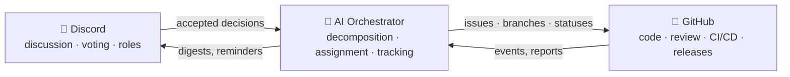

# 🗼 Tower of Babel

🌍 [العربية](translations/README.ar.md) · [বাংলা](translations/README.bn.md) · [Deutsch](translations/README.de.md) · **English** · [Español](translations/README.es.md) · [Filipino](translations/README.tl.md) · [Français](translations/README.fr.md) · [हिन्दी](translations/README.hi.md) · [Bahasa Indonesia](translations/README.id.md) · [Italiano](translations/README.it.md) · [日本語](translations/README.ja.md) · [한국어](translations/README.ko.md) · [Português](translations/README.pt.md) · [Русский](translations/README.ru.md) · [Kiswahili](translations/README.sw.md) · [தமிழ்](translations/README.ta.md) · [ไทย](translations/README.th.md) · [Türkçe](translations/README.tr.md) · [Tiếng Việt](translations/README.vi.md) · [中文](translations/README.zh.md)

> An open system for collective software development — governed by people, executed by AI.
> A learning-by-building project by the [Skillaria.Top](https://skillaria.top) school.

---

## 💡 The Idea

People make decisions in **Discord**, code lives on **GitHub**, and in between works an **AI Orchestrator** that turns community decisions into concrete tasks, assigns them, tracks progress, and handles all the routine.

The project's defining feature is **self-application**: Tower of Babel is developed *by the rules of Tower of Babel itself*. Every improvement to the bot, the orchestrator, or the processes goes through the same votes, tasks, and reviews that the system automates.



---

## 📜 Principles

1. **People decide — AI executes.** The Orchestrator makes no substantive decisions of its own. Its source of truth is the recorded decisions of the community.
2. **Transparency.** Every AI action and every human decision is written to a public log. There are no "closed-door" decisions.
3. **Meritocracy.** Authority is not handed out — it is earned through contribution and confirmed by a vote.
4. **Reversibility.** Any decision can be revisited by a new vote. Any AI action can be rolled back.
5. **Self-application.** The project evolves by its own rules from day one — manually at first, then with ever more automation.

---

## 👥 Role System

Roles are unified across Discord and GitHub: the bot syncs them automatically (until the bot exists, the Keepers do it manually).

| Role | How to obtain | Discord | GitHub | Authority |
|---|---|---|---|---|
| 👁️ **Observer** | Join the server via your school dashboard | Read all channels, ask in `#help` | Fork, create Issues | Watch, ask, suggest ideas |
| 🧱 **Apprentice** | Introduce yourself + take your first task | Vote in *routine* votes, join discussions | PRs from forks, assignment to `good first issue` tasks | Take tasks, participate in discussions |
| ⚒️ **Mason** | 5 merged PRs + simple majority vote | Vote in *all* votes, create RFCs | Triage: labels, assignments; PR reviews | Take any task, review, propose RFCs and candidates |
| 🏛️ **Architect** | Nomination + 2/3 of Masons' votes | Moderate tech channels, own a domain | Maintain: merge into `main`, milestones, release branches | Decide *within their domain* unilaterally (see "Domains"), merge PRs |
| 🛡️ **Keeper** | School curators / founders | Server administrator | Admin: secrets, settings, branch protection | Emergency veto, AI kill switch, onboarding. Does not interfere in day-to-day development |
| 🤖 **Orchestrator** | It's the bot. You can't become it 🙂 | Its own role with limited rights | Separate machine account, no merge into `main` | See "AI Orchestrator" |

**Domains** are areas of responsibility owned by Architects (e.g. `bot`, `orchestrator`, `infra`, `docs`). An Architect decides matters within their domain without a vote, but any 3 Masons may challenge the decision and put it to a vote (a "challenge").

**Demotion** happens through the same vote as promotion, or automatically after 60 days of inactivity (the role is frozen and restored upon return without a vote).

---

## 🗳️ Decision-Making

All decisions fall into three levels. Votes are held in `#voting` (via reactions or the bot's `/vote` command), and the result is recorded as a file in `decisions/` — this is the **source of truth for the AI**.

| Level | Examples | Who votes | Threshold | Quorum | Duration |
|---|---|---|---|---|---|
| 🟢 **Routine** | feature naming, digest format, task priority | Apprentice+ | simple majority | 3 votes | 24 h |
| 🟡 **Significant** | architecture, tech stack, roadmap, promotion to Mason/Architect | Mason+ | 2/3 | 50% of active members | 48 h |
| 🔴 **Critical** | changes to governance rules, AI permissions, license, data deletion | Mason+ | 3/4 **+ Keeper approval** | 50% of active members | 72 h |

Additionally:

- **Decision by authority.** An Architect may settle a matter in their domain without a vote — the decision is still recorded in `decisions/` with the `by-authority` flag.
- **Emergency decision.** A Keeper may act unilaterally (incident, security), but must publish a report within 24 h; the community may overturn the decision with a significant vote.
- **RFC process.** Major proposals are written up as RFCs in the `#rfc` forum channel: problem → proposal → alternatives → at least 48 h of discussion → vote.

### Decision file format (`decisions/`)

```yaml
# decisions/2026-06-15-choose-tech-stack.yaml
id: 23
title: "Choosing the tech stack"
level: significant        # routine | significant | critical | by-authority | emergency
status: accepted          # accepted | rejected | superseded
votes: { for: 14, against: 3, abstain: 2 }
discord_thread: "<link to the thread>"
decision: |
  Backend in Python 3.12, bot on discord.py, AI behind an
  OpenRouter/Ollama adapter, PostgreSQL database, Docker deployment.
tasks_hint: |              # a hint for the Orchestrator's decomposition (optional)
  Start with the bot skeleton and CI.
```

---

## 🤖 AI Orchestrator

The brain of the routine. Works through OpenRouter (cloud models) or Ollama (local models) behind a single adapter — the provider is chosen via config.

### What it does

- 📥 **Reads** accepted decisions from `decisions/` and Discord threads;
- 🧩 **Decomposes** decisions into GitHub Issues: subtasks, labels, estimates, dependencies, milestones;
- 🎯 **Assigns** tasks by priority: volunteer → matching skills → lowest workload. Any assignment can be declined with a single command;
- ⏰ **Tracks** deadlines: reminds, escalates to the domain's Architect, reassigns stalled tasks;
- 📝 **Summarizes**: short digests of long discussions, a weekly progress digest in `#announcements`;
- 🔍 **Drafts PR reviews** (advice, not a verdict — the final word belongs to a human);
- 🗳️ **Runs votes**: counting, quorum control, generating the decision file;
- 📒 **Keeps the audit log**: every action it takes is published in `#audit-log`.

### What it CANNOT do (hard limits)

- ❌ Merge into `main` or release branches (branch protection);
- ❌ Change people's roles (it only records vote outcomes);
- ❌ Modify its own system prompt, permissions, or config — only via a 🔴 critical vote;
- ❌ Touch secrets, repository settings, or billing;
- ❌ Delete branches, issues, or people's messages;
- ❌ Act without a recorded decision — to "verbal" requests in chat it replies "please formalize a decision".

Keepers have a **kill switch** — the bot can be stopped instantly with a single command.

---

## 🔄 Task Lifecycle

```
💬 Discussion in Discord
        ↓
🗳️ Vote → decisions/NNN.yaml
        ↓
🤖 AI decomposes → GitHub Issues (backlog)
        ↓
🎯 Assignment (volunteer / AI suggests)
        ↓
🌿 Branch feat/NNN-short-name → code → PR
        ↓
✅ CI (tests, linters) + 🤖 draft review
        ↓
👤 Review by a Mason+ → merge by an Architect
        ↓
🚀 Release → 🤖 release notes → digest in Discord
```

---

## 💬 Discord Server Structure

| Channel | Purpose |
|---|---|
| `#announcements` | Releases, digests, important decisions (Architects+ and the bot post) |
| `#rfc` *(forum)* | Major proposals, each in its own thread |
| `#voting` | Votes and their results only |
| `#tasks` | Task feed from the Orchestrator, claiming/submitting tasks |
| `#dev-general` | Free-form technical discussion |
| `#help` | Newcomers' questions — everyone answers |
| `#audit-log` | AI action log (bot only) |
| 🔊 `Construction Site` | Voice calls, mob sessions, standups |

---

## 📁 Repository Structure (target)

```
Tower_of_Babel/
├── README.md            ← you are here
├── translations/        ← this README in 19 other languages
├── docs/                ← rules, guides, RFC archive, ADRs
├── decisions/           ← decision log — the source of truth for the AI
├── bot/                 ← Discord bot (commands, votes, roles)
├── orchestrator/        ← AI core (LLM adapter, decomposition, assignment)
├── integrations/        ← GitHub API clients, webhooks
├── infra/               ← Docker, compose, CI/CD, deployment
└── tests/               ← tests for all of the above
```

---

## 🛠️ Technology (proposal — to be approved by Vote #1)

| Layer | Candidate | Why |
|---|---|---|
| Language | Python 3.12+ | Low entry barrier for students, rich ecosystem |
| Discord | `discord.py` | Mature library, slash commands, events |
| GitHub | `githubkit` / REST + webhooks | Full API coverage |
| LLM | OpenRouter **and** Ollama behind a single adapter | Cloud for quality, local for free and private |
| Webhooks/API | FastAPI | Simple, async, auto-documented |
| Database | SQLite → PostgreSQL | Start simple, grow painlessly |
| Infra | Docker Compose, GitHub Actions | Reproducibility, free CI |

---

## 🗺️ Roadmap

### Phase 0 — "The Foundation" *(manual, no code)*
- [ ] Create the Discord server per the structure above, hand out starting roles
- [ ] Hold **Vote #1** — approve the tech stack (the first decision in `decisions/`!)
- [ ] Approve the rules from this README with a critical vote
- [ ] Run a full task lifecycle by hand — understand the process before automating it

### Phase 1 — "The First Stone": the Discord bot
- [ ] Bot skeleton, Docker deployment
- [ ] `/vote` — creating a vote, counting, quorum and deadline control
- [ ] Auto-generation of the decision file in `decisions/` (PR from the bot)
- [ ] Discord role ↔ GitHub team synchronization

### Phase 2 — "The Bridge": GitHub integration
- [ ] GitHub webhooks → events in `#tasks` (PR opened, CI failed, merged)
- [ ] Commands `/task take`, `/task done`, `/task status`
- [ ] Project board (GitHub Projects), status automation

### Phase 3 — "The Voice of the Tower": plugging in the AI
- [ ] Unified LLM adapter (OpenRouter / Ollama, chosen via config)
- [ ] Decision decomposition → Issues with labels and dependencies
- [ ] Thread summaries and the weekly digest

### Phase 4 — "The Orchestra": full management
- [ ] Task assignment (volunteer → skills → workload)
- [ ] Deadline control, reminders, escalation
- [ ] Draft AI reviews of PRs, release notes
- [ ] `#audit-log` and the kill switch

### Phase 5 — "Self-Construction"
- [ ] The system fully manages its own development (dogfooding)
- [ ] Metrics: task velocity, activity, review quality
- [ ] Onboard a second project — test portability
- [ ] A public template: "deploy your own Tower in an evening"

---

## 🚪 How to Join

The project's Discord server is available to Skillaria.Top students only:

1. Become a student at [Skillaria.Top](https://skillaria.top);
2. Learn and grow until you reach the **Intern** level;
3. Get the Discord invite link in your personal dashboard;
4. Introduce yourself in `#help` — you'll receive the 🧱 Apprentice role;
5. Take a task labeled [`good first issue`](https://github.com/skillariatop/Tower_of_Babel/labels/good%20first%20issue);
6. Open a PR — and you're on your way to ⚒️ Mason.

Can't code? We also need testers, technical writers, moderators, and process designers — contributions to `docs/` and `decisions/` are valued as much as code.

---

## 📄 License

The project is distributed under the license in the [LICENSE](LICENSE) file.

> *"And the LORD said, Behold, the people is one, and they have all one language; and this they begin to do: and now nothing will be restrained from them, which they have imagined to do"* — Genesis 11:6.
> This time, we have version control.
