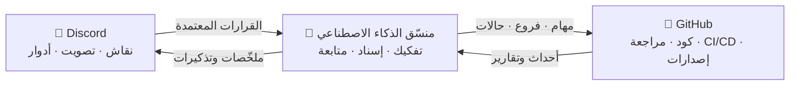

# 🗼 Tower of Babel — برج بابل

🌍 **العربية** · [বাংলা](README.bn.md) · [Deutsch](README.de.md) · [English](../README.md) · [Español](README.es.md) · [Filipino](README.tl.md) · [Français](README.fr.md) · [हिन्दी](README.hi.md) · [Bahasa Indonesia](README.id.md) · [Italiano](README.it.md) · [日本語](README.ja.md) · [한국어](README.ko.md) · [Português](README.pt.md) · [Русский](README.ru.md) · [Kiswahili](README.sw.md) · [தமிழ்](README.ta.md) · [ไทย](README.th.md) · [Türkçe](README.tr.md) · [Tiếng Việt](README.vi.md) · [中文](README.zh.md)

> نظام مفتوح للتطوير الجماعي للبرمجيات — يحكمه البشر، وينفّذه الذكاء الاصطناعي.
> مشروع للتعلّم بالبناء من مدرسة [Skillaria.Top](https://skillaria.top).

---

## 💡 الفكرة

يتّخذ الناس القرارات في **Discord**، ويعيش الكود على **GitHub**، وبينهما يعمل **منسّق ذكاء اصطناعي** يحوّل قرارات المجتمع إلى مهام ملموسة، ويوزّعها، ويتابع تقدّمها، ويتكفّل بكل الأعمال الروتينية.

السمة المميِّزة للمشروع هي **التطبيق الذاتي**: يُطوَّر برج بابل *وفق قواعد برج بابل نفسها*. كل تحسين على البوت أو المنسّق أو العمليات يمرّ عبر نفس التصويتات والمهام والمراجعات التي يقوم النظام بأتمتتها.



---

## 📜 المبادئ

1. **البشر يقرّرون — والذكاء الاصطناعي ينفّذ.** لا يتّخذ المنسّق أي قرارات جوهرية من تلقاء نفسه. مصدر الحقيقة لديه هو قرارات المجتمع المسجّلة.
2. **الشفافية.** كل إجراء يقوم به الذكاء الاصطناعي وكل قرار بشري يُدوَّن في سجلّ علني. لا توجد قرارات «خلف الأبواب المغلقة».
3. **الجدارة.** السلطة لا تُمنَح — بل تُكتسَب بالمساهمة وتُثبَّت بالتصويت.
4. **القابلية للتراجع.** أي قرار يمكن إعادة النظر فيه بتصويت جديد. وأي إجراء للذكاء الاصطناعي يمكن التراجع عنه.
5. **التطبيق الذاتي.** يتطوّر المشروع وفق قواعده الخاصة منذ اليوم الأول — يدويًا في البداية، ثم بأتمتة متزايدة باستمرار.

---

## 👥 نظام الأدوار

الأدوار موحَّدة بين Discord وGitHub: يقوم البوت بمزامنتها تلقائيًا (وإلى أن يوجد البوت، يتولّى الحرّاس ذلك يدويًا).

| الدور | كيفية الحصول عليه | Discord | GitHub | الصلاحيات |
|---|---|---|---|---|
| 👁️ **المراقِب** | الانضمام إلى الخادم عبر لوحة المدرسة الشخصية | قراءة جميع القنوات، والسؤال في `#help` | عمل Fork، وإنشاء Issues | المشاهدة والسؤال واقتراح الأفكار |
| 🧱 **الصانع المتدرّب** | التعريف بنفسك + أخذ مهمتك الأولى | التصويت في التصويتات *الروتينية*، والمشاركة في النقاشات | فتح PRs من الـ Forks، والإسناد إلى مهام `good first issue` | أخذ المهام والمشاركة في النقاشات |
| ⚒️ **البنّاء** | 5 طلبات PR مدموجة + تصويت بأغلبية بسيطة | التصويت في *جميع* التصويتات، وإنشاء RFCs | الفرز: التصنيفات والإسنادات؛ ومراجعة الـ PRs | أخذ أي مهمة، والمراجعة، واقتراح الـ RFCs والمرشّحين |
| 🏛️ **المعماري** | ترشيح + أصوات 2/3 من البنّائين | إدارة القنوات التقنية، وتولّي نطاق خاص به | الصيانة: الدمج في `main`، والمعالم، وفروع الإصدارات | يقرّر *ضمن نطاقه* بشكل منفرد (انظر «النطاقات»)، ويدمج الـ PRs |
| 🛡️ **الحارس** | مشرفو المدرسة / المؤسّسون | مدير الخادم | الإدارة: الأسرار والإعدادات وحماية الفروع | فيتو طارئ، ومفتاح إيقاف الذكاء الاصطناعي، واستقبال الجدد. لا يتدخّل في التطوير اليومي |
| 🤖 **المنسّق** | إنه البوت. لا يمكنك أن تصبح إيّاه 🙂 | دور خاص به بصلاحيات محدودة | حساب آلي منفصل، بلا دمج في `main` | انظر «منسّق الذكاء الاصطناعي» |

**النطاقات** هي مجالات مسؤولية يتولّاها المعماريون (مثل `bot` و`orchestrator` و`infra` و`docs`). يقرّر المعماري في شؤون نطاقه دون تصويت، لكن يحقّ لأي 3 بنّائين الاعتراض على القرار وطرحه للتصويت («طعن»).

**التنزيل من الدور** يتم عبر نفس آلية التصويت الخاصة بالترقية، أو تلقائيًا بعد 60 يومًا من عدم النشاط (يُجمَّد الدور ويُستعاد عند العودة دون تصويت).

---

## 🗳️ اتّخاذ القرارات

تنقسم جميع القرارات إلى ثلاثة مستويات. تُجرى التصويتات في `#voting` (عبر التفاعلات أو أمر البوت `/vote`)، وتُسجَّل النتيجة كملف في `decisions/` — وهذا هو **مصدر الحقيقة للذكاء الاصطناعي**.

| المستوى | أمثلة | من يصوّت | العتبة | النِّصاب | المدة |
|---|---|---|---|---|---|
| 🟢 **روتيني** | تسمية الميزات، شكل الملخّصات، أولوية المهام | الصانع المتدرّب فأعلى | أغلبية بسيطة | 3 أصوات | 24 ساعة |
| 🟡 **مهم** | البنية المعمارية، حزمة التقنيات، خارطة الطريق، الترقية إلى بنّاء/معماري | البنّاء فأعلى | 2/3 | 50% من الأعضاء النشطين | 48 ساعة |
| 🔴 **حرج** | تغيير قواعد الحوكمة، صلاحيات الذكاء الاصطناعي، الرخصة، حذف البيانات | البنّاء فأعلى | 3/4 **+ موافقة حارس** | 50% من الأعضاء النشطين | 72 ساعة |

إضافة إلى ذلك:

- **القرار بحكم السلطة.** يجوز للمعماري حسم مسألة في نطاقه دون تصويت — ويُسجَّل القرار مع ذلك في `decisions/` مع العلامة `by-authority`.
- **القرار الطارئ.** يجوز للحارس التصرّف منفردًا (حادثة، أمن)، لكن عليه نشر تقرير خلال 24 ساعة؛ ويمكن للمجتمع نقض القرار بتصويت من المستوى المهم.
- **عملية الـ RFC.** تُكتب المقترحات الكبرى كـ RFCs في قناة المنتدى `#rfc`: المشكلة ← الاقتراح ← البدائل ← نقاش لمدة 48 ساعة على الأقل ← التصويت.

### صيغة ملف القرار (`decisions/`)

```yaml
# decisions/2026-06-15-choose-tech-stack.yaml
id: 23
title: "اختيار حزمة التقنيات"
level: significant        # routine | significant | critical | by-authority | emergency
status: accepted          # accepted | rejected | superseded
votes: { for: 14, against: 3, abstain: 2 }
discord_thread: "<رابط إلى الموضوع>"
decision: |
  الواجهة الخلفية بلغة Python 3.12، والبوت على discord.py، والذكاء الاصطناعي
  خلف محوّل OpenRouter/Ollama، وقاعدة بيانات PostgreSQL، والنشر عبر Docker.
tasks_hint: |              # تلميح لتفكيك المنسّق للمهام (اختياري)
  ابدأ بهيكل البوت والـ CI.
```

---

## 🤖 منسّق الذكاء الاصطناعي

عقل الأعمال الروتينية. يعمل عبر OpenRouter (نماذج سحابية) أو Ollama (نماذج محلية) خلف محوّل واحد — ويُختار المزوّد عبر ملف الإعدادات.

### ما يفعله

- 📥 **يقرأ** القرارات المعتمدة من `decisions/` ومواضيع Discord؛
- 🧩 **يفكّك** القرارات إلى GitHub Issues: مهام فرعية وتصنيفات وتقديرات وتبعيات ومعالم؛
- 🎯 **يُسند** المهام حسب الأولوية: متطوّع ← مهارات مطابقة ← أقل عبء عمل. ويمكن رفض أي إسناد بأمر واحد؛
- ⏰ **يتابع** المواعيد النهائية: يذكّر، ويصعّد الأمر إلى معماري النطاق، ويعيد إسناد المهام المتعثّرة؛
- 📝 **يلخّص**: ملخّصات قصيرة للنقاشات الطويلة، وملخّص أسبوعي للتقدّم في `#announcements`؛
- 🔍 **يكتب مسودّات مراجعات الـ PR** (نصيحة لا حُكمًا — الكلمة الأخيرة للإنسان)؛
- 🗳️ **يدير التصويتات**: العدّ، ومراقبة النِّصاب، وتوليد ملف القرار؛
- 📒 **يحفظ سجلّ التدقيق**: كل إجراء يقوم به يُنشَر في `#audit-log`.

### ما لا يستطيع فعله (حدود صارمة)

- ❌ الدمج في `main` أو فروع الإصدارات (حماية الفروع)؛
- ❌ تغيير أدوار الأشخاص (هو يسجّل نتائج التصويتات فقط)؛
- ❌ تعديل موجِّه النظام الخاص به أو صلاحياته أو إعداداته — إلا عبر تصويت 🔴 حرج؛
- ❌ لمس الأسرار أو إعدادات المستودع أو الفوترة؛
- ❌ حذف الفروع أو الـ Issues أو رسائل الأشخاص؛
- ❌ التصرّف دون قرار مسجّل — وعلى الطلبات «الشفهية» في الدردشة يردّ: «من فضلك وثّق القرار رسميًا».

يملك الحرّاس **مفتاح إيقاف** — يمكن إيقاف البوت فورًا بأمر واحد.

---

## 🔄 دورة حياة المهمة

```
💬 نقاش في Discord
        ↓
🗳️ تصويت ← decisions/NNN.yaml
        ↓
🤖 الذكاء الاصطناعي يفكّك ← GitHub Issues (قائمة الانتظار)
        ↓
🎯 الإسناد (متطوّع / يقترح الذكاء الاصطناعي)
        ↓
🌿 فرع feat/NNN-short-name ← كود ← PR
        ↓
✅ CI (اختبارات، مدقّقات) + 🤖 مسودّة مراجعة
        ↓
👤 مراجعة من بنّاء فأعلى ← دمج بواسطة معماري
        ↓
🚀 إصدار ← 🤖 ملاحظات الإصدار ← ملخّص في Discord
```

---

## 💬 هيكل خادم Discord

| القناة | الغرض |
|---|---|
| `#announcements` | الإصدارات والملخّصات والقرارات المهمة (ينشر فيها المعماريون فأعلى والبوت) |
| `#rfc` *(منتدى)* | المقترحات الكبرى، كلٌّ في موضوعه الخاص |
| `#voting` | التصويتات ونتائجها فقط |
| `#tasks` | تدفّق المهام من المنسّق، وأخذ المهام وتسليمها |
| `#dev-general` | نقاش تقني حر |
| `#help` | أسئلة الوافدين الجدد — الجميع يجيب |
| `#audit-log` | سجلّ إجراءات الذكاء الاصطناعي (البوت فقط) |
| 🔊 `ورشة البناء` | مكالمات صوتية، وجلسات عمل جماعية، واجتماعات يومية |

---

## 📁 هيكل المستودع (المستهدف)

```
Tower_of_Babel/
├── README.md            ← أنت هنا
├── translations/        ← هذا الـ README بـ 19 لغة أخرى
├── docs/                ← القواعد والأدلّة وأرشيف الـ RFC وقرارات الـ ADR
├── decisions/           ← سجلّ القرارات — مصدر الحقيقة للذكاء الاصطناعي
├── bot/                 ← بوت Discord (الأوامر والتصويتات والأدوار)
├── orchestrator/        ← نواة الذكاء الاصطناعي (محوّل LLM، التفكيك، الإسناد)
├── integrations/        ← عملاء GitHub API والـ webhooks
├── infra/               ← Docker وcompose وCI/CD والنشر
└── tests/               ← اختبارات لكل ما سبق
```

---

## 🛠️ التقنيات (اقتراح — بانتظار اعتماده في التصويت رقم 1)

| الطبقة | المرشَّح | لماذا |
|---|---|---|
| اللغة | Python 3.12+ | حاجز دخول منخفض للطلاب، ومنظومة أدوات غنية |
| Discord | `discord.py` | مكتبة ناضجة، وأوامر slash، وأحداث |
| GitHub | `githubkit` / REST + webhooks | تغطية كاملة للـ API |
| LLM | OpenRouter **و** Ollama خلف محوّل واحد | السحابة للجودة، والمحلي مجاني وخاص |
| Webhooks/API | FastAPI | بسيط وغير متزامن وموثَّق تلقائيًا |
| قاعدة البيانات | SQLite ← PostgreSQL | ابدأ ببساطة، وانمُ دون ألم |
| البنية التحتية | Docker Compose, GitHub Actions | قابلية إعادة الإنتاج، وCI مجاني |

---

## 🗺️ خارطة الطريق

### المرحلة 0 — «الأساس» *(يدويًا، بلا كود)*
- [ ] إنشاء خادم Discord وفق الهيكل أعلاه، وتوزيع الأدوار الأولية
- [ ] إجراء **التصويت رقم 1** — اعتماد حزمة التقنيات (أول قرار في `decisions/`!)
- [ ] اعتماد قواعد هذا الـ README بتصويت حرج
- [ ] تنفيذ دورة حياة مهمة كاملة يدويًا — لفهم العملية قبل أتمتتها

### المرحلة 1 — «الحجر الأول»: بوت Discord
- [ ] هيكل البوت، والنشر عبر Docker
- [ ] ‏`/vote` — إنشاء التصويت، والعدّ، ومراقبة النِّصاب والمواعيد النهائية
- [ ] التوليد التلقائي لملف القرار في `decisions/`‏ (PR من البوت)
- [ ] مزامنة أدوار Discord ↔ فرق GitHub

### المرحلة 2 — «الجسر»: التكامل مع GitHub
- [ ] ‏GitHub webhooks ← أحداث في `#tasks`‏ (فتح PR، فشل CI، الدمج)
- [ ] الأوامر `/task take` و`/task done` و`/task status`
- [ ] لوحة المشروع (GitHub Projects)، وأتمتة الحالات

### المرحلة 3 — «صوت البرج»: توصيل الذكاء الاصطناعي
- [ ] محوّل LLM موحَّد (OpenRouter / Ollama، يُختار عبر الإعدادات)
- [ ] تفكيك القرارات ← Issues مع التصنيفات والتبعيات
- [ ] ملخّصات المواضيع والملخّص الأسبوعي

### المرحلة 4 — «الأوركسترا»: الإدارة الكاملة
- [ ] إسناد المهام (متطوّع ← مهارات ← عبء العمل)
- [ ] مراقبة المواعيد النهائية، والتذكيرات، والتصعيد
- [ ] مسودّات مراجعات الذكاء الاصطناعي للـ PRs، وملاحظات الإصدار
- [ ] ‏`#audit-log` ومفتاح الإيقاف

### المرحلة 5 — «البناء الذاتي»
- [ ] يدير النظام تطويره الخاص بالكامل (dogfooding)
- [ ] المقاييس: سرعة إنجاز المهام، والنشاط، وجودة المراجعات
- [ ] ضمّ مشروع ثانٍ — لاختبار قابلية النقل
- [ ] قالب عام: «انشر برجك الخاص في أمسية واحدة»

---

## 🚪 كيف تنضم

خادم Discord الخاص بالمشروع متاح لطلاب Skillaria.Top فقط:

1. كن طالبًا في [Skillaria.Top](https://skillaria.top)؛
2. تعلّم وتقدّم حتى تصل إلى مستوى **المتدرّب الداخلي (Intern)**؛
3. احصل على رابط دعوة Discord من لوحتك الشخصية؛
4. عرّف بنفسك في `#help` — وستحصل على دور 🧱 الصانع المتدرّب؛
5. خذ مهمة تحمل التصنيف [`good first issue`](https://github.com/skillariatop/Tower_of_Babel/labels/good%20first%20issue)؛
6. افتح PR — وها أنت في طريقك إلى ⚒️ البنّاء.

لا تجيد البرمجة؟ نحتاج أيضًا إلى مختبِرين وكتّاب تقنيين ومشرفين ومصمّمي عمليات — فالمساهمات في `docs/` و`decisions/` تُقدَّر بقدر الكود تمامًا.

---

## 📄 الرخصة

يُوزَّع المشروع بموجب الرخصة الموجودة في ملف [LICENSE](../LICENSE).

> *«وَقَالَ الرَّبُّ: هُوَذَا شَعْبٌ وَاحِدٌ وَلِسَانٌ وَاحِدٌ لِجَمِيعِهِمْ، وَهذَا ابْتِدَاؤُهُمْ بِالْعَمَلِ. وَالآنَ لاَ يَمْتَنِعُ عَلَيْهِمْ كُلُّ مَا يَنْوُونَ أَنْ يَعْمَلُوهُ»* — تكوين 11: 6.
> هذه المرّة، لدينا نظام للتحكّم في الإصدارات.
