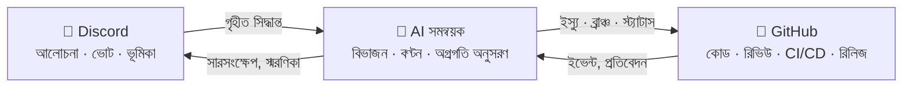

# 🗼 Tower of Babel — বাবেলের মিনার

🌍 [العربية](README.ar.md) · **বাংলা** · [Deutsch](README.de.md) · [English](../README.md) · [Español](README.es.md) · [Filipino](README.tl.md) · [Français](README.fr.md) · [हिन्दी](README.hi.md) · [Bahasa Indonesia](README.id.md) · [Italiano](README.it.md) · [日本語](README.ja.md) · [한국어](README.ko.md) · [Português](README.pt.md) · [Русский](README.ru.md) · [Kiswahili](README.sw.md) · [தமிழ்](README.ta.md) · [ไทย](README.th.md) · [Türkçe](README.tr.md) · [Tiếng Việt](README.vi.md) · [中文](README.zh.md)

> সমষ্টিগত সফটওয়্যার নির্মাণের জন্য একটি উন্মুক্ত ব্যবস্থা — পরিচালনা করে মানুষ, বাস্তবায়ন করে AI।
> [Skillaria.Top](https://skillaria.top) স্কুলের একটি "গড়তে-গড়তে-শেখা" প্রকল্প।

---

## 💡 মূল ভাবনা

সিদ্ধান্ত নেওয়া হয় **Discord**-এ, কোড থাকে **GitHub**-এ, আর এই দুইয়ের মাঝে কাজ করে একটি **AI সমন্বয়ক** — যে কমিউনিটির সিদ্ধান্তকে সুনির্দিষ্ট কাজে রূপান্তর করে, কাজ বণ্টন করে, অগ্রগতির হিসাব রাখে এবং যাবতীয় গতানুগতিক ঝামেলা সামলায়।

প্রকল্পটির সবচেয়ে বড় বৈশিষ্ট্য হলো **নিজের ওপর নিজের নিয়ম প্রয়োগ**: Tower of Babel গড়ে ওঠে *Tower of Babel-এরই নিয়ম মেনে*। বট, সমন্বয়ক বা প্রক্রিয়ার প্রতিটি উন্নতি সেই একই ভোট, কাজ ও রিভিউয়ের ধাপ পেরিয়ে আসে — যেগুলো এই ব্যবস্থা নিজেই স্বয়ংক্রিয় করে।



---

## 📜 মূলনীতি

1. **সিদ্ধান্ত নেয় মানুষ — বাস্তবায়ন করে AI।** সমন্বয়ক নিজে থেকে কোনো মূল সিদ্ধান্ত নেয় না। তার সত্যের উৎস হলো কমিউনিটির লিপিবদ্ধ সিদ্ধান্ত।
2. **স্বচ্ছতা।** AI-এর প্রতিটি পদক্ষেপ আর মানুষের প্রতিটি সিদ্ধান্ত প্রকাশ্য লগে লেখা হয়। "বন্ধ দরজার আড়ালে" কোনো সিদ্ধান্ত নেই।
3. **মেধাতন্ত্র।** কর্তৃত্ব কাউকে এমনি এমনি দেওয়া হয় না — তা অর্জন করতে হয় অবদানের মাধ্যমে, আর নিশ্চিত হয় ভোটে।
4. **প্রত্যাবর্তনযোগ্যতা।** যেকোনো সিদ্ধান্ত নতুন ভোটে পুনর্বিবেচনা করা যায়। AI-এর যেকোনো পদক্ষেপ ফিরিয়ে নেওয়া যায়।
5. **নিজের নিয়ম নিজের ওপর।** প্রকল্পটি প্রথম দিন থেকেই নিজের নিয়মে চলে — শুরুতে হাতে-কলমে, পরে ক্রমে আরও বেশি স্বয়ংক্রিয়ভাবে।

---

## 👥 ভূমিকা-ব্যবস্থা

ভূমিকাগুলো Discord ও GitHub-এ অভিন্ন: বট সেগুলো স্বয়ংক্রিয়ভাবে সিঙ্ক করে (বট তৈরি হওয়ার আগ পর্যন্ত প্রহরীরা এ কাজ হাতে করেন)।

| ভূমিকা | কীভাবে পাওয়া যায় | Discord | GitHub | কর্তৃত্ব |
|---|---|---|---|---|
| 👁️ **পর্যবেক্ষক** | স্কুলের ড্যাশবোর্ড থেকে সার্ভারে যোগ দিন | সব চ্যানেল পড়া, `#help`-এ প্রশ্ন করা | Fork, Issue তৈরি | দেখা, প্রশ্ন করা, ধারণা প্রস্তাব করা |
| 🧱 **শিক্ষানবিশ** | নিজের পরিচয় দিন + প্রথম কাজটি নিন | *গতানুগতিক* ভোটে ভোট দেওয়া, আলোচনায় অংশ নেওয়া | Fork থেকে PR, `good first issue` কাজে অ্যাসাইনমেন্ট | কাজ নেওয়া, আলোচনায় অংশগ্রহণ |
| ⚒️ **রাজমিস্ত্রি** | ৫টি মার্জ হওয়া PR + সাধারণ সংখ্যাগরিষ্ঠ ভোট | *সব* ভোটে ভোট দেওয়া, RFC তৈরি | ট্রিয়াজ: লেবেল, অ্যাসাইনমেন্ট; PR রিভিউ | যেকোনো কাজ নেওয়া, রিভিউ করা, RFC ও প্রার্থী প্রস্তাব করা |
| 🏛️ **স্থপতি** | মনোনয়ন + রাজমিস্ত্রিদের ২/৩ ভোট | টেক চ্যানেল মডারেট করা, নিজস্ব ক্ষেত্রের মালিকানা | মেইনটেইন: `main`-এ মার্জ, মাইলস্টোন, রিলিজ ব্রাঞ্চ | *নিজ ক্ষেত্রে* এককভাবে সিদ্ধান্ত নেওয়া (দেখুন "ক্ষেত্র"), PR মার্জ করা |
| 🛡️ **প্রহরী** | স্কুলের কিউরেটর / প্রতিষ্ঠাতারা | সার্ভার অ্যাডমিনিস্ট্রেটর | অ্যাডমিন: সিক্রেট, সেটিংস, ব্রাঞ্চ প্রোটেকশন | জরুরি ভেটো, AI-এর কিল সুইচ, অনবোর্ডিং। দৈনন্দিন উন্নয়নে হস্তক্ষেপ করেন না |
| 🤖 **সমন্বয়ক** | এটা বট নিজেই। আপনি এটা হতে পারবেন না 🙂 | সীমিত অধিকারসহ নিজস্ব ভূমিকা | আলাদা মেশিন অ্যাকাউন্ট, `main`-এ মার্জের অধিকার নেই | দেখুন "AI সমন্বয়ক" |

**ক্ষেত্র** হলো স্থপতিদের মালিকানাধীন দায়িত্বের এলাকা (যেমন `bot`, `orchestrator`, `infra`, `docs`)। একজন স্থপতি নিজ ক্ষেত্রের বিষয়ে ভোট ছাড়াই সিদ্ধান্ত নেন, তবে যেকোনো ৩ জন রাজমিস্ত্রি সেই সিদ্ধান্তে আপত্তি জানিয়ে তা ভোটে তুলতে পারেন (একটি "চ্যালেঞ্জ")।

**পদাবনতি** হয় পদোন্নতির মতো একই ভোটের মাধ্যমে, অথবা ৬০ দিন নিষ্ক্রিয় থাকলে স্বয়ংক্রিয়ভাবে (ভূমিকাটি হিমায়িত হয় এবং ফিরে এলে ভোট ছাড়াই পুনর্বহাল হয়)।

---

## 🗳️ সিদ্ধান্ত গ্রহণ

সব সিদ্ধান্ত তিনটি স্তরে ভাগ হয়। ভোট হয় `#voting`-এ (রিঅ্যাকশন বা বটের `/vote` কমান্ডের মাধ্যমে), আর ফলাফল `decisions/`-এ একটি ফাইল হিসেবে লিপিবদ্ধ হয় — এটিই **AI-এর জন্য সত্যের উৎস**।

| স্তর | উদাহরণ | কারা ভোট দেন | প্রয়োজনীয় অনুপাত | কোরাম | মেয়াদ |
|---|---|---|---|---|---|
| 🟢 **গতানুগতিক** | ফিচারের নামকরণ, ডাইজেস্টের ফরম্যাট, কাজের অগ্রাধিকার | শিক্ষানবিশ+ | সাধারণ সংখ্যাগরিষ্ঠতা | ৩ ভোট | ২৪ ঘণ্টা |
| 🟡 **গুরুত্বপূর্ণ** | আর্কিটেকচার, টেক স্ট্যাক, রোডম্যাপ, রাজমিস্ত্রি/স্থপতি পদে উন্নীতকরণ | রাজমিস্ত্রি+ | ২/৩ | সক্রিয় সদস্যদের ৫০% | ৪৮ ঘণ্টা |
| 🔴 **অতীব গুরুতর** | পরিচালনার নিয়মে পরিবর্তন, AI-এর অনুমতি, লাইসেন্স, ডেটা মুছে ফেলা | রাজমিস্ত্রি+ | ৩/৪ **+ প্রহরীর অনুমোদন** | সক্রিয় সদস্যদের ৫০% | ৭২ ঘণ্টা |

এছাড়াও:

- **কর্তৃত্ববলে সিদ্ধান্ত।** একজন স্থপতি নিজ ক্ষেত্রের বিষয় ভোট ছাড়াই নিষ্পত্তি করতে পারেন — সিদ্ধান্তটি তবুও `decisions/`-এ `by-authority` ফ্ল্যাগসহ লিপিবদ্ধ হয়।
- **জরুরি সিদ্ধান্ত।** একজন প্রহরী এককভাবে পদক্ষেপ নিতে পারেন (ইনসিডেন্ট, নিরাপত্তা), তবে ২৪ ঘণ্টার মধ্যে প্রতিবেদন প্রকাশ করতে হবে; কমিউনিটি একটি গুরুত্বপূর্ণ ভোটের মাধ্যমে সিদ্ধান্তটি বাতিল করতে পারে।
- **RFC প্রক্রিয়া।** বড় প্রস্তাবগুলো `#rfc` ফোরাম চ্যানেলে RFC আকারে লেখা হয়: সমস্যা → প্রস্তাব → বিকল্প → অন্তত ৪৮ ঘণ্টার আলোচনা → ভোট।

### সিদ্ধান্ত-ফাইলের ফরম্যাট (`decisions/`)

```yaml
# decisions/2026-06-15-choose-tech-stack.yaml
id: 23
title: "টেক স্ট্যাক নির্বাচন"
level: significant        # routine | significant | critical | by-authority | emergency
status: accepted          # accepted | rejected | superseded
votes: { for: 14, against: 3, abstain: 2 }
discord_thread: "<থ্রেডের লিংক>"
decision: |
  ব্যাকএন্ড Python 3.12-এ, বট discord.py-তে, AI একটি
  OpenRouter/Ollama অ্যাডাপ্টারের পেছনে, ডেটাবেস PostgreSQL, ডিপ্লয়মেন্ট Docker-এ।
tasks_hint: |              # সমন্বয়কের কাজ-বিভাজনের জন্য ইঙ্গিত (ঐচ্ছিক)
  বটের কাঠামো আর CI দিয়ে শুরু করুন।
```

---

## 🤖 AI সমন্বয়ক

গতানুগতিক কাজের মস্তিষ্ক। OpenRouter (ক্লাউড মডেল) বা Ollama (লোকাল মডেল) — একটিমাত্র অ্যাডাপ্টারের মাধ্যমে কাজ করে; কোন প্রোভাইডার ব্যবহৃত হবে তা কনফিগে নির্ধারিত হয়।

### যা সে করে

- 📥 **পড়ে** `decisions/`-এর গৃহীত সিদ্ধান্ত আর Discord-এর থ্রেড;
- 🧩 **ভেঙে ফেলে** সিদ্ধান্তকে GitHub Issues-এ: উপ-কাজ, লেবেল, সময় অনুমান, নির্ভরতা, মাইলস্টোন;
- 🎯 **বণ্টন করে** কাজ অগ্রাধিকার অনুযায়ী: স্বেচ্ছাসেবক → মানানসই দক্ষতা → সবচেয়ে কম কাজের চাপ। যেকোনো অ্যাসাইনমেন্ট একটিমাত্র কমান্ডে প্রত্যাখ্যান করা যায়;
- ⏰ **নজর রাখে** সময়সীমায়: মনে করিয়ে দেয়, সংশ্লিষ্ট ক্ষেত্রের স্থপতির কাছে এস্কেলেট করে, আটকে থাকা কাজ পুনর্বণ্টন করে;
- 📝 **সারসংক্ষেপ করে**: দীর্ঘ আলোচনার ছোট সারমর্ম, `#announcements`-এ সাপ্তাহিক অগ্রগতি-ডাইজেস্ট;
- 🔍 **PR রিভিউয়ের খসড়া লেখে** (পরামর্শ, রায় নয় — শেষ কথা মানুষেরই);
- 🗳️ **ভোট পরিচালনা করে**: গণনা, কোরাম নিয়ন্ত্রণ, সিদ্ধান্ত-ফাইল তৈরি;
- 📒 **অডিট লগ রাখে**: তার প্রতিটি পদক্ষেপ `#audit-log`-এ প্রকাশিত হয়।

### যা সে পারে না (কঠোর সীমা)

- ❌ `main` বা রিলিজ ব্রাঞ্চে মার্জ করা (ব্রাঞ্চ প্রোটেকশন);
- ❌ মানুষের ভূমিকা বদলানো (সে কেবল ভোটের ফলাফল লিপিবদ্ধ করে);
- ❌ নিজের সিস্টেম প্রম্পট, অনুমতি বা কনফিগ পরিবর্তন করা — শুধু 🔴 অতীব গুরুতর ভোটের মাধ্যমেই সম্ভব;
- ❌ সিক্রেট, রিপোজিটরির সেটিংস বা বিলিং স্পর্শ করা;
- ❌ ব্রাঞ্চ, ইস্যু বা মানুষের বার্তা মুছে ফেলা;
- ❌ লিপিবদ্ধ সিদ্ধান্ত ছাড়া কাজ করা — চ্যাটে "মুখে মুখে" অনুরোধ পেলে সে জবাব দেয়: "অনুগ্রহ করে সিদ্ধান্তটি আনুষ্ঠানিকভাবে লিপিবদ্ধ করুন"।

প্রহরীদের হাতে আছে একটি **কিল সুইচ** — একটিমাত্র কমান্ডে বটকে তৎক্ষণাৎ থামিয়ে দেওয়া যায়।

---

## 🔄 কাজের জীবনচক্র

```
💬 Discord-এ আলোচনা
        ↓
🗳️ ভোট → decisions/NNN.yaml
        ↓
🤖 AI কাজ ভাঙে → GitHub Issues (ব্যাকলগ)
        ↓
🎯 বণ্টন (স্বেচ্ছাসেবক / AI-এর প্রস্তাব)
        ↓
🌿 ব্রাঞ্চ feat/NNN-short-name → কোড → PR
        ↓
✅ CI (টেস্ট, লিন্টার) + 🤖 খসড়া রিভিউ
        ↓
👤 রাজমিস্ত্রি+ এর রিভিউ → স্থপতির মার্জ
        ↓
🚀 রিলিজ → 🤖 রিলিজ নোট → Discord-এ ডাইজেস্ট
```

---

## 💬 Discord সার্ভারের কাঠামো

| চ্যানেল | উদ্দেশ্য |
|---|---|
| `#announcements` | রিলিজ, ডাইজেস্ট, গুরুত্বপূর্ণ সিদ্ধান্ত (লেখেন স্থপতি+ এবং বট) |
| `#rfc` *(ফোরাম)* | বড় প্রস্তাব, প্রতিটি নিজস্ব থ্রেডে |
| `#voting` | শুধুই ভোট ও তার ফলাফল |
| `#tasks` | সমন্বয়কের কাজের ফিড, কাজ নেওয়া/জমা দেওয়া |
| `#dev-general` | খোলামেলা প্রযুক্তিগত আলোচনা |
| `#help` | নবাগতদের প্রশ্ন — উত্তর দেন সবাই |
| `#audit-log` | AI-এর কর্মকাণ্ডের লগ (শুধু বট) |
| 🔊 `Construction Site` | ভয়েস কল, মব সেশন, স্ট্যান্ডআপ |

---

## 📁 রিপোজিটরির কাঠামো (লক্ষ্য)

```
Tower_of_Babel/
├── README.md            ← আপনি এখানে আছেন
├── translations/        ← এই README আরও ১৯টি ভাষায়
├── docs/                ← নিয়মকানুন, গাইড, RFC আর্কাইভ, ADR
├── decisions/           ← সিদ্ধান্তের লগ — AI-এর জন্য সত্যের উৎস
├── bot/                 ← Discord বট (কমান্ড, ভোট, ভূমিকা)
├── orchestrator/        ← AI-এর মূল অংশ (LLM অ্যাডাপ্টার, বিভাজন, বণ্টন)
├── integrations/        ← GitHub API ক্লায়েন্ট, ওয়েবহুক
├── infra/               ← Docker, compose, CI/CD, ডিপ্লয়মেন্ট
└── tests/               ← ওপরের সবকিছুর টেস্ট
```

---

## 🛠️ প্রযুক্তি (প্রস্তাব — ভোট #১-এ অনুমোদিত হবে)

| স্তর | প্রার্থী | কেন |
|---|---|---|
| ভাষা | Python 3.12+ | শিক্ষার্থীদের জন্য সহজ প্রবেশপথ, সমৃদ্ধ ইকোসিস্টেম |
| Discord | `discord.py` | পরিণত লাইব্রেরি, স্ল্যাশ কমান্ড, ইভেন্ট |
| GitHub | `githubkit` / REST + ওয়েবহুক | API-এর সম্পূর্ণ কভারেজ |
| LLM | OpenRouter **এবং** Ollama, একটি অভিন্ন অ্যাডাপ্টারের পেছনে | মানের জন্য ক্লাউড, বিনামূল্যে ও গোপনীয়তার জন্য লোকাল |
| ওয়েবহুক/API | FastAPI | সহজ, অ্যাসিনক্রোনাস, স্বয়ংক্রিয় ডকুমেন্টেশন |
| ডেটাবেস | SQLite → PostgreSQL | সহজে শুরু, নির্বিঘ্নে বৃদ্ধি |
| ইনফ্রা | Docker Compose, GitHub Actions | পুনরুৎপাদনযোগ্যতা, বিনামূল্যের CI |

---

## 🗺️ রোডম্যাপ

### পর্যায় ০ — "ভিত্তি" *(হাতে-কলমে, কোড ছাড়া)*
- [ ] ওপরের কাঠামো অনুযায়ী Discord সার্ভার তৈরি করা, প্রাথমিক ভূমিকা বণ্টন করা
- [ ] **ভোট #১** অনুষ্ঠিত করা — টেক স্ট্যাক অনুমোদন (`decisions/`-এর প্রথম সিদ্ধান্ত!)
- [ ] এই README-র নিয়মগুলো একটি অতীব গুরুতর ভোটে অনুমোদন করা
- [ ] একটি কাজের পুরো জীবনচক্র হাতে-কলমে চালানো — স্বয়ংক্রিয় করার আগে প্রক্রিয়াটা বোঝা

### পর্যায় ১ — "প্রথম পাথর": Discord বট
- [ ] বটের কাঠামো, Docker-এ ডিপ্লয়মেন্ট
- [ ] `/vote` — ভোট তৈরি, গণনা, কোরাম ও সময়সীমা নিয়ন্ত্রণ
- [ ] `decisions/`-এ সিদ্ধান্ত-ফাইলের স্বয়ংক্রিয় তৈরি (বটের পক্ষ থেকে PR)
- [ ] Discord ভূমিকা ↔ GitHub টিম সিঙ্ক্রোনাইজেশন

### পর্যায় ২ — "সেতু": GitHub ইন্টিগ্রেশন
- [ ] GitHub ওয়েবহুক → `#tasks`-এ ইভেন্ট (PR খোলা হয়েছে, CI ব্যর্থ, মার্জ হয়েছে)
- [ ] কমান্ড `/task take`, `/task done`, `/task status`
- [ ] প্রজেক্ট বোর্ড (GitHub Projects), স্ট্যাটাসের অটোমেশন

### পর্যায় ৩ — "মিনারের কণ্ঠস্বর": AI যুক্ত করা
- [ ] অভিন্ন LLM অ্যাডাপ্টার (OpenRouter / Ollama, কনফিগে নির্বাচিত)
- [ ] সিদ্ধান্তের বিভাজন → লেবেল ও নির্ভরতাসহ Issues
- [ ] থ্রেডের সারসংক্ষেপ ও সাপ্তাহিক ডাইজেস্ট

### পর্যায় ৪ — "অর্কেস্ট্রা": পূর্ণাঙ্গ ব্যবস্থাপনা
- [ ] কাজ বণ্টন (স্বেচ্ছাসেবক → দক্ষতা → কাজের চাপ)
- [ ] সময়সীমা নিয়ন্ত্রণ, স্মরণ করিয়ে দেওয়া, এস্কেলেশন
- [ ] PR-এর খসড়া AI রিভিউ, রিলিজ নোট
- [ ] `#audit-log` এবং কিল সুইচ

### পর্যায় ৫ — "আত্মনির্মাণ"
- [ ] ব্যবস্থাটি নিজের উন্নয়ন সম্পূর্ণ নিজেই পরিচালনা করে (ডগফুডিং)
- [ ] মেট্রিক্স: কাজের গতি, সক্রিয়তা, রিভিউয়ের মান
- [ ] দ্বিতীয় একটি প্রকল্প যুক্ত করা — বহনযোগ্যতা পরীক্ষা
- [ ] একটি প্রকাশ্য টেমপ্লেট: "এক সন্ধ্যায় নিজের মিনার গড়ে তুলুন"

---

## 🚪 কীভাবে যোগ দেবেন

প্রকল্পের Discord সার্ভার শুধু Skillaria.Top-এর শিক্ষার্থীদের জন্য উন্মুক্ত:

1. [Skillaria.Top](https://skillaria.top)-এ শিক্ষার্থী হোন;
2. শিখতে শিখতে **Intern** স্তরে পৌঁছান;
3. আপনার ব্যক্তিগত ড্যাশবোর্ডে Discord-এর আমন্ত্রণ লিংক পান;
4. `#help`-এ নিজের পরিচয় দিন — আপনি পাবেন 🧱 শিক্ষানবিশ ভূমিকা;
5. [`good first issue`](https://github.com/skillariatop/Tower_of_Babel/labels/good%20first%20issue) লেবেলযুক্ত একটি কাজ নিন;
6. একটি PR খুলুন — আর আপনি ⚒️ রাজমিস্ত্রি হওয়ার পথে এগিয়ে গেলেন।

কোড লিখতে পারেন না? আমাদের টেস্টার, টেকনিক্যাল রাইটার, মডারেটর আর প্রসেস ডিজাইনারও দরকার — `docs/` ও `decisions/`-এ অবদান কোডের মতোই মূল্যবান।

---

## 📄 লাইসেন্স

প্রকল্পটি [LICENSE](../LICENSE) ফাইলে উল্লিখিত লাইসেন্সের অধীনে বিতরণ করা হয়।

> *"আর সদাপ্রভু কহিলেন, দেখ, ইহারা সকলে এক জাতি ও এক ভাষাবাদী; আর এই কর্ম্মে প্রবৃত্ত হইল; এখন ইহারা যাহা করিতে সঙ্কল্প করিবে, তাহা হইতে নিবারিত হইবে না।"* — আদিপুস্তক ১১:৬।
> তবে এবার আমাদের হাতে ভার্সন কন্ট্রোল আছে।
