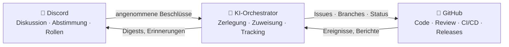

# 🗼 Tower of Babel (Turm zu Babel)

🌍 [العربية](README.ar.md) · [বাংলা](README.bn.md) · **Deutsch** · [English](../README.md) · [Español](README.es.md) · [Filipino](README.tl.md) · [Français](README.fr.md) · [हिन्दी](README.hi.md) · [Bahasa Indonesia](README.id.md) · [Italiano](README.it.md) · [日本語](README.ja.md) · [한국어](README.ko.md) · [Português](README.pt.md) · [Русский](README.ru.md) · [Kiswahili](README.sw.md) · [தமிழ்](README.ta.md) · [ไทย](README.th.md) · [Türkçe](README.tr.md) · [Tiếng Việt](README.vi.md) · [中文](README.zh.md)

> Ein offenes System für kollektive Softwareentwicklung — gesteuert von Menschen, ausgeführt von KI.
> Ein Learning-by-Building-Projekt der Schule [Skillaria.Top](https://skillaria.top).

---

## 💡 Die Idee

Menschen treffen Entscheidungen in **Discord**, der Code lebt auf **GitHub**, und dazwischen arbeitet ein **KI-Orchestrator**, der die Beschlüsse der Community in konkrete Aufgaben verwandelt, sie verteilt, den Fortschritt verfolgt und die gesamte Routine übernimmt.

Das prägende Merkmal des Projekts ist die **Selbstanwendung**: Tower of Babel wird *nach den Regeln von Tower of Babel selbst* entwickelt. Jede Verbesserung am Bot, am Orchestrator oder an den Prozessen durchläuft dieselben Abstimmungen, Aufgaben und Reviews, die das System automatisiert.



---

## 📜 Prinzipien

1. **Menschen entscheiden — die KI führt aus.** Der Orchestrator trifft keine inhaltlichen Entscheidungen aus eigenem Antrieb. Seine Quelle der Wahrheit sind die festgehaltenen Beschlüsse der Community.
2. **Transparenz.** Jede Aktion der KI und jede menschliche Entscheidung wird in ein öffentliches Protokoll geschrieben. Entscheidungen „hinter verschlossenen Türen“ gibt es nicht.
3. **Meritokratie.** Befugnisse werden nicht verteilt — sie werden durch Beiträge verdient und per Abstimmung bestätigt.
4. **Umkehrbarkeit.** Jede Entscheidung kann durch eine neue Abstimmung überprüft werden. Jede Aktion der KI lässt sich zurückrollen.
5. **Selbstanwendung.** Das Projekt entwickelt sich vom ersten Tag an nach seinen eigenen Regeln — zunächst von Hand, dann mit immer mehr Automatisierung.

---

## 👥 Rollensystem

Die Rollen sind über Discord und GitHub hinweg einheitlich: Der Bot synchronisiert sie automatisch (solange es den Bot noch nicht gibt, erledigen das die Hüter von Hand).

| Rolle | Wie man sie erhält | Discord | GitHub | Befugnisse |
|---|---|---|---|---|
| 👁️ **Beobachter** | Dem Server über das eigene Schul-Dashboard beitreten | Alle Kanäle lesen, in `#help` fragen | Forken, Issues erstellen | Zuschauen, fragen, Ideen vorschlagen |
| 🧱 **Lehrling** | Sich vorstellen + die erste Aufgabe übernehmen | Bei *Routine*-Abstimmungen mitstimmen, an Diskussionen teilnehmen | PRs aus Forks, Zuweisung zu `good first issue`-Aufgaben | Aufgaben übernehmen, an Diskussionen teilnehmen |
| ⚒️ **Maurer** | 5 gemergte PRs + Abstimmung mit einfacher Mehrheit | Bei *allen* Abstimmungen mitstimmen, RFCs erstellen | Triage: Labels, Zuweisungen; PR-Reviews | Jede Aufgabe übernehmen, reviewen, RFCs und Kandidaten vorschlagen |
| 🏛️ **Architekt** | Nominierung + 2/3 der Stimmen der Maurer | Tech-Kanäle moderieren, eine Domäne verantworten | Maintain: Merge in `main`, Milestones, Release-Branches | *Innerhalb der eigenen Domäne* allein entscheiden (siehe „Domänen“), PRs mergen |
| 🛡️ **Hüter** | Kuratoren der Schule / Gründer | Server-Administrator | Admin: Secrets, Einstellungen, Branch-Protection | Notfall-Veto, KI-Kill-Switch, Onboarding. Mischt sich nicht in die tägliche Entwicklung ein |
| 🤖 **Orchestrator** | Das ist der Bot. Man kann nicht zu ihm werden 🙂 | Eigene Rolle mit eingeschränkten Rechten | Separater Maschinen-Account, kein Merge in `main` | Siehe „KI-Orchestrator“ |

**Domänen** sind Verantwortungsbereiche, die von Architekten betreut werden (z. B. `bot`, `orchestrator`, `infra`, `docs`). Ein Architekt entscheidet Fragen innerhalb seiner Domäne ohne Abstimmung, aber drei beliebige Maurer können die Entscheidung anfechten und zur Abstimmung stellen (eine „Challenge“).

**Eine Herabstufung** erfolgt über dieselbe Abstimmung wie die Beförderung — oder automatisch nach 60 Tagen Inaktivität (die Rolle wird eingefroren und bei Rückkehr ohne Abstimmung wiederhergestellt).

---

## 🗳️ Entscheidungsfindung

Alle Entscheidungen fallen in drei Stufen. Abstimmungen finden in `#voting` statt (per Reaktionen oder über den Bot-Befehl `/vote`), und das Ergebnis wird als Datei in `decisions/` festgehalten — das ist die **Quelle der Wahrheit für die KI**.

| Stufe | Beispiele | Wer stimmt ab | Schwelle | Quorum | Dauer |
|---|---|---|---|---|---|
| 🟢 **Routine** | Feature-Benennung, Digest-Format, Aufgabenpriorität | Lehrling+ | einfache Mehrheit | 3 Stimmen | 24 h |
| 🟡 **Bedeutend** | Architektur, Tech-Stack, Roadmap, Beförderung zum Maurer/Architekten | Maurer+ | 2/3 | 50 % der aktiven Mitglieder | 48 h |
| 🔴 **Kritisch** | Änderungen an den Governance-Regeln, KI-Berechtigungen, Lizenz, Datenlöschung | Maurer+ | 3/4 **+ Zustimmung eines Hüters** | 50 % der aktiven Mitglieder | 72 h |

Außerdem gilt:

- **Entscheidung kraft Amtes.** Ein Architekt darf eine Frage in seiner Domäne ohne Abstimmung klären — die Entscheidung wird trotzdem in `decisions/` mit dem Flag `by-authority` festgehalten.
- **Notfallentscheidung.** Ein Hüter darf eigenmächtig handeln (Vorfall, Sicherheit), muss aber innerhalb von 24 h einen Bericht veröffentlichen; die Community kann die Entscheidung mit einer bedeutenden Abstimmung kippen.
- **RFC-Prozess.** Größere Vorschläge werden als RFCs im Forum-Kanal `#rfc` ausgearbeitet: Problem → Vorschlag → Alternativen → mindestens 48 h Diskussion → Abstimmung.

### Format der Entscheidungsdatei (`decisions/`)

```yaml
# decisions/2026-06-15-choose-tech-stack.yaml
id: 23
title: "Wahl des Tech-Stacks"
level: significant        # routine | significant | critical | by-authority | emergency
status: accepted          # accepted | rejected | superseded
votes: { for: 14, against: 3, abstain: 2 }
discord_thread: "<Link zum Thread>"
decision: |
  Backend in Python 3.12, Bot auf discord.py, KI hinter einem
  OpenRouter/Ollama-Adapter, PostgreSQL-Datenbank, Deployment per Docker.
tasks_hint: |              # ein Hinweis für die Zerlegung durch den Orchestrator (optional)
  Mit dem Bot-Grundgerüst und CI beginnen.
```

---

## 🤖 KI-Orchestrator

Das Gehirn der Routine. Arbeitet über OpenRouter (Cloud-Modelle) oder Ollama (lokale Modelle) hinter einem einheitlichen Adapter — der Anbieter wird per Konfiguration gewählt.

### Was er tut

- 📥 **Liest** angenommene Beschlüsse aus `decisions/` und Discord-Threads;
- 🧩 **Zerlegt** Beschlüsse in GitHub Issues: Teilaufgaben, Labels, Schätzungen, Abhängigkeiten, Milestones;
- 🎯 **Verteilt** Aufgaben nach Priorität: Freiwillige → passende Skills → geringste Auslastung. Jede Zuweisung lässt sich mit einem einzigen Befehl ablehnen;
- ⏰ **Überwacht** Deadlines: erinnert, eskaliert an den Architekten der Domäne, weist festgefahrene Aufgaben neu zu;
- 📝 **Fasst zusammen**: kurze Digests langer Diskussionen, ein wöchentlicher Fortschritts-Digest in `#announcements`;
- 🔍 **Entwirft PR-Reviews** (ein Ratschlag, kein Urteil — das letzte Wort hat ein Mensch);
- 🗳️ **Führt Abstimmungen durch**: Auszählung, Quorumskontrolle, Erzeugen der Entscheidungsdatei;
- 📒 **Führt das Audit-Log**: Jede seiner Aktionen wird in `#audit-log` veröffentlicht.

### Was er NICHT darf (harte Grenzen)

- ❌ In `main` oder Release-Branches mergen (Branch-Protection);
- ❌ Rollen von Menschen ändern (er protokolliert nur Abstimmungsergebnisse);
- ❌ Seinen eigenen System-Prompt, seine Berechtigungen oder seine Konfiguration ändern — nur über eine 🔴 kritische Abstimmung;
- ❌ Secrets, Repository-Einstellungen oder Abrechnung anfassen;
- ❌ Branches, Issues oder Nachrichten von Menschen löschen;
- ❌ Ohne festgehaltenen Beschluss handeln — auf „mündliche“ Bitten im Chat antwortet er mit „bitte formalisiert einen Beschluss“.

Die Hüter haben einen **Kill Switch** — der Bot lässt sich mit einem einzigen Befehl sofort stoppen.

---

## 🔄 Lebenszyklus einer Aufgabe

```
💬 Diskussion in Discord
        ↓
🗳️ Abstimmung → decisions/NNN.yaml
        ↓
🤖 KI zerlegt → GitHub Issues (Backlog)
        ↓
🎯 Zuweisung (Freiwillige / KI schlägt vor)
        ↓
🌿 Branch feat/NNN-short-name → Code → PR
        ↓
✅ CI (Tests, Linter) + 🤖 Review-Entwurf
        ↓
👤 Review durch einen Maurer+ → Merge durch einen Architekten
        ↓
🚀 Release → 🤖 Release Notes → Digest in Discord
```

---

## 💬 Struktur des Discord-Servers

| Kanal | Zweck |
|---|---|
| `#announcements` | Releases, Digests, wichtige Beschlüsse (es posten Architekten+ und der Bot) |
| `#rfc` *(Forum)* | Größere Vorschläge, jeder in einem eigenen Thread |
| `#voting` | Ausschließlich Abstimmungen und ihre Ergebnisse |
| `#tasks` | Aufgaben-Feed vom Orchestrator, Übernehmen/Abgeben von Aufgaben |
| `#dev-general` | Freie technische Diskussion |
| `#help` | Fragen von Neulingen — alle antworten |
| `#audit-log` | Protokoll der KI-Aktionen (nur der Bot) |
| 🔊 `Construction Site` | Sprachcalls, Mob-Sessions, Standups |

---

## 📁 Repository-Struktur (Zielbild)

```
Tower_of_Babel/
├── README.md            ← du bist hier
├── translations/        ← dieses README in 19 weiteren Sprachen
├── docs/                ← Regeln, Anleitungen, RFC-Archiv, ADRs
├── decisions/           ← Beschlussprotokoll — die Quelle der Wahrheit für die KI
├── bot/                 ← Discord-Bot (Befehle, Abstimmungen, Rollen)
├── orchestrator/        ← KI-Kern (LLM-Adapter, Zerlegung, Zuweisung)
├── integrations/        ← GitHub-API-Clients, Webhooks
├── infra/               ← Docker, Compose, CI/CD, Deployment
└── tests/               ← Tests für all das oben
```

---

## 🛠️ Technologie (Vorschlag — wird mit Abstimmung Nr. 1 bestätigt)

| Schicht | Kandidat | Warum |
|---|---|---|
| Sprache | Python 3.12+ | Niedrige Einstiegshürde für Lernende, reiches Ökosystem |
| Discord | `discord.py` | Ausgereifte Bibliothek, Slash-Commands, Events |
| GitHub | `githubkit` / REST + Webhooks | Vollständige API-Abdeckung |
| LLM | OpenRouter **und** Ollama hinter einem einheitlichen Adapter | Cloud für Qualität, lokal für kostenlos und privat |
| Webhooks/API | FastAPI | Einfach, asynchron, selbstdokumentierend |
| Datenbank | SQLite → PostgreSQL | Einfach starten, schmerzfrei wachsen |
| Infra | Docker Compose, GitHub Actions | Reproduzierbarkeit, kostenloses CI |

---

## 🗺️ Roadmap

### Phase 0 — „Das Fundament“ *(von Hand, ohne Code)*
- [ ] Den Discord-Server gemäß der obigen Struktur aufsetzen, Startrollen verteilen
- [ ] **Abstimmung Nr. 1** durchführen — den Tech-Stack bestätigen (der erste Beschluss in `decisions/`!)
- [ ] Die Regeln aus diesem README per kritischer Abstimmung bestätigen
- [ ] Einen kompletten Aufgaben-Lebenszyklus von Hand durchspielen — den Prozess verstehen, bevor man ihn automatisiert

### Phase 1 — „Der erste Stein“: der Discord-Bot
- [ ] Bot-Grundgerüst, Deployment per Docker
- [ ] `/vote` — Abstimmung anlegen, Auszählung, Quorums- und Fristenkontrolle
- [ ] Automatisches Erzeugen der Entscheidungsdatei in `decisions/` (PR vom Bot)
- [ ] Synchronisation Discord-Rolle ↔ GitHub-Team

### Phase 2 — „Die Brücke“: GitHub-Integration
- [ ] GitHub-Webhooks → Ereignisse in `#tasks` (PR eröffnet, CI fehlgeschlagen, gemergt)
- [ ] Befehle `/task take`, `/task done`, `/task status`
- [ ] Projektboard (GitHub Projects), Status-Automatisierung

### Phase 3 — „Die Stimme des Turms“: die KI anschließen
- [ ] Einheitlicher LLM-Adapter (OpenRouter / Ollama, Auswahl per Konfiguration)
- [ ] Zerlegung von Beschlüssen → Issues mit Labels und Abhängigkeiten
- [ ] Thread-Zusammenfassungen und der wöchentliche Digest

### Phase 4 — „Das Orchester“: vollständige Steuerung
- [ ] Aufgabenzuweisung (Freiwillige → Skills → Auslastung)
- [ ] Deadline-Kontrolle, Erinnerungen, Eskalation
- [ ] KI-Review-Entwürfe für PRs, Release Notes
- [ ] `#audit-log` und der Kill Switch

### Phase 5 — „Selbstbau“
- [ ] Das System steuert seine eigene Entwicklung vollständig selbst (Dogfooding)
- [ ] Metriken: Aufgaben-Velocity, Aktivität, Review-Qualität
- [ ] Ein zweites Projekt onboarden — die Übertragbarkeit testen
- [ ] Eine öffentliche Vorlage: „Errichte deinen eigenen Turm an einem Abend“

---

## 🚪 Wie man mitmacht

Der Discord-Server des Projekts steht ausschließlich Lernenden von Skillaria.Top offen:

1. Werde Schüler:in bei [Skillaria.Top](https://skillaria.top);
2. Lerne und wachse, bis du die Stufe **Intern** erreichst;
3. Hole dir den Discord-Einladungslink in deinem persönlichen Dashboard;
4. Stell dich in `#help` vor — du erhältst die Rolle 🧱 Lehrling;
5. Übernimm eine Aufgabe mit dem Label [`good first issue`](https://github.com/skillariatop/Tower_of_Babel/labels/good%20first%20issue);
6. Eröffne einen PR — und schon bist du auf dem Weg zum ⚒️ Maurer.

Du kannst nicht programmieren? Wir brauchen auch Tester, Technical Writer, Moderatoren und Prozessdesigner — Beiträge zu `docs/` und `decisions/` zählen genauso viel wie Code.

---

## 📄 Lizenz

Das Projekt wird unter der Lizenz in der Datei [LICENSE](../LICENSE) verbreitet.

> *„Und der HERR sprach: Siehe, es ist einerlei Volk und einerlei Sprache unter ihnen allen, und dies ist der Anfang ihres Tuns; nun wird ihnen nichts mehr verwehrt werden können von allem, was sie sich vorgenommen haben zu tun.“* — 1. Mose 11,6.
> Diesmal haben wir Versionskontrolle.
