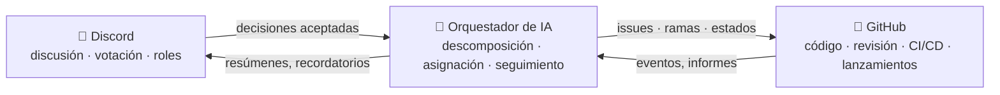

# 🗼 Tower of Babel (La Torre de Babel)

🌍 [العربية](README.ar.md) · [বাংলা](README.bn.md) · [Deutsch](README.de.md) · [English](../README.md) · **Español** · [Filipino](README.tl.md) · [Français](README.fr.md) · [हिन्दी](README.hi.md) · [Bahasa Indonesia](README.id.md) · [Italiano](README.it.md) · [日本語](README.ja.md) · [한국어](README.ko.md) · [Português](README.pt.md) · [Русский](README.ru.md) · [Kiswahili](README.sw.md) · [தமிழ்](README.ta.md) · [ไทย](README.th.md) · [Türkçe](README.tr.md) · [Tiếng Việt](README.vi.md) · [中文](README.zh.md)

> Un sistema abierto de desarrollo colectivo de software — gobernado por personas, ejecutado por IA.
> Un proyecto de aprender construyendo de la escuela [Skillaria.Top](https://skillaria.top).

---

## 💡 La idea

Las personas toman las decisiones en **Discord**, el código vive en **GitHub**, y entre ambos trabaja un **Orquestador de IA** que convierte las decisiones de la comunidad en tareas concretas, las asigna, sigue su progreso y se encarga de toda la rutina.

El rasgo distintivo del proyecto es la **autoaplicación**: Tower of Babel se desarrolla *según las propias reglas de Tower of Babel*. Cada mejora del bot, del orquestador o de los procesos pasa por las mismas votaciones, tareas y revisiones que el sistema automatiza.



---

## 📜 Principios

1. **Las personas deciden — la IA ejecuta.** El Orquestador no toma ninguna decisión de fondo por su cuenta. Su fuente de verdad son las decisiones registradas de la comunidad.
2. **Transparencia.** Cada acción de la IA y cada decisión humana se escribe en un registro público. No hay decisiones "a puerta cerrada".
3. **Meritocracia.** La autoridad no se regala — se gana con contribuciones y se confirma con una votación.
4. **Reversibilidad.** Cualquier decisión puede reconsiderarse con una nueva votación. Cualquier acción de la IA puede revertirse.
5. **Autoaplicación.** El proyecto evoluciona según sus propias reglas desde el primer día — primero a mano, luego con cada vez más automatización.

---

## 👥 Sistema de roles

Los roles están unificados entre Discord y GitHub: el bot los sincroniza automáticamente (mientras el bot no exista, los Guardianes lo hacen a mano).

| Rol | Cómo se obtiene | Discord | GitHub | Autoridad |
|---|---|---|---|---|
| 👁️ **Observador** | Unirse al servidor desde tu panel de la escuela | Leer todos los canales, preguntar en `#help` | Fork, crear Issues | Observar, preguntar, proponer ideas |
| 🧱 **Aprendiz** | Presentarse + tomar tu primera tarea | Votar en votaciones *rutinarias*, participar en discusiones | PRs desde forks, asignación a tareas `good first issue` | Tomar tareas, participar en discusiones |
| ⚒️ **Albañil** | 5 PRs fusionados + votación por mayoría simple | Votar en *todas* las votaciones, crear RFCs | Triage: etiquetas, asignaciones; revisiones de PRs | Tomar cualquier tarea, revisar, proponer RFCs y candidatos |
| 🏛️ **Arquitecto** | Nominación + 2/3 de los votos de los Albañiles | Moderar canales técnicos, ser dueño de un dominio | Maintain: merge a `main`, milestones, ramas de lanzamiento | Decidir *dentro de su dominio* de forma unilateral (ver "Dominios"), fusionar PRs |
| 🛡️ **Guardián** | Curadores de la escuela / fundadores | Administrador del servidor | Admin: secretos, configuración, protección de ramas | Veto de emergencia, interruptor de apagado de la IA, onboarding. No interfiere en el desarrollo del día a día |
| 🤖 **Orquestador** | Es el bot. No puedes convertirte en él 🙂 | Su propio rol con permisos limitados | Cuenta de máquina aparte, sin merge a `main` | Ver "Orquestador de IA" |

Los **dominios** son áreas de responsabilidad a cargo de los Arquitectos (p. ej. `bot`, `orchestrator`, `infra`, `docs`). Un Arquitecto decide los asuntos de su dominio sin votación, pero cualesquiera 3 Albañiles pueden impugnar la decisión y someterla a votación (un "desafío").

La **degradación** se realiza mediante la misma votación que la promoción, o de forma automática tras 60 días de inactividad (el rol se congela y se restituye al regresar, sin votación).

---

## 🗳️ Toma de decisiones

Todas las decisiones se dividen en tres niveles. Las votaciones se celebran en `#voting` (mediante reacciones o el comando `/vote` del bot), y el resultado se registra como un archivo en `decisions/` — esta es la **fuente de verdad para la IA**.

| Nivel | Ejemplos | Quién vota | Umbral | Quórum | Duración |
|---|---|---|---|---|---|
| 🟢 **Rutinaria** | nombre de una feature, formato del resumen, prioridad de tareas | Aprendiz+ | mayoría simple | 3 votos | 24 h |
| 🟡 **Significativa** | arquitectura, stack tecnológico, hoja de ruta, promoción a Albañil/Arquitecto | Albañil+ | 2/3 | 50% de los miembros activos | 48 h |
| 🔴 **Crítica** | cambios en las reglas de gobernanza, permisos de la IA, licencia, borrado de datos | Albañil+ | 3/4 **+ aprobación de un Guardián** | 50% de los miembros activos | 72 h |

Además:

- **Decisión por autoridad.** Un Arquitecto puede resolver un asunto de su dominio sin votación — la decisión se registra igualmente en `decisions/` con la marca `by-authority`.
- **Decisión de emergencia.** Un Guardián puede actuar unilateralmente (incidente, seguridad), pero debe publicar un informe en un plazo de 24 h; la comunidad puede anular la decisión con una votación significativa.
- **Proceso de RFC.** Las propuestas mayores se redactan como RFCs en el canal de foro `#rfc`: problema → propuesta → alternativas → al menos 48 h de discusión → votación.

### Formato del archivo de decisión (`decisions/`)

```yaml
# decisions/2026-06-15-choose-tech-stack.yaml
id: 23
title: "Elección del stack tecnológico"
level: significant        # routine | significant | critical | by-authority | emergency
status: accepted          # accepted | rejected | superseded
votes: { for: 14, against: 3, abstain: 2 }
discord_thread: "<enlace al hilo>"
decision: |
  Backend en Python 3.12, bot con discord.py, IA detrás de un
  adaptador OpenRouter/Ollama, base de datos PostgreSQL, despliegue con Docker.
tasks_hint: |              # una pista para la descomposición del Orquestador (opcional)
  Empezar por el esqueleto del bot y la CI.
```

---

## 🤖 Orquestador de IA

El cerebro de la rutina. Funciona a través de OpenRouter (modelos en la nube) u Ollama (modelos locales) detrás de un único adaptador — el proveedor se elige por configuración.

### Qué hace

- 📥 **Lee** las decisiones aceptadas de `decisions/` y los hilos de Discord;
- 🧩 **Descompone** las decisiones en GitHub Issues: subtareas, etiquetas, estimaciones, dependencias, milestones;
- 🎯 **Asigna** las tareas por prioridad: voluntario → habilidades afines → menor carga de trabajo. Cualquier asignación puede rechazarse con un solo comando;
- ⏰ **Controla** los plazos: recuerda, escala al Arquitecto del dominio, reasigna las tareas estancadas;
- 📝 **Resume**: síntesis breves de discusiones largas, un resumen semanal de progreso en `#announcements`;
- 🔍 **Redacta borradores de revisión de PRs** (consejo, no veredicto — la última palabra es de un humano);
- 🗳️ **Gestiona las votaciones**: recuento, control de quórum, generación del archivo de decisión;
- 📒 **Mantiene el registro de auditoría**: cada acción que realiza se publica en `#audit-log`.

### Qué NO puede hacer (límites estrictos)

- ❌ Hacer merge a `main` ni a las ramas de lanzamiento (protección de ramas);
- ❌ Cambiar los roles de las personas (solo registra los resultados de las votaciones);
- ❌ Modificar su propio system prompt, permisos o configuración — solo mediante una votación 🔴 crítica;
- ❌ Tocar secretos, configuración del repositorio o facturación;
- ❌ Borrar ramas, issues o mensajes de las personas;
- ❌ Actuar sin una decisión registrada — a las peticiones "de palabra" en el chat responde "por favor, formaliza una decisión".

Los Guardianes disponen de un **interruptor de apagado** — el bot puede detenerse al instante con un solo comando.

---

## 🔄 Ciclo de vida de una tarea

```
💬 Discusión en Discord
        ↓
🗳️ Votación → decisions/NNN.yaml
        ↓
🤖 La IA descompone → GitHub Issues (backlog)
        ↓
🎯 Asignación (voluntario / la IA sugiere)
        ↓
🌿 Rama feat/NNN-short-name → código → PR
        ↓
✅ CI (tests, linters) + 🤖 borrador de revisión
        ↓
👤 Revisión por un Albañil+ → merge por un Arquitecto
        ↓
🚀 Lanzamiento → 🤖 notas de la versión → resumen en Discord
```

---

## 💬 Estructura del servidor de Discord

| Canal | Propósito |
|---|---|
| `#announcements` | Lanzamientos, resúmenes, decisiones importantes (publican Arquitectos+ y el bot) |
| `#rfc` *(foro)* | Propuestas mayores, cada una en su propio hilo |
| `#voting` | Solo votaciones y sus resultados |
| `#tasks` | Feed de tareas del Orquestador, tomar/entregar tareas |
| `#dev-general` | Discusión técnica libre |
| `#help` | Preguntas de los recién llegados — responde todo el mundo |
| `#audit-log` | Registro de acciones de la IA (solo el bot) |
| 🔊 `Construction Site` | Llamadas de voz, sesiones mob, standups |

---

## 📁 Estructura del repositorio (objetivo)

```
Tower_of_Babel/
├── README.md            ← estás aquí
├── translations/        ← este README en otros 19 idiomas
├── docs/                ← reglas, guías, archivo de RFCs, ADRs
├── decisions/           ← registro de decisiones — la fuente de verdad para la IA
├── bot/                 ← bot de Discord (comandos, votaciones, roles)
├── orchestrator/        ← núcleo de IA (adaptador LLM, descomposición, asignación)
├── integrations/        ← clientes de la API de GitHub, webhooks
├── infra/               ← Docker, compose, CI/CD, despliegue
└── tests/               ← tests de todo lo anterior
```

---

## 🛠️ Tecnología (propuesta — pendiente de aprobación en la Votación #1)

| Capa | Candidato | Por qué |
|---|---|---|
| Lenguaje | Python 3.12+ | Barrera de entrada baja para estudiantes, ecosistema rico |
| Discord | `discord.py` | Biblioteca madura, slash commands, eventos |
| GitHub | `githubkit` / REST + webhooks | Cobertura completa de la API |
| LLM | OpenRouter **y** Ollama detrás de un único adaptador | La nube para la calidad, lo local para lo gratuito y privado |
| Webhooks/API | FastAPI | Simple, asíncrono, autodocumentado |
| Base de datos | SQLite → PostgreSQL | Empezar simple, crecer sin dolor |
| Infra | Docker Compose, GitHub Actions | Reproducibilidad, CI gratuita |

---

## 🗺️ Hoja de ruta

### Fase 0 — "Los cimientos" *(manual, sin código)*
- [ ] Crear el servidor de Discord según la estructura anterior, repartir los roles iniciales
- [ ] Celebrar la **Votación #1** — aprobar el stack tecnológico (¡la primera decisión en `decisions/`!)
- [ ] Aprobar las reglas de este README con una votación crítica
- [ ] Recorrer a mano un ciclo de vida completo de una tarea — entender el proceso antes de automatizarlo

### Fase 1 — "La primera piedra": el bot de Discord
- [ ] Esqueleto del bot, despliegue con Docker
- [ ] `/vote` — creación de una votación, recuento, control de quórum y de plazos
- [ ] Generación automática del archivo de decisión en `decisions/` (PR del bot)
- [ ] Sincronización rol de Discord ↔ equipo de GitHub

### Fase 2 — "El puente": integración con GitHub
- [ ] Webhooks de GitHub → eventos en `#tasks` (PR abierto, CI fallida, merge hecho)
- [ ] Comandos `/task take`, `/task done`, `/task status`
- [ ] Tablero de proyecto (GitHub Projects), automatización de estados

### Fase 3 — "La voz de la Torre": conectar la IA
- [ ] Adaptador LLM unificado (OpenRouter / Ollama, elegido por configuración)
- [ ] Descomposición de decisiones → Issues con etiquetas y dependencias
- [ ] Resúmenes de hilos y el resumen semanal

### Fase 4 — "La orquesta": gestión completa
- [ ] Asignación de tareas (voluntario → habilidades → carga de trabajo)
- [ ] Control de plazos, recordatorios, escalado
- [ ] Borradores de revisión de PRs por la IA, notas de versión
- [ ] `#audit-log` y el interruptor de apagado

### Fase 5 — "Autoconstrucción"
- [ ] El sistema gestiona por completo su propio desarrollo (dogfooding)
- [ ] Métricas: velocidad de las tareas, actividad, calidad de las revisiones
- [ ] Incorporar un segundo proyecto — probar la portabilidad
- [ ] Una plantilla pública: "despliega tu propia Torre en una tarde"

---

## 🚪 Cómo unirse

El servidor de Discord del proyecto está disponible solo para estudiantes de Skillaria.Top:

1. Conviértete en estudiante de [Skillaria.Top](https://skillaria.top);
2. Aprende y progresa hasta alcanzar el nivel **Intern**;
3. Obtén el enlace de invitación a Discord en tu panel personal;
4. Preséntate en `#help` — recibirás el rol de 🧱 Aprendiz;
5. Toma una tarea con la etiqueta [`good first issue`](https://github.com/skillariatop/Tower_of_Babel/labels/good%20first%20issue);
6. Abre un PR — y ya estás en camino de ser ⚒️ Albañil.

¿No sabes programar? También necesitamos testers, redactores técnicos, moderadores y diseñadores de procesos — las contribuciones a `docs/` y `decisions/` se valoran tanto como el código.

---

## 📄 Licencia

El proyecto se distribuye bajo la licencia del archivo [LICENSE](../LICENSE).

> *"Y dijo Jehová: He aquí el pueblo es uno, y todos estos tienen un solo lenguaje; y han comenzado la obra, y nada les hará desistir ahora de lo que han pensado hacer"* — Génesis 11:6.
> Esta vez, tenemos control de versiones.
