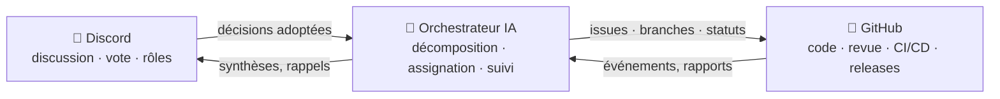

# 🗼 Tower of Babel — La Tour de Babel

🌍 [العربية](README.ar.md) · [বাংলা](README.bn.md) · [Deutsch](README.de.md) · [English](../README.md) · [Español](README.es.md) · [Filipino](README.tl.md) · **Français** · [हिन्दी](README.hi.md) · [Bahasa Indonesia](README.id.md) · [Italiano](README.it.md) · [日本語](README.ja.md) · [한국어](README.ko.md) · [Português](README.pt.md) · [Русский](README.ru.md) · [Kiswahili](README.sw.md) · [தமிழ்](README.ta.md) · [ไทย](README.th.md) · [Türkçe](README.tr.md) · [Tiếng Việt](README.vi.md) · [中文](README.zh.md)

> Un système ouvert de développement logiciel collectif — gouverné par les humains, exécuté par l'IA.
> Un projet d'apprentissage par la pratique de l'école [Skillaria.Top](https://skillaria.top).

---

## 💡 L'idée

Les humains prennent les décisions dans **Discord**, le code vit sur **GitHub**, et entre les deux travaille un **Orchestrateur IA** qui transforme les décisions de la communauté en tâches concrètes, les assigne, suit leur avancement et s'occupe de toute la routine.

La caractéristique fondatrice du projet, c'est l'**auto-application** : Tower of Babel se développe *selon les règles de Tower of Babel elle-même*. Chaque amélioration du bot, de l'orchestrateur ou des processus passe par les mêmes votes, tâches et revues que le système automatise.



---

## 📜 Principes

1. **Les humains décident — l'IA exécute.** L'Orchestrateur ne prend aucune décision de fond de sa propre initiative. Sa source de vérité, ce sont les décisions de la communauté consignées par écrit.
2. **Transparence.** Chaque action de l'IA et chaque décision humaine est inscrite dans un journal public. Pas de décisions « en coulisses ».
3. **Méritocratie.** L'autorité ne se distribue pas — elle se gagne par la contribution et se confirme par un vote.
4. **Réversibilité.** Toute décision peut être remise en question par un nouveau vote. Toute action de l'IA peut être annulée.
5. **Auto-application.** Le projet évolue selon ses propres règles dès le premier jour — d'abord à la main, puis avec toujours plus d'automatisation.

---

## 👥 Système de rôles

Les rôles sont unifiés entre Discord et GitHub : le bot les synchronise automatiquement (tant que le bot n'existe pas, les Gardiens le font à la main).

| Rôle | Comment l'obtenir | Discord | GitHub | Autorité |
|---|---|---|---|---|
| 👁️ **Observateur** | Rejoindre le serveur via son tableau de bord de l'école | Lire tous les canaux, poser des questions dans `#help` | Fork, créer des Issues | Observer, questionner, proposer des idées |
| 🧱 **Apprenti** | Se présenter + prendre sa première tâche | Voter dans les votes *courants*, participer aux discussions | PRs depuis des forks, assignation aux tâches `good first issue` | Prendre des tâches, participer aux discussions |
| ⚒️ **Maçon** | 5 PRs fusionnées + vote à la majorité simple | Voter dans *tous* les votes, créer des RFC | Triage : labels, assignations ; revues de PR | Prendre n'importe quelle tâche, faire des revues, proposer des RFC et des candidats |
| 🏛️ **Architecte** | Nomination + 2/3 des voix des Maçons | Modérer les canaux techniques, posséder un domaine | Maintain : merge dans `main`, jalons, branches de release | Décider *dans son domaine* unilatéralement (voir « Domaines »), fusionner les PRs |
| 🛡️ **Gardien** | Curateurs / fondateurs de l'école | Administrateur du serveur | Admin : secrets, paramètres, protection des branches | Veto d'urgence, coupe-circuit de l'IA, onboarding. N'intervient pas dans le développement quotidien |
| 🤖 **Orchestrateur** | C'est le bot. Vous ne pouvez pas le devenir 🙂 | Son propre rôle aux droits limités | Compte machine séparé, pas de merge dans `main` | Voir « Orchestrateur IA » |

Les **domaines** sont des périmètres de responsabilité détenus par les Architectes (p. ex. `bot`, `orchestrator`, `infra`, `docs`). Un Architecte tranche les questions de son domaine sans vote, mais 3 Maçons peuvent contester la décision et la soumettre au vote (un « challenge »).

La **rétrogradation** passe par le même vote que la promotion, ou intervient automatiquement après 60 jours d'inactivité (le rôle est gelé et restitué au retour sans vote).

---

## 🗳️ Prise de décision

Toutes les décisions se répartissent en trois niveaux. Les votes ont lieu dans `#voting` (via des réactions ou la commande `/vote` du bot), et le résultat est consigné sous forme de fichier dans `decisions/` — c'est la **source de vérité pour l'IA**.

| Niveau | Exemples | Qui vote | Seuil | Quorum | Durée |
|---|---|---|---|---|---|
| 🟢 **Courant** | nom d'une fonctionnalité, format de la synthèse, priorité d'une tâche | Apprenti+ | majorité simple | 3 voix | 24 h |
| 🟡 **Significatif** | architecture, stack technique, feuille de route, promotion en Maçon/Architecte | Maçon+ | 2/3 | 50 % des membres actifs | 48 h |
| 🔴 **Critique** | modification des règles de gouvernance, permissions de l'IA, licence, suppression de données | Maçon+ | 3/4 **+ approbation d'un Gardien** | 50 % des membres actifs | 72 h |

En complément :

- **Décision d'autorité.** Un Architecte peut trancher une question de son domaine sans vote — la décision est tout de même consignée dans `decisions/` avec le flag `by-authority`.
- **Décision d'urgence.** Un Gardien peut agir unilatéralement (incident, sécurité), mais doit publier un rapport sous 24 h ; la communauté peut annuler la décision par un vote significatif.
- **Processus RFC.** Les grandes propositions sont rédigées en RFC dans le canal forum `#rfc` : problème → proposition → alternatives → au moins 48 h de discussion → vote.

### Format du fichier de décision (`decisions/`)

```yaml
# decisions/2026-06-15-choose-tech-stack.yaml
id: 23
title: "Choix de la stack technique"
level: significant        # routine | significant | critical | by-authority | emergency
status: accepted          # accepted | rejected | superseded
votes: { for: 14, against: 3, abstain: 2 }
discord_thread: "<lien vers le fil>"
decision: |
  Backend en Python 3.12, bot sur discord.py, IA derrière un
  adaptateur OpenRouter/Ollama, base de données PostgreSQL, déploiement Docker.
tasks_hint: |              # un indice pour la décomposition par l'Orchestrateur (optionnel)
  Commencer par le squelette du bot et la CI.
```

---

## 🤖 Orchestrateur IA

Le cerveau de la routine. Fonctionne via OpenRouter (modèles cloud) ou Ollama (modèles locaux) derrière un adaptateur unique — le fournisseur se choisit dans la config.

### Ce qu'il fait

- 📥 **Lit** les décisions adoptées dans `decisions/` et les fils Discord ;
- 🧩 **Décompose** les décisions en GitHub Issues : sous-tâches, labels, estimations, dépendances, jalons ;
- 🎯 **Assigne** les tâches par priorité : volontaire → compétences correspondantes → charge la plus faible. Toute assignation peut être refusée d'une seule commande ;
- ⏰ **Suit** les échéances : rappelle, escalade vers l'Architecte du domaine, réassigne les tâches au point mort ;
- 📝 **Synthétise** : de courts résumés des longues discussions, une synthèse hebdomadaire de l'avancement dans `#announcements` ;
- 🔍 **Rédige des brouillons de revue de PR** (un conseil, pas un verdict — le dernier mot revient à un humain) ;
- 🗳️ **Gère les votes** : décompte, contrôle du quorum, génération du fichier de décision ;
- 📒 **Tient le journal d'audit** : chacune de ses actions est publiée dans `#audit-log`.

### Ce qu'il NE PEUT PAS faire (limites strictes)

- ❌ Merger dans `main` ou les branches de release (protection des branches) ;
- ❌ Changer les rôles des personnes (il ne fait qu'enregistrer les résultats des votes) ;
- ❌ Modifier son propre prompt système, ses permissions ou sa config — uniquement via un vote 🔴 critique ;
- ❌ Toucher aux secrets, aux paramètres du dépôt ou à la facturation ;
- ❌ Supprimer des branches, des issues ou des messages des membres ;
- ❌ Agir sans décision consignée — aux demandes « orales » dans le chat, il répond « merci de formaliser une décision ».

Les Gardiens disposent d'un **coupe-circuit** — le bot peut être arrêté instantanément d'une seule commande.

---

## 🔄 Cycle de vie d'une tâche

```
💬 Discussion dans Discord
        ↓
🗳️ Vote → decisions/NNN.yaml
        ↓
🤖 L'IA décompose → GitHub Issues (backlog)
        ↓
🎯 Assignation (volontaire / suggestion de l'IA)
        ↓
🌿 Branche feat/NNN-short-name → code → PR
        ↓
✅ CI (tests, linters) + 🤖 brouillon de revue
        ↓
👤 Revue par un Maçon+ → merge par un Architecte
        ↓
🚀 Release → 🤖 notes de version → synthèse dans Discord
```

---

## 💬 Structure du serveur Discord

| Canal | Rôle |
|---|---|
| `#announcements` | Releases, synthèses, décisions importantes (publient : Architectes+ et le bot) |
| `#rfc` *(forum)* | Grandes propositions, chacune dans son propre fil |
| `#voting` | Uniquement les votes et leurs résultats |
| `#tasks` | Flux des tâches de l'Orchestrateur, prise/rendu des tâches |
| `#dev-general` | Discussion technique libre |
| `#help` | Questions des nouveaux — tout le monde répond |
| `#audit-log` | Journal des actions de l'IA (bot uniquement) |
| 🔊 `Construction Site` | Appels vocaux, sessions de mob programming, standups |

---

## 📁 Structure du dépôt (cible)

```
Tower_of_Babel/
├── README.md            ← vous êtes ici
├── translations/        ← ce README en 19 autres langues
├── docs/                ← règles, guides, archive des RFC, ADRs
├── decisions/           ← journal des décisions — la source de vérité pour l'IA
├── bot/                 ← bot Discord (commandes, votes, rôles)
├── orchestrator/        ← cœur IA (adaptateur LLM, décomposition, assignation)
├── integrations/        ← clients de l'API GitHub, webhooks
├── infra/               ← Docker, compose, CI/CD, déploiement
└── tests/               ← des tests pour tout ce qui précède
```

---

## 🛠️ Technologies (proposition — à approuver par le Vote n°1)

| Couche | Candidat | Pourquoi |
|---|---|---|
| Langage | Python 3.12+ | Faible barrière d'entrée pour les étudiants, écosystème riche |
| Discord | `discord.py` | Bibliothèque mature, slash commands, événements |
| GitHub | `githubkit` / REST + webhooks | Couverture complète de l'API |
| LLM | OpenRouter **et** Ollama derrière un adaptateur unique | Le cloud pour la qualité, le local pour la gratuité et la confidentialité |
| Webhooks/API | FastAPI | Simple, asynchrone, auto-documenté |
| Base de données | SQLite → PostgreSQL | Démarrer simple, grandir sans douleur |
| Infra | Docker Compose, GitHub Actions | Reproductibilité, CI gratuite |

---

## 🗺️ Feuille de route

### Phase 0 — « Les Fondations » *(à la main, sans code)*
- [ ] Créer le serveur Discord selon la structure ci-dessus, distribuer les rôles de départ
- [ ] Tenir le **Vote n°1** — approuver la stack technique (la première décision dans `decisions/` !)
- [ ] Approuver les règles de ce README par un vote critique
- [ ] Dérouler un cycle de vie de tâche complet à la main — comprendre le processus avant de l'automatiser

### Phase 1 — « La Première Pierre » : le bot Discord
- [ ] Squelette du bot, déploiement Docker
- [ ] `/vote` — création d'un vote, décompte, contrôle du quorum et des délais
- [ ] Génération automatique du fichier de décision dans `decisions/` (PR du bot)
- [ ] Synchronisation rôle Discord ↔ équipe GitHub

### Phase 2 — « Le Pont » : intégration GitHub
- [ ] Webhooks GitHub → événements dans `#tasks` (PR ouverte, CI en échec, merge effectué)
- [ ] Commandes `/task take`, `/task done`, `/task status`
- [ ] Tableau de projet (GitHub Projects), automatisation des statuts

### Phase 3 — « La Voix de la Tour » : branchement de l'IA
- [ ] Adaptateur LLM unifié (OpenRouter / Ollama, choisi dans la config)
- [ ] Décomposition des décisions → Issues avec labels et dépendances
- [ ] Résumés des fils et synthèse hebdomadaire

### Phase 4 — « L'Orchestre » : gestion complète
- [ ] Assignation des tâches (volontaire → compétences → charge)
- [ ] Contrôle des échéances, rappels, escalade
- [ ] Brouillons de revues de PR par l'IA, notes de version
- [ ] `#audit-log` et le coupe-circuit

### Phase 5 — « L'Auto-Construction »
- [ ] Le système gère entièrement son propre développement (dogfooding)
- [ ] Métriques : vélocité des tâches, activité, qualité des revues
- [ ] Embarquer un second projet — tester la portabilité
- [ ] Un modèle public : « déployez votre propre Tour en une soirée »

---

## 🚪 Comment rejoindre

Le serveur Discord du projet est réservé aux étudiants de Skillaria.Top :

1. Devenez étudiant sur [Skillaria.Top](https://skillaria.top) ;
2. Apprenez et progressez jusqu'au niveau **Intern** ;
3. Récupérez le lien d'invitation Discord dans votre tableau de bord personnel ;
4. Présentez-vous dans `#help` — vous recevrez le rôle 🧱 Apprenti ;
5. Prenez une tâche étiquetée [`good first issue`](https://github.com/skillariatop/Tower_of_Babel/labels/good%20first%20issue) ;
6. Ouvrez une PR — et vous voilà en route vers ⚒️ Maçon.

Vous ne savez pas coder ? Nous avons aussi besoin de testeurs, de rédacteurs techniques, de modérateurs et de concepteurs de processus — les contributions à `docs/` et `decisions/` valent autant que le code.

---

## 📄 Licence

Le projet est distribué sous la licence du fichier [LICENSE](../LICENSE).

> *« Et l'Éternel dit : Voici, ils forment un seul peuple et ont tous une même langue, et c'est là ce qu'ils ont entrepris ; maintenant rien ne les empêcherait de faire tout ce qu'ils auraient projeté. »* — Genèse 11:6.
> Cette fois, nous avons un système de contrôle de version.
