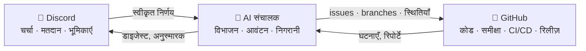

# 🗼 Tower of Babel (बाबेल की मीनार)

🌍 [العربية](README.ar.md) · [বাংলা](README.bn.md) · [Deutsch](README.de.md) · [English](../README.md) · [Español](README.es.md) · [Filipino](README.tl.md) · [Français](README.fr.md) · **हिन्दी** · [Bahasa Indonesia](README.id.md) · [Italiano](README.it.md) · [日本語](README.ja.md) · [한국어](README.ko.md) · [Português](README.pt.md) · [Русский](README.ru.md) · [Kiswahili](README.sw.md) · [தமிழ்](README.ta.md) · [ไทย](README.th.md) · [Türkçe](README.tr.md) · [Tiếng Việt](README.vi.md) · [中文](README.zh.md)

> सामूहिक सॉफ़्टवेयर विकास की एक खुली प्रणाली — शासन लोगों का, क्रियान्वयन AI का।
> [Skillaria.Top](https://skillaria.top) स्कूल का एक "बनाते-बनाते सीखो" प्रोजेक्ट।

---

## 💡 मूल विचार

लोग निर्णय **Discord** में लेते हैं, कोड **GitHub** पर रहता है, और इन दोनों के बीच काम करता है एक **AI संचालक** — जो समुदाय के निर्णयों को ठोस कार्यों में बदलता है, उन्हें सौंपता है, प्रगति पर नज़र रखता है और सारा रोज़मर्रा का काम संभालता है।

इस प्रोजेक्ट की सबसे ख़ास बात है **स्व-प्रयोग (self-application)**: Tower of Babel का विकास *स्वयं Tower of Babel के नियमों से* होता है। बॉट, संचालक या प्रक्रियाओं में हर सुधार उन्हीं मतदानों, कार्यों और समीक्षाओं से होकर गुज़रता है, जिन्हें यह प्रणाली स्वचालित करती है।



---

## 📜 सिद्धांत

1. **निर्णय लोग लेते हैं — AI उन्हें पूरा करता है।** संचालक अपनी ओर से कोई सारगर्भित निर्णय नहीं लेता। उसका सत्य का स्रोत है समुदाय के दर्ज किए गए निर्णय।
2. **पारदर्शिता।** AI की हर कार्रवाई और इंसान का हर निर्णय सार्वजनिक लॉग में दर्ज होता है। "बंद दरवाज़ों के पीछे" कोई निर्णय नहीं होता।
3. **योग्यता-तंत्र।** अधिकार बाँटे नहीं जाते — वे योगदान से अर्जित किए जाते हैं और मतदान से पुष्ट होते हैं।
4. **प्रतिवर्तनीयता।** किसी भी निर्णय पर नए मतदान से पुनर्विचार किया जा सकता है। AI की कोई भी कार्रवाई वापस लौटाई जा सकती है।
5. **स्व-प्रयोग।** प्रोजेक्ट पहले दिन से अपने ही नियमों के अनुसार विकसित होता है — शुरुआत में हाथ से, फिर धीरे-धीरे बढ़ते स्वचालन के साथ।

---

## 👥 भूमिका प्रणाली

भूमिकाएँ Discord और GitHub में एक समान हैं: बॉट इन्हें अपने-आप समकालिक रखता है (जब तक बॉट नहीं बना, यह काम रखवाले हाथ से करते हैं)।

| भूमिका | कैसे मिलती है | Discord | GitHub | अधिकार |
|---|---|---|---|---|
| 👁️ **प्रेक्षक** | अपने स्कूल डैशबोर्ड से सर्वर से जुड़ें | सभी चैनल पढ़ना, `#help` में सवाल पूछना | Fork करना, Issues बनाना | देखना, पूछना, विचार सुझाना |
| 🧱 **शागिर्द** | अपना परिचय दें + पहला कार्य उठाएँ | *रोज़मर्रा* के मतदानों में वोट देना, चर्चाओं में भाग लेना | Fork से PR, `good first issue` कार्यों पर नियुक्ति | कार्य लेना, चर्चाओं में भाग लेना |
| ⚒️ **राजमिस्त्री** | 5 merge हुए PR + साधारण बहुमत का मतदान | *सभी* मतदानों में वोट देना, RFC बनाना | Triage: लेबल, नियुक्तियाँ; PR की समीक्षा | कोई भी कार्य लेना, समीक्षा करना, RFC और उम्मीदवार प्रस्तावित करना |
| 🏛️ **वास्तुकार** | नामांकन + राजमिस्त्रियों के 2/3 वोट | तकनीकी चैनलों का संचालन, एक क्षेत्र का स्वामित्व | Maintain: `main` में merge, milestones, release branches | *अपने क्षेत्र में* अकेले निर्णय लेना (देखें "क्षेत्र"), PR merge करना |
| 🛡️ **रखवाला** | स्कूल के क्यूरेटर / संस्थापक | सर्वर प्रशासक | Admin: secrets, सेटिंग्स, branch protection | आपातकालीन वीटो, AI kill switch, ऑनबोर्डिंग। रोज़मर्रा के विकास में दख़ल नहीं देता |
| 🤖 **संचालक** | यह तो बॉट है। आप यह नहीं बन सकते 🙂 | सीमित अधिकारों वाली अपनी अलग भूमिका | अलग machine account, `main` में merge नहीं | देखें "AI संचालक" |

**क्षेत्र (Domains)** वे ज़िम्मेदारी के दायरे हैं जिनके स्वामी वास्तुकार होते हैं (जैसे `bot`, `orchestrator`, `infra`, `docs`)। वास्तुकार अपने क्षेत्र के मामले बिना मतदान के तय करता है, लेकिन कोई भी 3 राजमिस्त्री उस निर्णय को चुनौती देकर मतदान में डाल सकते हैं ("challenge")।

**पदावनति** उसी मतदान से होती है जिससे पदोन्नति, या 60 दिन की निष्क्रियता के बाद अपने-आप (भूमिका स्थगित हो जाती है और वापसी पर बिना मतदान के बहाल कर दी जाती है)।

---

## 🗳️ निर्णय-प्रक्रिया

सभी निर्णय तीन स्तरों में बँटे हैं। मतदान `#voting` में होते हैं (रिएक्शन या बॉट के `/vote` कमांड से), और नतीजा `decisions/` में एक फ़ाइल के रूप में दर्ज होता है — यही **AI के लिए सत्य का स्रोत** है।

| स्तर | उदाहरण | कौन वोट देता है | सीमा | कोरम | अवधि |
|---|---|---|---|---|---|
| 🟢 **रोज़मर्रा** | फ़ीचर का नाम, डाइजेस्ट का प्रारूप, कार्य की प्राथमिकता | शागिर्द+ | साधारण बहुमत | 3 वोट | 24 घंटे |
| 🟡 **महत्वपूर्ण** | आर्किटेक्चर, टेक स्टैक, रोडमैप, राजमिस्त्री/वास्तुकार पद पर पदोन्नति | राजमिस्त्री+ | 2/3 | सक्रिय सदस्यों का 50% | 48 घंटे |
| 🔴 **गंभीर** | शासन नियमों में बदलाव, AI के अधिकार, लाइसेंस, डेटा हटाना | राजमिस्त्री+ | 3/4 **+ रखवाले की स्वीकृति** | सक्रिय सदस्यों का 50% | 72 घंटे |

इसके अतिरिक्त:

- **अधिकार से निर्णय।** वास्तुकार अपने क्षेत्र का मामला बिना मतदान के निपटा सकता है — फिर भी निर्णय `decisions/` में `by-authority` फ़्लैग के साथ दर्ज होता है।
- **आपातकालीन निर्णय।** रखवाला अकेले कार्रवाई कर सकता है (घटना, सुरक्षा), लेकिन उसे 24 घंटे के भीतर रिपोर्ट प्रकाशित करनी होगी; समुदाय उस निर्णय को महत्वपूर्ण मतदान से पलट सकता है।
- **RFC प्रक्रिया।** बड़े प्रस्ताव `#rfc` फ़ोरम चैनल में RFC के रूप में लिखे जाते हैं: समस्या → प्रस्ताव → विकल्प → कम से कम 48 घंटे की चर्चा → मतदान।

### निर्णय फ़ाइल का प्रारूप (`decisions/`)

```yaml
# decisions/2026-06-15-choose-tech-stack.yaml
id: 23
title: "टेक स्टैक का चुनाव"
level: significant        # routine | significant | critical | by-authority | emergency
status: accepted          # accepted | rejected | superseded
votes: { for: 14, against: 3, abstain: 2 }
discord_thread: "<थ्रेड का लिंक>"
decision: |
  Backend Python 3.12 में, बॉट discord.py पर, AI एक
  OpenRouter/Ollama अडैप्टर के पीछे, डेटाबेस PostgreSQL, डिप्लॉयमेंट Docker से।
tasks_hint: |              # संचालक के कार्य-विभाजन के लिए संकेत (वैकल्पिक)
  बॉट के ढाँचे और CI से शुरुआत करें।
```

---

## 🤖 AI संचालक

रोज़मर्रा के काम का दिमाग़। OpenRouter (क्लाउड मॉडल) या Ollama (लोकल मॉडल) के ज़रिए एक ही अडैप्टर के पीछे काम करता है — प्रोवाइडर config से चुना जाता है।

### यह क्या करता है

- 📥 **पढ़ता है** `decisions/` से स्वीकृत निर्णय और Discord के थ्रेड;
- 🧩 **विभाजित करता है** निर्णयों को GitHub Issues में: उप-कार्य, लेबल, अनुमान, निर्भरताएँ, milestones;
- 🎯 **सौंपता है** कार्य प्राथमिकता के अनुसार: स्वयंसेवक → मेल खाते कौशल → सबसे कम कार्यभार। कोई भी नियुक्ति एक ही कमांड से अस्वीकार की जा सकती है;
- ⏰ **नज़र रखता है** समय-सीमाओं पर: याद दिलाता है, क्षेत्र के वास्तुकार तक मामला पहुँचाता है, अटके हुए कार्य फिर से सौंपता है;
- 📝 **सारांश बनाता है**: लंबी चर्चाओं के छोटे सार, `#announcements` में साप्ताहिक प्रगति डाइजेस्ट;
- 🔍 **PR की मसौदा समीक्षाएँ लिखता है** (सलाह, फ़ैसला नहीं — आख़िरी शब्द इंसान का होता है);
- 🗳️ **मतदान चलाता है**: गिनती, कोरम की निगरानी, निर्णय फ़ाइल का निर्माण;
- 📒 **ऑडिट लॉग रखता है**: उसकी हर कार्रवाई `#audit-log` में प्रकाशित होती है।

### यह क्या नहीं कर सकता (कठोर सीमाएँ)

- ❌ `main` या release branches में merge करना (branch protection);
- ❌ लोगों की भूमिकाएँ बदलना (वह केवल मतदान के नतीजे दर्ज करता है);
- ❌ अपना system prompt, अधिकार या config बदलना — केवल 🔴 गंभीर मतदान के ज़रिए;
- ❌ secrets, रिपॉज़िटरी सेटिंग्स या billing को छूना;
- ❌ branches, issues या लोगों के संदेश हटाना;
- ❌ बिना दर्ज निर्णय के कार्रवाई करना — चैट में "ज़बानी" अनुरोधों पर वह जवाब देता है: "कृपया निर्णय को औपचारिक रूप दें"।

रखवालों के पास **kill switch** है — बॉट को एक ही कमांड से तुरंत रोका जा सकता है।

---

## 🔄 कार्य का जीवन-चक्र

```
💬 Discord में चर्चा
        ↓
🗳️ मतदान → decisions/NNN.yaml
        ↓
🤖 AI विभाजित करता है → GitHub Issues (backlog)
        ↓
🎯 आवंटन (स्वयंसेवक / AI सुझाव देता है)
        ↓
🌿 Branch feat/NNN-short-name → कोड → PR
        ↓
✅ CI (टेस्ट, linters) + 🤖 मसौदा समीक्षा
        ↓
👤 राजमिस्त्री+ की समीक्षा → वास्तुकार द्वारा merge
        ↓
🚀 रिलीज़ → 🤖 release notes → Discord में डाइजेस्ट
```

---

## 💬 Discord सर्वर की संरचना

| चैनल | उद्देश्य |
|---|---|
| `#announcements` | रिलीज़, डाइजेस्ट, महत्वपूर्ण निर्णय (वास्तुकार+ और बॉट पोस्ट करते हैं) |
| `#rfc` *(फ़ोरम)* | बड़े प्रस्ताव, हर एक अपने थ्रेड में |
| `#voting` | केवल मतदान और उनके नतीजे |
| `#tasks` | संचालक से कार्यों की फ़ीड, कार्य लेना/जमा करना |
| `#dev-general` | खुली तकनीकी चर्चा |
| `#help` | नवागंतुकों के सवाल — जवाब सब देते हैं |
| `#audit-log` | AI की कार्रवाइयों का लॉग (केवल बॉट) |
| 🔊 `Construction Site` | वॉइस कॉल, मॉब सेशन, स्टैंडअप |

---

## 📁 रिपॉज़िटरी की संरचना (लक्ष्य)

```
Tower_of_Babel/
├── README.md            ← आप यहाँ हैं
├── translations/        ← यही README 19 अन्य भाषाओं में
├── docs/                ← नियम, गाइड, RFC संग्रह, ADRs
├── decisions/           ← निर्णय लॉग — AI के लिए सत्य का स्रोत
├── bot/                 ← Discord बॉट (कमांड, मतदान, भूमिकाएँ)
├── orchestrator/        ← AI कोर (LLM अडैप्टर, विभाजन, आवंटन)
├── integrations/        ← GitHub API क्लाइंट, webhooks
├── infra/               ← Docker, compose, CI/CD, डिप्लॉयमेंट
└── tests/               ← ऊपर लिखे सबके लिए टेस्ट
```

---

## 🛠️ तकनीक (प्रस्ताव — मतदान #1 से स्वीकृत होना बाक़ी)

| परत | उम्मीदवार | क्यों |
|---|---|---|
| भाषा | Python 3.12+ | छात्रों के लिए आसान शुरुआत, समृद्ध इकोसिस्टम |
| Discord | `discord.py` | परिपक्व लाइब्रेरी, slash commands, events |
| GitHub | `githubkit` / REST + webhooks | पूरा API कवरेज |
| LLM | OpenRouter **और** Ollama एक ही अडैप्टर के पीछे | गुणवत्ता के लिए क्लाउड, मुफ़्त और निजी के लिए लोकल |
| Webhooks/API | FastAPI | सरल, async, स्वतः-प्रलेखित |
| डेटाबेस | SQLite → PostgreSQL | सरल शुरुआत, बिना दर्द के विकास |
| इन्फ्रा | Docker Compose, GitHub Actions | पुनरुत्पादन-योग्यता, मुफ़्त CI |

---

## 🗺️ रोडमैप

### चरण 0 — "नींव" *(हाथ से, बिना कोड के)*
- [ ] ऊपर दी गई संरचना के अनुसार Discord सर्वर बनाएँ, शुरुआती भूमिकाएँ बाँटें
- [ ] **मतदान #1** कराएँ — टेक स्टैक स्वीकृत करें (`decisions/` में पहला निर्णय!)
- [ ] इस README के नियमों को गंभीर मतदान से स्वीकृत करें
- [ ] कार्य का पूरा जीवन-चक्र हाथ से चलाकर देखें — स्वचालन से पहले प्रक्रिया को समझें

### चरण 1 — "पहला पत्थर": Discord बॉट
- [ ] बॉट का ढाँचा, Docker डिप्लॉयमेंट
- [ ] `/vote` — मतदान बनाना, गिनती, कोरम और समय-सीमा की निगरानी
- [ ] `decisions/` में निर्णय फ़ाइल का स्वतः निर्माण (बॉट से PR)
- [ ] Discord भूमिका ↔ GitHub टीम का समकालन

### चरण 2 — "पुल": GitHub इंटीग्रेशन
- [ ] GitHub webhooks → `#tasks` में घटनाएँ (PR खुला, CI विफल, merge हुआ)
- [ ] कमांड `/task take`, `/task done`, `/task status`
- [ ] प्रोजेक्ट बोर्ड (GitHub Projects), स्थितियों का स्वचालन

### चरण 3 — "मीनार की आवाज़": AI को जोड़ना
- [ ] एकीकृत LLM अडैप्टर (OpenRouter / Ollama, config से चयन)
- [ ] निर्णयों का विभाजन → लेबल और निर्भरताओं के साथ Issues
- [ ] थ्रेड के सारांश और साप्ताहिक डाइजेस्ट

### चरण 4 — "ऑर्केस्ट्रा": पूर्ण प्रबंधन
- [ ] कार्यों का आवंटन (स्वयंसेवक → कौशल → कार्यभार)
- [ ] समय-सीमा की निगरानी, अनुस्मारक, एस्केलेशन
- [ ] PR की मसौदा AI समीक्षाएँ, release notes
- [ ] `#audit-log` और kill switch

### चरण 5 — "स्व-निर्माण"
- [ ] प्रणाली अपने ही विकास का पूरा प्रबंधन करती है (dogfooding)
- [ ] मेट्रिक्स: कार्यों की गति, सक्रियता, समीक्षाओं की गुणवत्ता
- [ ] दूसरा प्रोजेक्ट जोड़ें — पोर्टेबिलिटी की जाँच करें
- [ ] एक सार्वजनिक टेम्प्लेट: "एक शाम में अपनी ख़ुद की मीनार खड़ी करें"

---

## 🚪 कैसे जुड़ें

प्रोजेक्ट का Discord सर्वर केवल Skillaria.Top के छात्रों के लिए उपलब्ध है:

1. [Skillaria.Top](https://skillaria.top) के छात्र बनें;
2. सीखते हुए आगे बढ़ें और **Intern** स्तर तक पहुँचें;
3. अपने व्यक्तिगत डैशबोर्ड में Discord आमंत्रण लिंक प्राप्त करें;
4. `#help` में अपना परिचय दें — आपको 🧱 शागिर्द की भूमिका मिल जाएगी;
5. [`good first issue`](https://github.com/skillariatop/Tower_of_Babel/labels/good%20first%20issue) लेबल वाला कोई कार्य उठाएँ;
6. PR खोलें — और आप ⚒️ राजमिस्त्री बनने की राह पर हैं।

कोड नहीं आता? हमें टेस्टर, तकनीकी लेखक, मॉडरेटर और प्रक्रिया डिज़ाइनर भी चाहिए — `docs/` और `decisions/` में योगदान कोड जितना ही क़ीमती है।

---

## 📄 लाइसेंस

यह प्रोजेक्ट [LICENSE](../LICENSE) फ़ाइल में दिए गए लाइसेंस के तहत वितरित किया जाता है।

> *"और यहोवा ने कहा, मैं क्या देखता हूँ, कि सब एक ही दल के हैं और भाषा भी उन सब की एक ही है, और उन्होंने ऐसा ही काम भी आरम्भ किया; और अब जो कुछ वे करने का यत्न करेंगे, उस में से कुछ भी उनके लिये अनहोना न होगा"* — उत्पत्ति 11:6।
> इस बार हमारे पास version control है।
