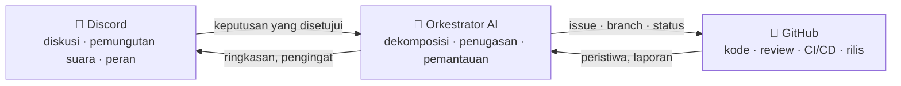

# 🗼 Tower of Babel (Menara Babel)

🌍 [العربية](README.ar.md) · [বাংলা](README.bn.md) · [Deutsch](README.de.md) · [English](../README.md) · [Español](README.es.md) · [Filipino](README.tl.md) · [Français](README.fr.md) · [हिन्दी](README.hi.md) · **Bahasa Indonesia** · [Italiano](README.it.md) · [日本語](README.ja.md) · [한국어](README.ko.md) · [Português](README.pt.md) · [Русский](README.ru.md) · [Kiswahili](README.sw.md) · [தமிழ்](README.ta.md) · [ไทย](README.th.md) · [Türkçe](README.tr.md) · [Tiếng Việt](README.vi.md) · [中文](README.zh.md)

> Sistem terbuka untuk pengembangan perangkat lunak secara kolektif — diatur oleh manusia, dijalankan oleh AI.
> Proyek belajar-sambil-membangun dari sekolah [Skillaria.Top](https://skillaria.top).

---

## 💡 Idenya

Manusia mengambil keputusan di **Discord**, kode tinggal di **GitHub**, dan di antara keduanya bekerja seorang **Orkestrator AI** yang mengubah keputusan komunitas menjadi tugas-tugas konkret, membagikannya, memantau kemajuan, dan mengurus semua hal rutin.

Ciri khas proyek ini adalah **penerapan pada diri sendiri**: Tower of Babel dikembangkan *dengan aturan Tower of Babel itu sendiri*. Setiap perbaikan pada bot, orkestrator, maupun prosesnya melewati pemungutan suara, tugas, dan review yang sama dengan yang diotomatiskan oleh sistem.



---

## 📜 Prinsip

1. **Manusia memutuskan — AI mengeksekusi.** Orkestrator tidak membuat keputusan substantif sendiri. Sumber kebenarannya adalah keputusan komunitas yang tercatat.
2. **Transparansi.** Setiap tindakan AI dan setiap keputusan manusia ditulis ke log publik. Tidak ada keputusan "di balik pintu tertutup".
3. **Meritokrasi.** Wewenang tidak dibagikan begitu saja — ia diraih lewat kontribusi dan dikukuhkan lewat pemungutan suara.
4. **Dapat dibatalkan.** Keputusan apa pun bisa ditinjau ulang lewat pemungutan suara baru. Tindakan AI apa pun bisa dikembalikan seperti semula.
5. **Penerapan pada diri sendiri.** Proyek ini berkembang dengan aturannya sendiri sejak hari pertama — awalnya secara manual, lalu dengan otomatisasi yang semakin banyak.

---

## 👥 Sistem Peran

Peran disatukan antara Discord dan GitHub: bot menyinkronkannya secara otomatis (selama bot belum ada, para Penjaga melakukannya secara manual).

| Peran | Cara mendapatkannya | Discord | GitHub | Wewenang |
|---|---|---|---|---|
| 👁️ **Pengamat** | Bergabung ke server lewat dasbor sekolahmu | Membaca semua channel, bertanya di `#help` | Fork, membuat Issue | Mengamati, bertanya, mengusulkan ide |
| 🧱 **Kuli Magang** | Perkenalkan diri + ambil tugas pertamamu | Ikut memilih dalam voting *rutin*, ikut diskusi | PR dari fork, penugasan ke tugas `good first issue` | Mengambil tugas, ikut serta dalam diskusi |
| ⚒️ **Tukang Batu** | 5 PR yang di-merge + suara mayoritas sederhana | Memilih dalam *semua* voting, membuat RFC | Triage: label, penugasan; review PR | Mengambil tugas apa pun, me-review, mengusulkan RFC dan kandidat |
| 🏛️ **Arsitek** | Pencalonan + 2/3 suara para Tukang Batu | Memoderasi channel teknis, memegang satu domain | Maintain: merge ke `main`, milestone, branch rilis | Memutuskan sendiri *di dalam domainnya* (lihat "Domain"), me-merge PR |
| 🛡️ **Penjaga** | Kurator sekolah / pendiri | Administrator server | Admin: secret, pengaturan, branch protection | Veto darurat, kill switch AI, onboarding. Tidak ikut campur dalam pengembangan sehari-hari |
| 🤖 **Orkestrator** | Ini si bot. Kamu tidak bisa menjadi dia 🙂 | Peran tersendiri dengan hak terbatas | Akun mesin terpisah, tanpa merge ke `main` | Lihat "Orkestrator AI" |

**Domain** adalah area tanggung jawab yang dipegang para Arsitek (misalnya `bot`, `orchestrator`, `infra`, `docs`). Seorang Arsitek memutuskan urusan di dalam domainnya tanpa voting, tetapi 3 Tukang Batu mana pun boleh menggugat keputusan itu dan membawanya ke pemungutan suara (sebuah "challenge").

**Penurunan peran** dilakukan lewat voting yang sama dengan kenaikan peran, atau otomatis setelah 60 hari tidak aktif (peran dibekukan dan dipulihkan tanpa voting saat yang bersangkutan kembali).

---

## 🗳️ Pengambilan Keputusan

Semua keputusan terbagi dalam tiga tingkat. Pemungutan suara diadakan di `#voting` (lewat reaksi atau perintah `/vote` milik bot), dan hasilnya dicatat sebagai berkas di `decisions/` — inilah **sumber kebenaran bagi AI**.

| Tingkat | Contoh | Siapa yang memilih | Ambang batas | Kuorum | Durasi |
|---|---|---|---|---|---|
| 🟢 **Rutin** | penamaan fitur, format ringkasan, prioritas tugas | Kuli Magang+ | mayoritas sederhana | 3 suara | 24 jam |
| 🟡 **Signifikan** | arsitektur, tech stack, roadmap, kenaikan ke Tukang Batu/Arsitek | Tukang Batu+ | 2/3 | 50% anggota aktif | 48 jam |
| 🔴 **Kritis** | perubahan aturan tata kelola, izin AI, lisensi, penghapusan data | Tukang Batu+ | 3/4 **+ persetujuan Penjaga** | 50% anggota aktif | 72 jam |

Selain itu:

- **Keputusan berdasarkan wewenang.** Seorang Arsitek boleh memutuskan urusan di domainnya tanpa voting — keputusan itu tetap dicatat di `decisions/` dengan penanda `by-authority`.
- **Keputusan darurat.** Seorang Penjaga boleh bertindak sepihak (insiden, keamanan), tetapi wajib menerbitkan laporan dalam 24 jam; komunitas dapat membatalkan keputusan itu lewat voting signifikan.
- **Proses RFC.** Usulan besar dituliskan sebagai RFC di channel forum `#rfc`: masalah → usulan → alternatif → diskusi minimal 48 jam → pemungutan suara.

### Format berkas keputusan (`decisions/`)

```yaml
# decisions/2026-06-15-choose-tech-stack.yaml
id: 23
title: "Memilih tech stack"
level: significant        # routine | significant | critical | by-authority | emergency
status: accepted          # accepted | rejected | superseded
votes: { for: 14, against: 3, abstain: 2 }
discord_thread: "<tautan ke thread>"
decision: |
  Backend dengan Python 3.12, bot dengan discord.py, AI di balik
  adapter OpenRouter/Ollama, basis data PostgreSQL, deployment Docker.
tasks_hint: |              # petunjuk untuk dekomposisi oleh Orkestrator (opsional)
  Mulai dari kerangka bot dan CI.
```

---

## 🤖 Orkestrator AI

Otak dari segala urusan rutin. Bekerja lewat OpenRouter (model cloud) atau Ollama (model lokal) di balik satu adapter — penyedianya dipilih lewat config.

### Apa yang dilakukannya

- 📥 **Membaca** keputusan yang disetujui dari `decisions/` dan thread Discord;
- 🧩 **Mendekomposisi** keputusan menjadi GitHub Issues: subtugas, label, estimasi, dependensi, milestone;
- 🎯 **Menugaskan** tugas berdasarkan prioritas: sukarelawan → keahlian yang cocok → beban kerja paling ringan. Penugasan apa pun bisa ditolak dengan satu perintah;
- ⏰ **Memantau** tenggat: mengingatkan, mengeskalasi ke Arsitek domain terkait, memindahkan tugas yang mandek;
- 📝 **Merangkum**: ringkasan singkat dari diskusi panjang, ringkasan kemajuan mingguan di `#announcements`;
- 🔍 **Membuat draf review PR** (saran, bukan vonis — kata akhir tetap milik manusia);
- 🗳️ **Menjalankan voting**: penghitungan suara, kontrol kuorum, pembuatan berkas keputusan;
- 📒 **Memelihara log audit**: setiap tindakannya dipublikasikan di `#audit-log`.

### Apa yang TIDAK BOLEH dilakukannya (batasan keras)

- ❌ Merge ke `main` atau branch rilis (branch protection);
- ❌ Mengubah peran manusia (ia hanya mencatat hasil voting);
- ❌ Mengubah system prompt, izin, atau config-nya sendiri — hanya lewat voting 🔴 kritis;
- ❌ Menyentuh secret, pengaturan repositori, atau billing;
- ❌ Menghapus branch, issue, atau pesan manusia;
- ❌ Bertindak tanpa keputusan yang tercatat — terhadap permintaan "lisan" di chat ia akan menjawab "mohon formalkan keputusannya".

Para Penjaga memegang **kill switch** — bot bisa dihentikan seketika dengan satu perintah.

---

## 🔄 Daur Hidup Tugas

```
💬 Diskusi di Discord
        ↓
🗳️ Voting → decisions/NNN.yaml
        ↓
🤖 AI mendekomposisi → GitHub Issues (backlog)
        ↓
🎯 Penugasan (sukarelawan / usulan AI)
        ↓
🌿 Branch feat/NNN-short-name → kode → PR
        ↓
✅ CI (tes, linter) + 🤖 draf review
        ↓
👤 Review oleh Tukang Batu+ → merge oleh Arsitek
        ↓
🚀 Rilis → 🤖 release notes → ringkasan di Discord
```

---

## 💬 Struktur Server Discord

| Channel | Kegunaan |
|---|---|
| `#announcements` | Rilis, ringkasan, keputusan penting (yang memposting: Arsitek+ dan bot) |
| `#rfc` *(forum)* | Usulan besar, masing-masing di thread tersendiri |
| `#voting` | Hanya voting dan hasilnya |
| `#tasks` | Umpan tugas dari Orkestrator, mengambil/menyetorkan tugas |
| `#dev-general` | Diskusi teknis bebas |
| `#help` | Pertanyaan para pendatang baru — semua boleh menjawab |
| `#audit-log` | Log tindakan AI (khusus bot) |
| 🔊 `Construction Site` | Panggilan suara, sesi mob programming, standup |

---

## 📁 Struktur Repositori (target)

```
Tower_of_Babel/
├── README.md            ← kamu sedang di sini
├── translations/        ← README ini dalam 19 bahasa lain
├── docs/                ← aturan, panduan, arsip RFC, ADR
├── decisions/           ← log keputusan — sumber kebenaran bagi AI
├── bot/                 ← bot Discord (perintah, voting, peran)
├── orchestrator/        ← inti AI (adapter LLM, dekomposisi, penugasan)
├── integrations/        ← klien GitHub API, webhook
├── infra/               ← Docker, compose, CI/CD, deployment
└── tests/               ← tes untuk semua yang di atas
```

---

## 🛠️ Teknologi (usulan — menunggu persetujuan Voting #1)

| Lapisan | Kandidat | Alasan |
|---|---|---|
| Bahasa | Python 3.12+ | Ambang masuk rendah bagi siswa, ekosistem kaya |
| Discord | `discord.py` | Pustaka yang matang, slash command, event |
| GitHub | `githubkit` / REST + webhook | Cakupan API lengkap |
| LLM | OpenRouter **dan** Ollama di balik satu adapter | Cloud untuk kualitas, lokal untuk gratis dan privat |
| Webhook/API | FastAPI | Sederhana, async, dokumentasi otomatis |
| Basis data | SQLite → PostgreSQL | Mulai dari yang sederhana, tumbuh tanpa rasa sakit |
| Infra | Docker Compose, GitHub Actions | Reproducibility, CI gratis |

---

## 🗺️ Roadmap

### Fase 0 — "Fondasi" *(manual, tanpa kode)*
- [ ] Membuat server Discord sesuai struktur di atas, membagikan peran awal
- [ ] Menggelar **Voting #1** — menyetujui tech stack (keputusan pertama di `decisions/`!)
- [ ] Menyetujui aturan dari README ini lewat voting kritis
- [ ] Menjalankan satu daur hidup tugas penuh secara manual — pahami prosesnya sebelum mengotomatiskannya

### Fase 1 — "Batu Pertama": bot Discord
- [ ] Kerangka bot, deployment Docker
- [ ] `/vote` — membuat voting, penghitungan suara, kontrol kuorum dan tenggat
- [ ] Pembuatan otomatis berkas keputusan di `decisions/` (PR dari bot)
- [ ] Sinkronisasi peran Discord ↔ tim GitHub

### Fase 2 — "Jembatan": integrasi GitHub
- [ ] Webhook GitHub → peristiwa di `#tasks` (PR dibuka, CI gagal, ter-merge)
- [ ] Perintah `/task take`, `/task done`, `/task status`
- [ ] Papan proyek (GitHub Projects), otomatisasi status

### Fase 3 — "Suara Sang Menara": menyambungkan AI
- [ ] Adapter LLM terpadu (OpenRouter / Ollama, dipilih lewat config)
- [ ] Dekomposisi keputusan → Issues dengan label dan dependensi
- [ ] Ringkasan thread dan ringkasan mingguan

### Fase 4 — "Orkestra": pengelolaan penuh
- [ ] Penugasan tugas (sukarelawan → keahlian → beban kerja)
- [ ] Kontrol tenggat, pengingat, eskalasi
- [ ] Draf review AI atas PR, release notes
- [ ] `#audit-log` dan kill switch

### Fase 5 — "Membangun Diri Sendiri"
- [ ] Sistem sepenuhnya mengelola pengembangannya sendiri (dogfooding)
- [ ] Metrik: kecepatan penyelesaian tugas, aktivitas, kualitas review
- [ ] Mengajak proyek kedua bergabung — menguji portabilitas
- [ ] Templat publik: "dirikan Menara-mu sendiri dalam semalam"

---

## 🚪 Cara Bergabung

Server Discord proyek ini hanya tersedia bagi siswa Skillaria.Top:

1. Jadilah siswa di [Skillaria.Top](https://skillaria.top);
2. Belajar dan berkembanglah hingga mencapai level **Intern**;
3. Ambil tautan undangan Discord di dasbor pribadimu;
4. Perkenalkan dirimu di `#help` — kamu akan menerima peran 🧱 Kuli Magang;
5. Ambil sebuah tugas berlabel [`good first issue`](https://github.com/skillariatop/Tower_of_Babel/labels/good%20first%20issue);
6. Buka sebuah PR — dan kamu sudah melangkah menuju ⚒️ Tukang Batu.

Tidak bisa ngoding? Kami juga butuh penguji, penulis teknis, moderator, dan perancang proses — kontribusi ke `docs/` dan `decisions/` dihargai sama tingginya dengan kode.

---

## 📄 Lisensi

Proyek ini didistribusikan di bawah lisensi yang tercantum dalam berkas [LICENSE](../LICENSE).

> *"Berfirmanlah TUHAN: 'Mereka ini satu bangsa dengan satu bahasa untuk semuanya. Ini barulah permulaan usaha mereka; mungkin nanti tidak ada lagi yang tidak dapat terlaksana oleh mereka.'"* — Kejadian 11:6.
> Kali ini, kita punya version control.
