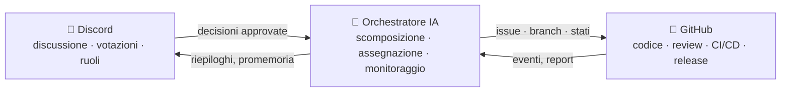

# 🗼 Tower of Babel (Torre di Babele)

🌍 [العربية](README.ar.md) · [বাংলা](README.bn.md) · [Deutsch](README.de.md) · [English](../README.md) · [Español](README.es.md) · [Filipino](README.tl.md) · [Français](README.fr.md) · [हिन्दी](README.hi.md) · [Bahasa Indonesia](README.id.md) · **Italiano** · [日本語](README.ja.md) · [한국어](README.ko.md) · [Português](README.pt.md) · [Русский](README.ru.md) · [Kiswahili](README.sw.md) · [தமிழ்](README.ta.md) · [ไทย](README.th.md) · [Türkçe](README.tr.md) · [Tiếng Việt](README.vi.md) · [中文](README.zh.md)

> Un sistema aperto per lo sviluppo software collettivo — governato dalle persone, eseguito dall'IA.
> Un progetto "imparare costruendo" della scuola [Skillaria.Top](https://skillaria.top).

---

## 💡 L'idea

Le persone prendono le decisioni su **Discord**, il codice vive su **GitHub**, e nel mezzo lavora un **Orchestratore IA** che trasforma le decisioni della community in compiti concreti, li assegna, ne segue i progressi e si occupa di tutta la routine.

Il tratto distintivo del progetto è l'**auto-applicazione**: Tower of Babel viene sviluppato *secondo le regole di Tower of Babel stesso*. Ogni miglioramento al bot, all'orchestratore o ai processi passa attraverso le stesse votazioni, gli stessi compiti e le stesse review che il sistema automatizza.



---

## 📜 Principi

1. **Le persone decidono — l'IA esegue.** L'Orchestratore non prende alcuna decisione di merito per conto proprio. La sua fonte di verità sono le decisioni registrate della community.
2. **Trasparenza.** Ogni azione dell'IA e ogni decisione umana viene scritta in un registro pubblico. Niente decisioni "a porte chiuse".
3. **Meritocrazia.** L'autorità non viene distribuita — si guadagna con il contributo e viene confermata da una votazione.
4. **Reversibilità.** Qualsiasi decisione può essere rimessa in discussione con una nuova votazione. Qualsiasi azione dell'IA può essere annullata.
5. **Auto-applicazione.** Il progetto evolve secondo le proprie regole fin dal primo giorno — all'inizio manualmente, poi con sempre più automazione.

---

## 👥 Sistema dei ruoli

I ruoli sono unificati tra Discord e GitHub: il bot li sincronizza automaticamente (finché il bot non esiste, i Custodi lo fanno a mano).

| Ruolo | Come si ottiene | Discord | GitHub | Autorità |
|---|---|---|---|---|
| 👁️ **Osservatore** | Entrare nel server dalla propria dashboard della scuola | Lettura di tutti i canali, domande in `#help` | Fork, creazione di Issue | Osservare, chiedere, proporre idee |
| 🧱 **Apprendista** | Presentarsi + prendere il primo compito | Voto nelle votazioni *di routine*, partecipazione alle discussioni | PR dai fork, assegnazione ai compiti `good first issue` | Prendere compiti, partecipare alle discussioni |
| ⚒️ **Muratore** | 5 PR merged + votazione a maggioranza semplice | Voto in *tutte* le votazioni, creazione di RFC | Triage: label, assegnazioni; review delle PR | Prendere qualsiasi compito, fare review, proporre RFC e candidati |
| 🏛️ **Architetto** | Candidatura + 2/3 dei voti dei Muratori | Moderazione dei canali tecnici, responsabilità di un dominio | Maintain: merge in `main`, milestone, branch di release | Decidere *nel proprio dominio* in autonomia (vedi "Domini"), fare merge delle PR |
| 🛡️ **Custode** | Curatori della scuola / fondatori | Amministratore del server | Admin: secret, impostazioni, branch protection | Veto d'emergenza, kill switch dell'IA, onboarding. Non interferisce nello sviluppo quotidiano |
| 🤖 **Orchestratore** | È il bot. Non puoi diventarlo 🙂 | Ruolo dedicato con permessi limitati | Account macchina separato, niente merge in `main` | Vedi "Orchestratore IA" |

I **Domini** sono aree di responsabilità affidate agli Architetti (es. `bot`, `orchestrator`, `infra`, `docs`). Un Architetto decide le questioni del proprio dominio senza votazione, ma 3 Muratori qualsiasi possono contestare la decisione e metterla ai voti (una "contestazione").

La **retrocessione** avviene con la stessa votazione della promozione, oppure automaticamente dopo 60 giorni di inattività (il ruolo viene congelato e ripristinato al ritorno senza votazione).

---

## 🗳️ Processo decisionale

Tutte le decisioni rientrano in tre livelli. Le votazioni si svolgono in `#voting` (tramite reazioni o il comando `/vote` del bot) e il risultato viene registrato come file in `decisions/` — questa è la **fonte di verità per l'IA**.

| Livello | Esempi | Chi vota | Soglia | Quorum | Durata |
|---|---|---|---|---|---|
| 🟢 **Routine** | nome delle feature, formato dei riepiloghi, priorità dei compiti | Apprendista+ | maggioranza semplice | 3 voti | 24 h |
| 🟡 **Significativo** | architettura, stack tecnologico, roadmap, promozione a Muratore/Architetto | Muratore+ | 2/3 | 50% dei membri attivi | 48 h |
| 🔴 **Critico** | modifiche alle regole di governance, permessi dell'IA, licenza, cancellazione di dati | Muratore+ | 3/4 **+ approvazione di un Custode** | 50% dei membri attivi | 72 h |

Inoltre:

- **Decisione per autorità.** Un Architetto può risolvere una questione nel proprio dominio senza votazione — la decisione viene comunque registrata in `decisions/` con il flag `by-authority`.
- **Decisione d'emergenza.** Un Custode può agire unilateralmente (incidente, sicurezza), ma deve pubblicare un report entro 24 h; la community può ribaltare la decisione con una votazione significativa.
- **Processo RFC.** Le proposte importanti vengono formalizzate come RFC nel canale forum `#rfc`: problema → proposta → alternative → almeno 48 h di discussione → votazione.

### Formato del file di decisione (`decisions/`)

```yaml
# decisions/2026-06-15-choose-tech-stack.yaml
id: 23
title: "Scelta dello stack tecnologico"
level: significant        # routine | significant | critical | by-authority | emergency
status: accepted          # accepted | rejected | superseded
votes: { for: 14, against: 3, abstain: 2 }
discord_thread: "<link al thread>"
decision: |
  Backend in Python 3.12, bot su discord.py, IA dietro un
  adapter OpenRouter/Ollama, database PostgreSQL, deployment con Docker.
tasks_hint: |              # un suggerimento per la scomposizione dell'Orchestratore (opzionale)
  Iniziare dallo scheletro del bot e dalla CI.
```

---

## 🤖 Orchestratore IA

Il cervello della routine. Funziona tramite OpenRouter (modelli cloud) oppure Ollama (modelli locali) dietro un unico adapter — il provider si sceglie da config.

### Cosa fa

- 📥 **Legge** le decisioni approvate da `decisions/` e dai thread di Discord;
- 🧩 **Scompone** le decisioni in GitHub Issues: sottocompiti, label, stime, dipendenze, milestone;
- 🎯 **Assegna** i compiti per priorità: volontario → competenze adatte → carico di lavoro più basso. Qualsiasi assegnazione può essere rifiutata con un solo comando;
- ⏰ **Controlla** le scadenze: ricorda, fa escalation all'Architetto del dominio, riassegna i compiti fermi;
- 📝 **Riassume**: sintesi delle discussioni lunghe, un riepilogo settimanale dei progressi in `#announcements`;
- 🔍 **Prepara bozze di review delle PR** (consigli, non verdetti — l'ultima parola spetta a un essere umano);
- 🗳️ **Gestisce le votazioni**: conteggio, controllo del quorum, generazione del file di decisione;
- 📒 **Tiene il registro di audit**: ogni sua azione viene pubblicata in `#audit-log`.

### Cosa NON può fare (limiti rigidi)

- ❌ Fare merge in `main` o nei branch di release (branch protection);
- ❌ Cambiare i ruoli delle persone (registra soltanto gli esiti delle votazioni);
- ❌ Modificare il proprio system prompt, i propri permessi o la propria config — solo tramite una votazione 🔴 critica;
- ❌ Toccare i secret, le impostazioni del repository o la fatturazione;
- ❌ Cancellare branch, issue o messaggi delle persone;
- ❌ Agire senza una decisione registrata — alle richieste "a voce" in chat risponde "per favore formalizza una decisione".

I Custodi hanno un **kill switch** — il bot può essere fermato all'istante con un solo comando.

---

## 🔄 Ciclo di vita di un compito

```
💬 Discussione su Discord
        ↓
🗳️ Votazione → decisions/NNN.yaml
        ↓
🤖 L'IA scompone → GitHub Issues (backlog)
        ↓
🎯 Assegnazione (volontario / suggerita dall'IA)
        ↓
🌿 Branch feat/NNN-short-name → codice → PR
        ↓
✅ CI (test, linter) + 🤖 bozza di review
        ↓
👤 Review di un Muratore+ → merge di un Architetto
        ↓
🚀 Release → 🤖 release notes → riepilogo su Discord
```

---

## 💬 Struttura del server Discord

| Canale | Scopo |
|---|---|
| `#announcements` | Release, riepiloghi, decisioni importanti (pubblicano Architetti+ e il bot) |
| `#rfc` *(forum)* | Proposte importanti, ognuna nel proprio thread |
| `#voting` | Solo votazioni e relativi risultati |
| `#tasks` | Flusso dei compiti dall'Orchestratore, presa in carico/consegna dei compiti |
| `#dev-general` | Discussione tecnica libera |
| `#help` | Domande dei nuovi arrivati — rispondono tutti |
| `#audit-log` | Registro delle azioni dell'IA (solo il bot) |
| 🔊 `Construction Site` | Chiamate vocali, sessioni di mob programming, standup |

---

## 📁 Struttura del repository (obiettivo)

```
Tower_of_Babel/
├── README.md            ← sei qui
├── translations/        ← questo README in altre 19 lingue
├── docs/                ← regole, guide, archivio RFC, ADR
├── decisions/           ← registro delle decisioni — la fonte di verità per l'IA
├── bot/                 ← bot Discord (comandi, votazioni, ruoli)
├── orchestrator/        ← nucleo IA (adapter LLM, scomposizione, assegnazione)
├── integrations/        ← client per l'API di GitHub, webhook
├── infra/               ← Docker, compose, CI/CD, deployment
└── tests/               ← test per tutto quanto sopra
```

---

## 🛠️ Tecnologie (proposta — da approvare con la Votazione n. 1)

| Livello | Candidato | Perché |
|---|---|---|
| Linguaggio | Python 3.12+ | Barriera d'ingresso bassa per gli studenti, ecosistema ricco |
| Discord | `discord.py` | Libreria matura, slash command, eventi |
| GitHub | `githubkit` / REST + webhook | Copertura completa dell'API |
| LLM | OpenRouter **e** Ollama dietro un unico adapter | Cloud per la qualità, locale per gratuità e privacy |
| Webhook/API | FastAPI | Semplice, asincrono, auto-documentato |
| Database | SQLite → PostgreSQL | Si parte semplici, si cresce senza dolore |
| Infra | Docker Compose, GitHub Actions | Riproducibilità, CI gratuita |

---

## 🗺️ Roadmap

### Fase 0 — "Le Fondamenta" *(manuale, senza codice)*
- [ ] Creare il server Discord secondo la struttura qui sopra, distribuire i ruoli iniziali
- [ ] Tenere la **Votazione n. 1** — approvare lo stack tecnologico (la prima decisione in `decisions/`!)
- [ ] Approvare le regole di questo README con una votazione critica
- [ ] Eseguire a mano un ciclo di vita completo di un compito — capire il processo prima di automatizzarlo

### Fase 1 — "La Prima Pietra": il bot Discord
- [ ] Scheletro del bot, deployment con Docker
- [ ] `/vote` — creazione di una votazione, conteggio, controllo di quorum e scadenze
- [ ] Generazione automatica del file di decisione in `decisions/` (PR dal bot)
- [ ] Sincronizzazione ruoli Discord ↔ team GitHub

### Fase 2 — "Il Ponte": integrazione con GitHub
- [ ] Webhook di GitHub → eventi in `#tasks` (PR aperta, CI fallita, merge effettuato)
- [ ] Comandi `/task take`, `/task done`, `/task status`
- [ ] Project board (GitHub Projects), automazione degli stati

### Fase 3 — "La Voce della Torre": collegare l'IA
- [ ] Adapter LLM unificato (OpenRouter / Ollama, scelto da config)
- [ ] Scomposizione delle decisioni → Issue con label e dipendenze
- [ ] Riassunti dei thread e riepilogo settimanale

### Fase 4 — "L'Orchestra": gestione completa
- [ ] Assegnazione dei compiti (volontario → competenze → carico di lavoro)
- [ ] Controllo delle scadenze, promemoria, escalation
- [ ] Bozze di review IA delle PR, release notes
- [ ] `#audit-log` e kill switch

### Fase 5 — "Auto-costruzione"
- [ ] Il sistema gestisce completamente il proprio sviluppo (dogfooding)
- [ ] Metriche: velocità dei compiti, attività, qualità delle review
- [ ] Inserire un secondo progetto — testare la portabilità
- [ ] Un template pubblico: "metti in piedi la tua Torre in una sera"

---

## 🚪 Come unirsi

Il server Discord del progetto è riservato agli studenti di Skillaria.Top:

1. Diventa studente su [Skillaria.Top](https://skillaria.top);
2. Studia e cresci fino a raggiungere il livello **Intern**;
3. Trova il link d'invito a Discord nella tua dashboard personale;
4. Presentati in `#help` — riceverai il ruolo di 🧱 Apprendista;
5. Prendi un compito con la label [`good first issue`](https://github.com/skillariatop/Tower_of_Babel/labels/good%20first%20issue);
6. Apri una PR — e sei sulla buona strada per diventare ⚒️ Muratore.

Non sai programmare? Ci servono anche tester, technical writer, moderatori e progettisti di processi — i contributi a `docs/` e `decisions/` valgono quanto il codice.

---

## 📄 Licenza

Il progetto è distribuito sotto la licenza contenuta nel file [LICENSE](../LICENSE).

> *"Il Signore disse: «Ecco, essi sono un solo popolo e hanno tutti una lingua sola; questo è l'inizio della loro opera e ora quanto avranno in progetto di fare non sarà loro impossibile»"* — Genesi 11,6.
> Questa volta, abbiamo il controllo di versione.
