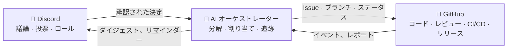

# 🗼 Tower of Babel（バベルの塔）

🌍 [العربية](README.ar.md) · [বাংলা](README.bn.md) · [Deutsch](README.de.md) · [English](../README.md) · [Español](README.es.md) · [Filipino](README.tl.md) · [Français](README.fr.md) · [हिन्दी](README.hi.md) · [Bahasa Indonesia](README.id.md) · [Italiano](README.it.md) · **日本語** · [한국어](README.ko.md) · [Português](README.pt.md) · [Русский](README.ru.md) · [Kiswahili](README.sw.md) · [தமிழ்](README.ta.md) · [ไทย](README.th.md) · [Türkçe](README.tr.md) · [Tiếng Việt](README.vi.md) · [中文](README.zh.md)

> 集団的ソフトウェア開発のためのオープンなシステム — 人が統治し、AI が実行する。
> [Skillaria.Top](https://skillaria.top) スクールによる「作りながら学ぶ」プロジェクト。

---

## 💡 アイデア

意思決定は **Discord** で行い、コードは **GitHub** に置く。その間で働くのが **AI オーケストレーター** — コミュニティの決定を具体的なタスクへと変換し、割り当て、進捗を追跡し、ルーチンワークをすべて引き受けます。

このプロジェクトの最大の特徴は **自己適用** です。Tower of Babel は *Tower of Babel 自身のルールに従って* 開発されます。ボット、オーケストレーター、プロセスへのあらゆる改善は、システムが自動化するのと同じ投票・タスク・レビューのプロセスを通ります。



---

## 📜 原則

1. **決めるのは人、実行するのは AI。** オーケストレーターは自ら実質的な決定を下しません。その判断の拠り所は、記録されたコミュニティの決定です。
2. **透明性。** AI のすべての行動と人間のすべての決定は、公開ログに記録されます。「密室での決定」は存在しません。
3. **実力主義。** 権限は与えられるものではなく、貢献によって獲得し、投票によって承認されるものです。
4. **可逆性。** どんな決定も新たな投票で見直せます。AI のどんな行動もロールバックできます。
5. **自己適用。** プロジェクトは初日から自らのルールに従って進化します — 最初は手作業で、やがて自動化を増やしながら。

---

## 👥 ロールシステム

ロールは Discord と GitHub で統一されています。同期はボットが自動で行います（ボットが完成するまでは、守り手が手作業で対応します）。

| ロール | 取得方法 | Discord | GitHub | 権限 |
|---|---|---|---|---|
| 👁️ **見学者（Observer）** | スクールのダッシュボードからサーバーに参加 | 全チャンネルの閲覧、`#help` での質問 | フォーク、Issue の作成 | 見守る、質問する、アイデアを提案する |
| 🧱 **見習い（Apprentice）** | 自己紹介 + 最初のタスクを取る | *ルーチン* 投票への参加、議論への参加 | フォークからの PR、`good first issue` タスクへのアサイン | タスクを取る、議論に参加する |
| ⚒️ **石工（Mason）** | マージされた PR が 5 件 + 単純多数の投票 | *すべて* の投票への参加、RFC の作成 | トリアージ：ラベル、アサイン、PR レビュー | あらゆるタスクの取得、レビュー、RFC や候補者の提案 |
| 🏛️ **棟梁（Architect）** | 推薦 + 石工の 2/3 の賛成票 | 技術チャンネルのモデレート、ドメインの所有 | メンテナー：`main` へのマージ、マイルストーン、リリースブランチ | *自分のドメイン内* では単独で決定（「ドメイン」参照）、PR のマージ |
| 🛡️ **守り手（Keeper）** | スクールのキュレーター / 創設者 | サーバー管理者 | 管理者：シークレット、設定、ブランチ保護 | 緊急拒否権、AI のキルスイッチ、オンボーディング。日々の開発には介入しない |
| 🤖 **オーケストレーター（Orchestrator）** | ボット本人。なることはできません 🙂 | 権限を制限した専用ロール | 専用のマシンアカウント、`main` へのマージ不可 | 「AI オーケストレーター」参照 |

**ドメイン** とは、棟梁が所有する責任範囲のことです（例：`bot`、`orchestrator`、`infra`、`docs`）。棟梁は自分のドメイン内の事柄を投票なしで決定できますが、石工 3 名が集まればその決定に異議を唱えて投票にかけることができます（「チャレンジ」）。

**降格** は昇格と同じ投票プロセスで行われるか、60 日間の非アクティブで自動的に発生します（ロールは凍結され、復帰すれば投票なしで復元されます）。

---

## 🗳️ 意思決定

すべての決定は 3 つのレベルに分かれます。投票は `#voting` で行われ（リアクション、またはボットの `/vote` コマンドで）、結果は `decisions/` 内のファイルとして記録されます — これが **AI にとっての信頼できる唯一の情報源** です。

| レベル | 例 | 投票者 | 可決ライン | 定足数 | 期間 |
|---|---|---|---|---|---|
| 🟢 **ルーチン** | 機能の命名、ダイジェストの形式、タスクの優先度 | 見習い以上 | 単純多数 | 3 票 | 24 時間 |
| 🟡 **重要** | アーキテクチャ、技術スタック、ロードマップ、石工・棟梁への昇格 | 石工以上 | 2/3 | アクティブメンバーの 50% | 48 時間 |
| 🔴 **クリティカル** | 統治ルールの変更、AI の権限、ライセンス、データの削除 | 石工以上 | 3/4 **+ 守り手の承認** | アクティブメンバーの 50% | 72 時間 |

さらに：

- **権限による決定。** 棟梁は自分のドメイン内の事柄を投票なしで決定できます — ただしその決定も `by-authority` フラグ付きで `decisions/` に記録されます。
- **緊急決定。** 守り手は単独で行動できます（インシデント、セキュリティ）。ただし 24 時間以内に報告を公開しなければならず、コミュニティは重要投票でその決定を覆すことができます。
- **RFC プロセス。** 大きな提案は `#rfc` フォーラムチャンネルで RFC として文書化します：課題 → 提案 → 代替案 → 最低 48 時間の議論 → 投票。

### 決定ファイルの形式（`decisions/`）

```yaml
# decisions/2026-06-15-choose-tech-stack.yaml
id: 23
title: "技術スタックの選定"
level: significant        # routine | significant | critical | by-authority | emergency
status: accepted          # accepted | rejected | superseded
votes: { for: 14, against: 3, abstain: 2 }
discord_thread: "<スレッドへのリンク>"
decision: |
  バックエンドは Python 3.12、ボットは discord.py、AI は
  OpenRouter/Ollama アダプターの背後に、データベースは PostgreSQL、デプロイは Docker。
tasks_hint: |              # オーケストレーターの分解のためのヒント（任意）
  ボットのスケルトンと CI から始める。
```

---

## 🤖 AI オーケストレーター

ルーチンワークの頭脳。OpenRouter（クラウドモデル）または Ollama（ローカルモデル）を単一のアダプター越しに利用し、プロバイダーは設定で選択します。

### できること

- 📥 **読む**：`decisions/` と Discord スレッドから承認済みの決定を読み取る；
- 🧩 **分解する**：決定を GitHub Issue へ展開する — サブタスク、ラベル、見積もり、依存関係、マイルストーン；
- 🎯 **割り当てる**：優先順位は「立候補者 → スキルの一致 → 負荷の少ない人」。どの割り当てもコマンド一つで辞退可能；
- ⏰ **追跡する**：締め切りの管理 — リマインド、ドメインの棟梁へのエスカレーション、停滞したタスクの再割り当て；
- 📝 **要約する**：長い議論の短いダイジェスト、`#announcements` での週次進捗ダイジェスト；
- 🔍 **PR レビューの下書きを作る**（助言であって裁定ではない — 最終判断は人間のもの）；
- 🗳️ **投票を運営する**：集計、定足数の管理、決定ファイルの生成；
- 📒 **監査ログを保つ**：自身のすべての行動を `#audit-log` に公開する。

### できないこと（ハードリミット）

- ❌ `main` やリリースブランチへのマージ（ブランチ保護）；
- ❌ 人のロールの変更（投票結果を記録するだけ）；
- ❌ 自身のシステムプロンプト・権限・設定の変更 — 🔴 クリティカル投票を通じてのみ可能；
- ❌ シークレット、リポジトリ設定、課金への接触；
- ❌ ブランチ、Issue、人のメッセージの削除；
- ❌ 記録された決定なしの行動 — チャットでの「口頭」の依頼には「決定として正式化してください」と返答します。

守り手は **キルスイッチ** を持っています — ボットはコマンド一つで即座に停止できます。

---

## 🔄 タスクのライフサイクル

```
💬 Discord での議論
        ↓
🗳️ 投票 → decisions/NNN.yaml
        ↓
🤖 AI が分解 → GitHub Issues（バックログ）
        ↓
🎯 割り当て（立候補 / AI が提案）
        ↓
🌿 ブランチ feat/NNN-short-name → コード → PR
        ↓
✅ CI（テスト、リンター）+ 🤖 レビューの下書き
        ↓
👤 石工以上によるレビュー → 棟梁によるマージ
        ↓
🚀 リリース → 🤖 リリースノート → Discord でダイジェスト
```

---

## 💬 Discord サーバーの構成

| チャンネル | 目的 |
|---|---|
| `#announcements` | リリース、ダイジェスト、重要な決定（投稿できるのは棟梁以上とボット） |
| `#rfc` *(フォーラム)* | 大きな提案、それぞれ専用スレッドで |
| `#voting` | 投票とその結果のみ |
| `#tasks` | オーケストレーターからのタスクフィード、タスクの取得・提出 |
| `#dev-general` | 自由な技術談義 |
| `#help` | 新人の質問 — みんなで答える |
| `#audit-log` | AI の行動ログ（ボット専用） |
| 🔊 `Construction Site` | ボイス通話、モブセッション、スタンドアップ |

---

## 📁 リポジトリ構成（目標）

```
Tower_of_Babel/
├── README.md            ← 今ここ
├── translations/        ← この README の他 19 言語版
├── docs/                ← ルール、ガイド、RFC アーカイブ、ADR
├── decisions/           ← 決定ログ — AI にとっての信頼できる唯一の情報源
├── bot/                 ← Discord ボット（コマンド、投票、ロール）
├── orchestrator/        ← AI コア（LLM アダプター、分解、割り当て）
├── integrations/        ← GitHub API クライアント、Webhook
├── infra/               ← Docker、compose、CI/CD、デプロイ
└── tests/               ← 上記すべてのテスト
```

---

## 🛠️ 技術（提案 — 投票 #1 で承認予定）

| レイヤー | 候補 | 理由 |
|---|---|---|
| 言語 | Python 3.12+ | 学生にとって敷居が低く、エコシステムが豊か |
| Discord | `discord.py` | 成熟したライブラリ、スラッシュコマンド、イベント |
| GitHub | `githubkit` / REST + Webhook | API を完全にカバー |
| LLM | OpenRouter **と** Ollama を単一アダプターの背後に | 品質ならクラウド、無料かつプライベートならローカル |
| Webhook/API | FastAPI | シンプル、非同期、ドキュメント自動生成 |
| データベース | SQLite → PostgreSQL | 小さく始めて、痛みなく育てる |
| インフラ | Docker Compose、GitHub Actions | 再現性、無料の CI |

---

## 🗺️ ロードマップ

### フェーズ 0 — 「礎（いしずえ）」 *(手作業、コードなし)*
- [ ] 上記の構成どおりに Discord サーバーを作成し、初期ロールを配布する
- [ ] **投票 #1** を実施 — 技術スタックを承認する（`decisions/` 最初の決定！）
- [ ] この README のルールをクリティカル投票で承認する
- [ ] タスクのライフサイクルを一通り手作業で回す — 自動化の前にプロセスを理解する

### フェーズ 1 — 「最初の石」：Discord ボット
- [ ] ボットのスケルトン、Docker でのデプロイ
- [ ] `/vote` — 投票の作成、集計、定足数と締め切りの管理
- [ ] `decisions/` への決定ファイルの自動生成（ボットからの PR）
- [ ] Discord ロール ↔ GitHub チームの同期

### フェーズ 2 — 「橋」：GitHub 連携
- [ ] GitHub Webhook → `#tasks` へのイベント通知（PR オープン、CI 失敗、マージ済み）
- [ ] コマンド `/task take`、`/task done`、`/task status`
- [ ] プロジェクトボード（GitHub Projects）、ステータスの自動化

### フェーズ 3 — 「塔の声」：AI の接続
- [ ] 統一 LLM アダプター（OpenRouter / Ollama、設定で選択）
- [ ] 決定の分解 → ラベルと依存関係付きの Issue
- [ ] スレッドの要約と週次ダイジェスト

### フェーズ 4 — 「オーケストラ」：フルマネジメント
- [ ] タスクの割り当て（立候補 → スキル → 負荷）
- [ ] 締め切り管理、リマインダー、エスカレーション
- [ ] AI による PR レビューの下書き、リリースノート
- [ ] `#audit-log` とキルスイッチ

### フェーズ 5 — 「自己建設」
- [ ] システムが自身の開発を完全に管理する（ドッグフーディング）
- [ ] メトリクス：タスクの速度、活動量、レビューの質
- [ ] 2 つ目のプロジェクトを受け入れる — 移植性の検証
- [ ] 公開テンプレート：「一晩で自分の塔を建てよう」

---

## 🚪 参加方法

このプロジェクトの Discord サーバーは Skillaria.Top の受講生専用です：

1. [Skillaria.Top](https://skillaria.top) の受講生になる；
2. **Intern** レベルに到達するまで学び、成長する；
3. 個人ダッシュボードで Discord の招待リンクを受け取る；
4. `#help` で自己紹介する — 🧱 見習いロールが付与されます；
5. [`good first issue`](https://github.com/skillariatop/Tower_of_Babel/labels/good%20first%20issue) ラベルの付いたタスクを取る；
6. PR を開く — これで ⚒️ 石工への道が始まります。

コードが書けなくても大丈夫。テスター、テクニカルライター、モデレーター、プロセス設計者も必要です — `docs/` や `decisions/` への貢献は、コードと同じくらい価値があります。

---

## 📄 ライセンス

このプロジェクトは [LICENSE](../LICENSE) ファイルに記載のライセンスのもとで配布されています。

> *「主は言われた。『彼らは一つの民で、皆一つの言葉を話しているから、このようなことをし始めたのだ。これからは彼らが何を企てても、妨げることはできない。』」* — 創世記 11:6。
> 今回の私たちには、バージョン管理があります。
