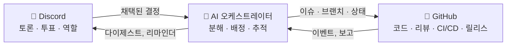

# 🗼 Tower of Babel (바벨탑)

🌍 [العربية](README.ar.md) · [বাংলা](README.bn.md) · [Deutsch](README.de.md) · [English](../README.md) · [Español](README.es.md) · [Filipino](README.tl.md) · [Français](README.fr.md) · [हिन्दी](README.hi.md) · [Bahasa Indonesia](README.id.md) · [Italiano](README.it.md) · [日本語](README.ja.md) · **한국어** · [Português](README.pt.md) · [Русский](README.ru.md) · [Kiswahili](README.sw.md) · [தமிழ்](README.ta.md) · [ไทย](README.th.md) · [Türkçe](README.tr.md) · [Tiếng Việt](README.vi.md) · [中文](README.zh.md)

> 사람이 다스리고 AI가 실행하는, 집단 소프트웨어 개발을 위한 오픈 시스템.
> [Skillaria.Top](https://skillaria.top) 스쿨의 '만들면서 배우는' 프로젝트입니다.

---

## 💡 아이디어

사람들은 **Discord**에서 의사결정을 하고, 코드는 **GitHub**에 살며, 그 사이에서 **AI 오케스트레이터**가 일합니다. 커뮤니티의 결정을 구체적인 작업으로 바꾸고, 담당자를 배정하고, 진행 상황을 추적하고, 온갖 잡무를 처리하죠.

이 프로젝트의 가장 큰 특징은 **자기 적용(self-application)** 입니다. Tower of Babel은 *Tower of Babel 자신의 규칙에 따라* 개발됩니다. 봇이든 오케스트레이터든 프로세스든, 모든 개선 사항은 시스템이 자동화하는 바로 그 투표·작업·리뷰 절차를 똑같이 거칩니다.



---

## 📜 원칙

1. **사람이 결정하고 — AI가 실행한다.** 오케스트레이터는 스스로 실질적인 결정을 내리지 않습니다. 유일한 진실의 원천은 커뮤니티가 기록한 결정입니다.
2. **투명성.** AI의 모든 행동과 사람의 모든 결정은 공개 로그에 기록됩니다. "밀실 결정"은 없습니다.
3. **실력주의.** 권한은 나눠 주는 것이 아니라, 기여로 얻어내고 투표로 확인받는 것입니다.
4. **되돌릴 수 있음.** 어떤 결정이든 새 투표로 다시 다룰 수 있습니다. AI의 어떤 행동이든 롤백할 수 있습니다.
5. **자기 적용.** 프로젝트는 첫날부터 자신의 규칙에 따라 굴러갑니다 — 처음에는 수동으로, 점점 더 많은 부분을 자동화하면서.

---

## 👥 역할 체계

역할은 Discord와 GitHub에서 동일하게 유지되며, 봇이 자동으로 동기화합니다 (봇이 생기기 전까지는 수호자들이 손으로 합니다).

| 역할 | 얻는 방법 | Discord | GitHub | 권한 |
|---|---|---|---|---|
| 👁️ **관찰자(Observer)** | 스쿨 대시보드를 통해 서버 입장 | 모든 채널 읽기, `#help`에서 질문 | 포크, Issue 생성 | 지켜보기, 질문하기, 아이디어 제안하기 |
| 🧱 **견습공(Apprentice)** | 자기소개 + 첫 작업 맡기 | *일상* 투표 참여, 토론 참여 | 포크에서 PR, `good first issue` 작업 배정 가능 | 작업 맡기, 토론 참여 |
| ⚒️ **석공(Mason)** | 머지된 PR 5개 + 단순 과반 투표 | *모든* 투표 참여, RFC 작성 | 트리아지: 라벨, 배정; PR 리뷰 | 어떤 작업이든 맡기, 리뷰, RFC와 후보 추천 |
| 🏛️ **건축가(Architect)** | 추천 + 석공 2/3 찬성 | 기술 채널 운영, 도메인 하나 책임 | 메인테인: `main` 머지, 마일스톤, 릴리스 브랜치 | *자기 도메인 안에서는* 단독 결정 ("도메인" 참조), PR 머지 |
| 🛡️ **수호자(Keeper)** | 스쿨 큐레이터 / 창립자 | 서버 관리자 | 어드민: 시크릿, 설정, 브랜치 보호 | 비상 거부권, AI 킬 스위치, 온보딩. 일상 개발에는 개입하지 않음 |
| 🤖 **오케스트레이터(Orchestrator)** | 봇입니다. 사람은 될 수 없어요 🙂 | 제한된 권한의 전용 역할 | 별도 머신 계정, `main` 머지 불가 | "AI 오케스트레이터" 참조 |

**도메인**은 건축가가 책임지는 영역입니다 (예: `bot`, `orchestrator`, `infra`, `docs`). 건축가는 자기 도메인의 사안을 투표 없이 결정할 수 있지만, 석공 3명이 모이면 그 결정에 이의를 제기하고 투표에 부칠 수 있습니다 ("챌린지").

**강등**은 승급과 동일한 투표를 거치거나, 60일간 활동이 없으면 자동으로 이루어집니다 (역할은 동결되며 복귀 시 투표 없이 복원됩니다).

---

## 🗳️ 의사결정

모든 결정은 세 가지 등급으로 나뉩니다. 투표는 `#voting`에서 진행되며 (리액션 또는 봇의 `/vote` 명령어 사용), 결과는 `decisions/`에 파일로 기록됩니다 — 이것이 **AI에게 진실의 원천**입니다.

| 등급 | 예시 | 투표 자격 | 가결 기준 | 정족수 | 기간 |
|---|---|---|---|---|---|
| 🟢 **일상(Routine)** | 기능 이름 짓기, 다이제스트 형식, 작업 우선순위 | 견습공 이상 | 단순 과반 | 3표 | 24시간 |
| 🟡 **중요(Significant)** | 아키텍처, 기술 스택, 로드맵, 석공/건축가 승급 | 석공 이상 | 2/3 | 활동 멤버의 50% | 48시간 |
| 🔴 **핵심(Critical)** | 거버넌스 규칙 변경, AI 권한, 라이선스, 데이터 삭제 | 석공 이상 | 3/4 **+ 수호자 승인** | 활동 멤버의 50% | 72시간 |

추가로:

- **권한에 의한 결정.** 건축가는 자기 도메인의 사안을 투표 없이 결정할 수 있습니다 — 단, 그 결정도 `by-authority` 플래그와 함께 `decisions/`에 기록됩니다.
- **비상 결정.** 수호자는 단독으로 행동할 수 있지만 (사고, 보안), 24시간 안에 보고서를 공개해야 하며, 커뮤니티는 중요 등급 투표로 그 결정을 뒤집을 수 있습니다.
- **RFC 프로세스.** 큰 제안은 `#rfc` 포럼 채널에 RFC로 작성합니다: 문제 → 제안 → 대안 → 최소 48시간 토론 → 투표.

### 결정 파일 형식 (`decisions/`)

```yaml
# decisions/2026-06-15-choose-tech-stack.yaml
id: 23
title: "기술 스택 선정"
level: significant        # routine | significant | critical | by-authority | emergency
status: accepted          # accepted | rejected | superseded
votes: { for: 14, against: 3, abstain: 2 }
discord_thread: "<스레드 링크>"
decision: |
  백엔드는 Python 3.12, 봇은 discord.py, AI는
  OpenRouter/Ollama 어댑터 뒤에, 데이터베이스는 PostgreSQL, 배포는 Docker.
tasks_hint: |              # 오케스트레이터의 작업 분해를 위한 힌트 (선택)
  봇 뼈대와 CI부터 시작할 것.
```

---

## 🤖 AI 오케스트레이터

잡무 처리의 두뇌입니다. OpenRouter(클라우드 모델) 또는 Ollama(로컬 모델)를 단일 어댑터 뒤에서 사용하며, 프로바이더는 설정으로 선택합니다.

### 하는 일

- 📥 `decisions/`의 채택된 결정과 Discord 스레드를 **읽습니다**;
- 🧩 결정을 GitHub Issues로 **분해합니다**: 하위 작업, 라벨, 추정치, 의존성, 마일스톤;
- 🎯 우선순위에 따라 작업을 **배정합니다**: 자원자 → 스킬 일치 → 업무량 최소. 어떤 배정이든 명령어 하나로 거절할 수 있습니다;
- ⏰ 마감을 **추적합니다**: 리마인드하고, 해당 도메인의 건축가에게 에스컬레이션하고, 멈춰 있는 작업을 재배정합니다;
- 📝 **요약합니다**: 긴 토론의 짧은 다이제스트, `#announcements`의 주간 진행 다이제스트;
- 🔍 **PR 리뷰 초안을 작성합니다** (판결이 아닌 조언 — 최종 결정권은 사람에게 있습니다);
- 🗳️ **투표를 진행합니다**: 집계, 정족수 관리, 결정 파일 생성;
- 📒 **감사 로그를 기록합니다**: 자신의 모든 행동을 `#audit-log`에 게시합니다.

### 할 수 없는 일 (하드 리밋)

- ❌ `main` 또는 릴리스 브랜치로 머지 (브랜치 보호);
- ❌ 사람의 역할 변경 (투표 결과를 기록만 할 뿐);
- ❌ 자신의 시스템 프롬프트, 권한, 설정 수정 — 🔴 핵심 등급 투표를 통해서만 가능;
- ❌ 시크릿, 저장소 설정, 결제 정보에 손대기;
- ❌ 브랜치, 이슈, 사람들의 메시지 삭제;
- ❌ 기록된 결정 없이 행동하기 — 채팅에서의 "말로만" 요청에는 "결정을 공식화해 주세요"라고 답합니다.

수호자에게는 **킬 스위치**가 있습니다 — 명령어 하나로 봇을 즉시 멈출 수 있습니다.

---

## 🔄 작업 생애주기

```
💬 Discord에서 토론
        ↓
🗳️ 투표 → decisions/NNN.yaml
        ↓
🤖 AI가 분해 → GitHub Issues (백로그)
        ↓
🎯 배정 (자원 / AI 추천)
        ↓
🌿 브랜치 feat/NNN-short-name → 코드 → PR
        ↓
✅ CI (테스트, 린터) + 🤖 리뷰 초안
        ↓
👤 석공 이상의 리뷰 → 건축가가 머지
        ↓
🚀 릴리스 → 🤖 릴리스 노트 → Discord에 다이제스트
```

---

## 💬 Discord 서버 구조

| 채널 | 용도 |
|---|---|
| `#announcements` | 릴리스, 다이제스트, 중요 결정 (건축가 이상과 봇이 게시) |
| `#rfc` *(포럼)* | 큰 제안, 각각 별도 스레드 |
| `#voting` | 투표와 그 결과만 |
| `#tasks` | 오케스트레이터의 작업 피드, 작업 맡기/제출하기 |
| `#dev-general` | 자유로운 기술 토론 |
| `#help` | 신입의 질문 — 모두가 답합니다 |
| `#audit-log` | AI 행동 로그 (봇 전용) |
| 🔊 `Construction Site` | 음성 통화, 몹 세션, 스탠드업 |

---

## 📁 저장소 구조 (목표)

```
Tower_of_Babel/
├── README.md            ← 지금 여기
├── translations/        ← 이 README의 19개 언어 번역본
├── docs/                ← 규칙, 가이드, RFC 아카이브, ADR
├── decisions/           ← 결정 로그 — AI에게 진실의 원천
├── bot/                 ← Discord 봇 (명령어, 투표, 역할)
├── orchestrator/        ← AI 코어 (LLM 어댑터, 분해, 배정)
├── integrations/        ← GitHub API 클라이언트, 웹훅
├── infra/               ← Docker, compose, CI/CD, 배포
└── tests/               ← 위 모든 것의 테스트
```

---

## 🛠️ 기술 (제안 — 투표 #1에서 승인 예정)

| 계층 | 후보 | 이유 |
|---|---|---|
| 언어 | Python 3.12+ | 학생에게 낮은 진입 장벽, 풍부한 생태계 |
| Discord | `discord.py` | 성숙한 라이브러리, 슬래시 명령어, 이벤트 |
| GitHub | `githubkit` / REST + 웹훅 | API 전체 커버 |
| LLM | OpenRouter **그리고** Ollama, 단일 어댑터 뒤에 | 품질은 클라우드로, 무료·프라이버시는 로컬로 |
| 웹훅/API | FastAPI | 단순하고, 비동기에, 문서 자동 생성 |
| 데이터베이스 | SQLite → PostgreSQL | 단순하게 시작해서, 아픔 없이 성장 |
| 인프라 | Docker Compose, GitHub Actions | 재현성, 무료 CI |

---

## 🗺️ 로드맵

### 0단계 — "기초 공사" *(수동, 코드 없음)*
- [ ] 위 구조대로 Discord 서버 만들기, 시작 역할 나눠 주기
- [ ] **투표 #1** 진행 — 기술 스택 승인 (`decisions/`의 첫 결정!)
- [ ] 이 README의 규칙을 핵심 등급 투표로 승인
- [ ] 작업 생애주기 전체를 손으로 한 번 돌려 보기 — 자동화하기 전에 프로세스 이해하기

### 1단계 — "첫 돌": Discord 봇
- [ ] 봇 뼈대, Docker 배포
- [ ] `/vote` — 투표 생성, 집계, 정족수·마감 관리
- [ ] `decisions/`에 결정 파일 자동 생성 (봇이 PR 제출)
- [ ] Discord 역할 ↔ GitHub 팀 동기화

### 2단계 — "다리": GitHub 연동
- [ ] GitHub 웹훅 → `#tasks`에 이벤트 표시 (PR 열림, CI 실패, 머지됨)
- [ ] 명령어 `/task take`, `/task done`, `/task status`
- [ ] 프로젝트 보드 (GitHub Projects), 상태 자동화

### 3단계 — "탑의 목소리": AI 연결
- [ ] 통합 LLM 어댑터 (OpenRouter / Ollama, 설정으로 선택)
- [ ] 결정 분해 → 라벨과 의존성이 달린 Issues
- [ ] 스레드 요약과 주간 다이제스트

### 4단계 — "오케스트라": 완전한 관리
- [ ] 작업 배정 (자원자 → 스킬 → 업무량)
- [ ] 마감 관리, 리마인더, 에스컬레이션
- [ ] PR에 대한 AI 리뷰 초안, 릴리스 노트
- [ ] `#audit-log`와 킬 스위치

### 5단계 — "스스로 쌓는 탑"
- [ ] 시스템이 자기 자신의 개발을 완전히 관리 (도그푸딩)
- [ ] 지표: 작업 속도, 활동량, 리뷰 품질
- [ ] 두 번째 프로젝트 온보딩 — 이식성 검증
- [ ] 공개 템플릿: "하룻저녁에 나만의 탑 세우기"

---

## 🚪 참여 방법

프로젝트의 Discord 서버는 Skillaria.Top 학생에게만 열려 있습니다:

1. [Skillaria.Top](https://skillaria.top)의 학생이 되세요;
2. 배우고 성장해서 **인턴(Intern)** 레벨에 도달하세요;
3. 개인 대시보드에서 Discord 초대 링크를 받으세요;
4. `#help`에서 자기소개를 하면 🧱 견습공 역할을 받게 됩니다;
5. [`good first issue`](https://github.com/skillariatop/Tower_of_Babel/labels/good%20first%20issue) 라벨이 붙은 작업을 맡으세요;
6. PR을 열면 — ⚒️ 석공으로 가는 길이 시작됩니다.

코딩을 못 해도 괜찮습니다. 테스터, 테크니컬 라이터, 모더레이터, 프로세스 디자이너도 필요합니다 — `docs/`와 `decisions/`에 대한 기여도 코드만큼 소중합니다.

---

## 📄 라이선스

이 프로젝트는 [LICENSE](../LICENSE) 파일의 라이선스에 따라 배포됩니다.

> *"여호와께서 이르시되 이 무리가 한 족속이요 언어도 하나이므로 이같이 시작하였으니 이후로는 그 하고자 하는 일을 막을 수 없으리로다"* — 창세기 11:6.
> 이번에는 우리에게 버전 관리가 있습니다.
