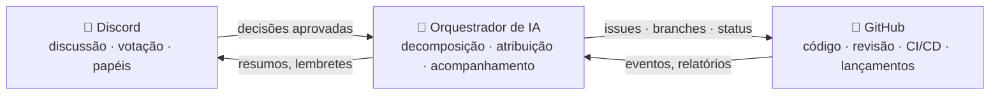

# 🗼 Tower of Babel (Torre de Babel)

🌍 [العربية](README.ar.md) · [বাংলা](README.bn.md) · [Deutsch](README.de.md) · [English](../README.md) · [Español](README.es.md) · [Filipino](README.tl.md) · [Français](README.fr.md) · [हिन्दी](README.hi.md) · [Bahasa Indonesia](README.id.md) · [Italiano](README.it.md) · [日本語](README.ja.md) · [한국어](README.ko.md) · **Português** · [Русский](README.ru.md) · [Kiswahili](README.sw.md) · [தமிழ்](README.ta.md) · [ไทย](README.th.md) · [Türkçe](README.tr.md) · [Tiếng Việt](README.vi.md) · [中文](README.zh.md)

> Um sistema aberto de desenvolvimento colaborativo de software — governado por pessoas, executado por IA.
> Um projeto de aprender-construindo da escola [Skillaria.Top](https://skillaria.top).

---

## 💡 A Ideia

As pessoas tomam decisões no **Discord**, o código vive no **GitHub**, e no meio do caminho trabalha um **Orquestrador de IA** que transforma as decisões da comunidade em tarefas concretas, distribui-as, acompanha o progresso e cuida de toda a rotina.

A característica que define o projeto é a **autoaplicação**: a Tower of Babel é desenvolvida *pelas próprias regras da Tower of Babel*. Cada melhoria no bot, no orquestrador ou nos processos passa pelas mesmas votações, tarefas e revisões que o sistema automatiza.



---

## 📜 Princípios

1. **As pessoas decidem — a IA executa.** O Orquestrador não toma nenhuma decisão de mérito por conta própria. Sua fonte de verdade são as decisões registradas pela comunidade.
2. **Transparência.** Cada ação da IA e cada decisão humana é gravada em um registro público. Não existem decisões "de portas fechadas".
3. **Meritocracia.** A autoridade não é distribuída — ela é conquistada pela contribuição e confirmada por votação.
4. **Reversibilidade.** Qualquer decisão pode ser revista por uma nova votação. Qualquer ação da IA pode ser desfeita.
5. **Autoaplicação.** O projeto evolui segundo as próprias regras desde o primeiro dia — manualmente no início, depois com cada vez mais automação.

---

## 👥 Sistema de Papéis

Os papéis são unificados entre o Discord e o GitHub: o bot os sincroniza automaticamente (enquanto o bot não existe, os Guardiões fazem isso manualmente).

| Papel | Como obter | Discord | GitHub | Autoridade |
|---|---|---|---|---|
| 👁️ **Observador** | Entrar no servidor pelo painel da escola | Ler todos os canais, perguntar no `#help` | Fork, criar Issues | Observar, perguntar, sugerir ideias |
| 🧱 **Aprendiz** | Apresentar-se + pegar a primeira tarefa | Votar nas votações *rotineiras*, participar das discussões | PRs a partir de forks, atribuição a tarefas `good first issue` | Pegar tarefas, participar das discussões |
| ⚒️ **Pedreiro** | 5 PRs mesclados + votação por maioria simples | Votar em *todas* as votações, criar RFCs | Triagem: labels, atribuições; revisões de PRs | Pegar qualquer tarefa, revisar, propor RFCs e candidatos |
| 🏛️ **Arquiteto** | Indicação + 2/3 dos votos dos Pedreiros | Moderar canais técnicos, ser dono de um domínio | Maintain: merge na `main`, milestones, branches de release | Decidir *dentro do seu domínio* unilateralmente (ver "Domínios"), mesclar PRs |
| 🛡️ **Guardião** | Curadores da escola / fundadores | Administrador do servidor | Admin: segredos, configurações, proteção de branches | Veto de emergência, kill switch da IA, onboarding. Não interfere no desenvolvimento do dia a dia |
| 🤖 **Orquestrador** | É o bot. Você não pode se tornar ele 🙂 | Papel próprio com direitos limitados | Conta de máquina separada, sem merge na `main` | Ver "Orquestrador de IA" |

**Domínios** são áreas de responsabilidade pertencentes aos Arquitetos (por exemplo, `bot`, `orchestrator`, `infra`, `docs`). Um Arquiteto decide as questões do seu domínio sem votação, mas quaisquer 3 Pedreiros podem contestar a decisão e levá-la a voto (um "desafio").

**O rebaixamento** acontece pela mesma votação que a promoção, ou automaticamente após 60 dias de inatividade (o papel é congelado e restaurado no retorno, sem votação).

---

## 🗳️ Tomada de Decisões

Todas as decisões se dividem em três níveis. As votações acontecem no `#voting` (por reações ou pelo comando `/vote` do bot), e o resultado é registrado como um arquivo em `decisions/` — esta é a **fonte de verdade para a IA**.

| Nível | Exemplos | Quem vota | Limiar | Quórum | Duração |
|---|---|---|---|---|---|
| 🟢 **Rotineiro** | nome de uma feature, formato do resumo, prioridade de tarefa | Aprendiz+ | maioria simples | 3 votos | 24 h |
| 🟡 **Significativo** | arquitetura, stack tecnológico, roadmap, promoção a Pedreiro/Arquiteto | Pedreiro+ | 2/3 | 50% dos membros ativos | 48 h |
| 🔴 **Crítico** | mudanças nas regras de governança, permissões da IA, licença, exclusão de dados | Pedreiro+ | 3/4 **+ aprovação de um Guardião** | 50% dos membros ativos | 72 h |

Além disso:

- **Decisão por autoridade.** Um Arquiteto pode resolver uma questão do seu domínio sem votação — a decisão ainda assim é registrada em `decisions/` com o sinalizador `by-authority`.
- **Decisão de emergência.** Um Guardião pode agir unilateralmente (incidente, segurança), mas deve publicar um relatório em até 24 h; a comunidade pode anular a decisão com uma votação significativa.
- **Processo de RFC.** Propostas de grande porte são redigidas como RFCs no canal de fórum `#rfc`: problema → proposta → alternativas → pelo menos 48 h de discussão → votação.

### Formato do arquivo de decisão (`decisions/`)

```yaml
# decisions/2026-06-15-choose-tech-stack.yaml
id: 23
title: "Escolha do stack tecnológico"
level: significant        # routine | significant | critical | by-authority | emergency
status: accepted          # accepted | rejected | superseded
votes: { for: 14, against: 3, abstain: 2 }
discord_thread: "<link para a thread>"
decision: |
  Backend em Python 3.12, bot em discord.py, IA atrás de um
  adaptador OpenRouter/Ollama, banco de dados PostgreSQL, deploy com Docker.
tasks_hint: |              # uma dica para a decomposição do Orquestrador (opcional)
  Comece pelo esqueleto do bot e pelo CI.
```

---

## 🤖 Orquestrador de IA

O cérebro da rotina. Funciona via OpenRouter (modelos na nuvem) ou Ollama (modelos locais) atrás de um único adaptador — o provedor é escolhido via configuração.

### O que ele faz

- 📥 **Lê** as decisões aprovadas em `decisions/` e as threads do Discord;
- 🧩 **Decompõe** as decisões em GitHub Issues: subtarefas, labels, estimativas, dependências, milestones;
- 🎯 **Atribui** tarefas por prioridade: voluntário → habilidades compatíveis → menor carga de trabalho. Qualquer atribuição pode ser recusada com um único comando;
- ⏰ **Acompanha** os prazos: lembra, escala para o Arquiteto do domínio, reatribui tarefas paradas;
- 📝 **Resume**: sínteses curtas de discussões longas, um resumo semanal de progresso no `#announcements`;
- 🔍 **Faz rascunhos de revisões de PRs** (conselho, não veredicto — a palavra final é de um humano);
- 🗳️ **Conduz as votações**: contagem, controle de quórum, geração do arquivo de decisão;
- 📒 **Mantém o registro de auditoria**: cada ação sua é publicada no `#audit-log`.

### O que ele NÃO PODE fazer (limites rígidos)

- ❌ Fazer merge na `main` ou em branches de release (proteção de branches);
- ❌ Mudar os papéis das pessoas (ele apenas registra os resultados das votações);
- ❌ Modificar seu próprio prompt de sistema, permissões ou configuração — apenas via votação 🔴 crítica;
- ❌ Tocar em segredos, configurações do repositório ou faturamento;
- ❌ Apagar branches, issues ou mensagens das pessoas;
- ❌ Agir sem uma decisão registrada — a pedidos "verbais" no chat ele responde "por favor, formalize uma decisão".

Os Guardiões têm um **kill switch** — o bot pode ser parado instantaneamente com um único comando.

---

## 🔄 Ciclo de Vida de uma Tarefa

```
💬 Discussão no Discord
        ↓
🗳️ Votação → decisions/NNN.yaml
        ↓
🤖 A IA decompõe → GitHub Issues (backlog)
        ↓
🎯 Atribuição (voluntário / a IA sugere)
        ↓
🌿 Branch feat/NNN-short-name → código → PR
        ↓
✅ CI (testes, linters) + 🤖 rascunho de revisão
        ↓
👤 Revisão por um Pedreiro+ → merge por um Arquiteto
        ↓
🚀 Release → 🤖 notas de lançamento → resumo no Discord
```

---

## 💬 Estrutura do Servidor do Discord

| Canal | Finalidade |
|---|---|
| `#announcements` | Lançamentos, resumos, decisões importantes (publicam Arquitetos+ e o bot) |
| `#rfc` *(fórum)* | Propostas de grande porte, cada uma em sua própria thread |
| `#voting` | Apenas votações e seus resultados |
| `#tasks` | Feed de tarefas do Orquestrador, pegar/entregar tarefas |
| `#dev-general` | Discussão técnica livre |
| `#help` | Perguntas dos novatos — todos respondem |
| `#audit-log` | Registro de ações da IA (apenas o bot) |
| 🔊 `Construction Site` | Chamadas de voz, sessões de mob programming, standups |

---

## 📁 Estrutura do Repositório (alvo)

```
Tower_of_Babel/
├── README.md            ← você está aqui
├── translations/        ← este README em 19 outros idiomas
├── docs/                ← regras, guias, arquivo de RFCs, ADRs
├── decisions/           ← registro de decisões — a fonte de verdade para a IA
├── bot/                 ← bot do Discord (comandos, votações, papéis)
├── orchestrator/        ← núcleo de IA (adaptador de LLM, decomposição, atribuição)
├── integrations/        ← clientes da API do GitHub, webhooks
├── infra/               ← Docker, compose, CI/CD, deploy
└── tests/               ← testes para tudo isso aí
```

---

## 🛠️ Tecnologia (proposta — a ser aprovada na Votação nº 1)

| Camada | Candidato | Por quê |
|---|---|---|
| Linguagem | Python 3.12+ | Barreira de entrada baixa para estudantes, ecossistema rico |
| Discord | `discord.py` | Biblioteca madura, slash commands, eventos |
| GitHub | `githubkit` / REST + webhooks | Cobertura completa da API |
| LLM | OpenRouter **e** Ollama atrás de um único adaptador | Nuvem pela qualidade, local de graça e com privacidade |
| Webhooks/API | FastAPI | Simples, assíncrono, autodocumentado |
| Banco de dados | SQLite → PostgreSQL | Comece simples, cresça sem dor |
| Infra | Docker Compose, GitHub Actions | Reprodutibilidade, CI gratuito |

---

## 🗺️ Roadmap

### Fase 0 — "A Fundação" *(manual, sem código)*
- [ ] Criar o servidor do Discord conforme a estrutura acima, distribuir os papéis iniciais
- [ ] Realizar a **Votação nº 1** — aprovar o stack tecnológico (a primeira decisão em `decisions/`!)
- [ ] Aprovar as regras deste README com uma votação crítica
- [ ] Executar um ciclo de vida completo de tarefa à mão — entender o processo antes de automatizá-lo

### Fase 1 — "A Primeira Pedra": o bot do Discord
- [ ] Esqueleto do bot, deploy com Docker
- [ ] `/vote` — criação de votação, contagem, controle de quórum e prazo
- [ ] Geração automática do arquivo de decisão em `decisions/` (PR do bot)
- [ ] Sincronização papel do Discord ↔ team do GitHub

### Fase 2 — "A Ponte": integração com o GitHub
- [ ] Webhooks do GitHub → eventos no `#tasks` (PR aberto, CI falhou, merge feito)
- [ ] Comandos `/task take`, `/task done`, `/task status`
- [ ] Quadro de projeto (GitHub Projects), automação de status

### Fase 3 — "A Voz da Torre": conectando a IA
- [ ] Adaptador de LLM unificado (OpenRouter / Ollama, escolhido via configuração)
- [ ] Decomposição de decisões → Issues com labels e dependências
- [ ] Resumos de threads e o resumo semanal

### Fase 4 — "A Orquestra": gestão completa
- [ ] Atribuição de tarefas (voluntário → habilidades → carga de trabalho)
- [ ] Controle de prazos, lembretes, escalonamento
- [ ] Rascunhos de revisões de PRs pela IA, notas de lançamento
- [ ] `#audit-log` e o kill switch

### Fase 5 — "Autoconstrução"
- [ ] O sistema gerencia totalmente o próprio desenvolvimento (dogfooding)
- [ ] Métricas: velocidade das tarefas, atividade, qualidade das revisões
- [ ] Integrar um segundo projeto — testar a portabilidade
- [ ] Um template público: "monte a sua própria Torre em uma noite"

---

## 🚪 Como Participar

O servidor do Discord do projeto está disponível apenas para estudantes da Skillaria.Top:

1. Torne-se estudante na [Skillaria.Top](https://skillaria.top);
2. Estude e evolua até alcançar o nível **Intern**;
3. Pegue o link de convite do Discord no seu painel pessoal;
4. Apresente-se no `#help` — você receberá o papel de 🧱 Aprendiz;
5. Pegue uma tarefa com o label [`good first issue`](https://github.com/skillariatop/Tower_of_Babel/labels/good%20first%20issue);
6. Abra um PR — e você já está a caminho de ⚒️ Pedreiro.

Não sabe programar? Também precisamos de testadores, redatores técnicos, moderadores e designers de processos — contribuições em `docs/` e `decisions/` valem tanto quanto código.

---

## 📄 Licença

O projeto é distribuído sob a licença no arquivo [LICENSE](../LICENSE).

> *"E o SENHOR disse: Eis que o povo é um, e todos têm uma mesma língua; e isto é o que começam a fazer; e agora, não haverá restrição para tudo o que eles intentarem fazer"* — Gênesis 11:6.
> Desta vez, temos controle de versão.
