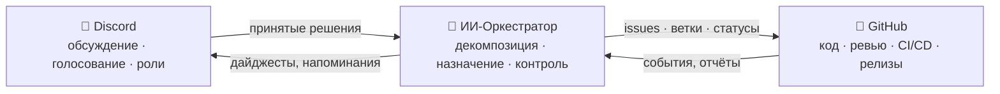

# 🗼 Tower of Babel

🌍 [العربية](README.ar.md) · [বাংলা](README.bn.md) · [Deutsch](README.de.md) · [English](../README.md) · [Español](README.es.md) · [Filipino](README.tl.md) · [Français](README.fr.md) · [हिन्दी](README.hi.md) · [Bahasa Indonesia](README.id.md) · [Italiano](README.it.md) · [日本語](README.ja.md) · [한국어](README.ko.md) · [Português](README.pt.md) · **Русский** · [Kiswahili](README.sw.md) · [தமிழ்](README.ta.md) · [ไทย](README.th.md) · [Türkçe](README.tr.md) · [Tiếng Việt](README.vi.md) · [中文](README.zh.md)

> Открытая система коллективной разработки, которой управляют люди, а исполняет — ИИ.
> Учебно-боевой проект школы [Skillaria.Top](https://skillaria.top).

---

## 💡 Идея

Люди договариваются в **Discord**, код живёт на **GitHub**, а между ними работает **ИИ-Оркестратор**, который превращает решения сообщества в конкретные задачи, распределяет их, следит за выполнением и ведёт всю рутину.

Особенность проекта — **самоприменимость**: система Tower of Babel разрабатывается *по правилам самой системы Tower of Babel*. Каждое улучшение бота, оркестратора или процессов проходит через те же голосования, задачи и ревью, которые она автоматизирует.



---

## 📜 Принципы

1. **Люди решают — ИИ исполняет.** Оркестратор не принимает ни одного содержательного решения сам. Его источник правды — зафиксированные решения сообщества.
2. **Прозрачность.** Каждое действие ИИ и каждое решение людей записывается в публичный журнал. Нет «закрытых» решений.
3. **Меритократия.** Полномочия не выдаются — они зарабатываются вкладом и подтверждаются голосованием.
4. **Обратимость.** Любое решение можно пересмотреть новым голосованием. Любое действие ИИ можно откатить.
5. **Самоприменимость.** Проект развивается по собственным правилам с первого дня — сначала вручную, потом всё более автоматизированно.

---

## 👥 Система ролей

Роли едины для Discord и GitHub: бот синхронизирует их автоматически (до появления бота — Хранители вручную).

| Роль | Как получить | Discord | GitHub | Полномочия |
|---|---|---|---|---|
| 👁️ **Наблюдатель** | Вступить на сервер по ссылке из личного кабинета школы | Чтение всех каналов, вопросы в `#help` | Fork, создание Issues | Смотреть, спрашивать, предлагать идеи |
| 🧱 **Подмастерье** | Представиться + взять первую задачу | Голос в *бытовых* голосованиях, участие в обсуждениях | PR из форков, назначение на задачи `good first issue` | Брать задачи, участвовать в обсуждениях |
| ⚒️ **Каменщик** | 5 принятых PR + простое большинство голосов | Голос во *всех* голосованиях, создание RFC | Триаж: метки, назначения; ревью PR | Брать любые задачи, ревьюить, выдвигать RFC и кандидатов |
| 🏛️ **Зодчий** | Выдвижение + 2/3 голосов Каменщиков | Модерация тех-каналов, ведение своего домена | Maintain: merge в `main`, milestones, релизные ветки | Единолично решать вопросы *своего домена* (см. «Домены»), мержить PR |
| 🛡️ **Хранитель** | Кураторы школы / основатели | Администратор сервера | Admin: secrets, настройки, защита веток | Экстренное вето, kill switch ИИ, онбординг. Не вмешивается в обычную разработку |
| 🤖 **Оркестратор** | Это бот. Им нельзя стать 🙂 | Своя роль с ограниченными правами | Отдельный machine-аккаунт, без merge в `main` | См. раздел «ИИ-Оркестратор» |

**Домены** — зоны ответственности Зодчих (например: `bot`, `orchestrator`, `infra`, `docs`). Зодчий решает вопросы внутри домена без голосования, но любые 3 Каменщика могут оспорить его решение и вынести на голосование («челлендж»).

**Понижение роли** происходит тем же голосованием, что и повышение, либо автоматически после 60 дней неактивности (роль замораживается, восстанавливается по возвращении без голосования).

---

## 🗳️ Принятие решений

Все решения делятся на три уровня. Голосование проводится в `#voting` (реакциями или командой бота `/vote`), результат фиксируется файлом в `decisions/` — это **источник правды для ИИ**.

| Уровень | Примеры | Кто голосует | Порог | Кворум | Срок |
|---|---|---|---|---|---|
| 🟢 **Бытовое** | название фичи, формат дайджеста, приоритет задачи | Подмастерье+ | простое большинство | 3 голоса | 24 ч |
| 🟡 **Значимое** | архитектура, стек, roadmap, повышение до Каменщика/Зодчего | Каменщик+ | 2/3 | 50% активных | 48 ч |
| 🔴 **Критическое** | изменение правил управления, права ИИ, лицензия, удаление данных | Каменщик+ | 3/4 **+ одобрение Хранителя** | 50% активных | 72 ч |

Дополнительно:

- **Решение по полномочиям.** Зодчий может решить вопрос своего домена без голосования — решение всё равно фиксируется в `decisions/` с пометкой `by-authority`.
- **Экстренное решение.** Хранитель может действовать единолично (инцидент, безопасность), но обязан в течение 24 ч опубликовать отчёт; сообщество может отменить решение значимым голосованием.
- **RFC-процесс.** Крупные предложения оформляются как RFC в форум-канале `#rfc`: проблема → предложение → альтернативы → обсуждение минимум 48 ч → голосование.

### Формат файла решения (`decisions/`)

```yaml
# decisions/2026-06-15-choose-tech-stack.yaml
id: 23
title: "Выбор технологического стека"
level: significant        # routine | significant | critical | by-authority | emergency
status: accepted          # accepted | rejected | superseded
votes: { for: 14, against: 3, abstain: 2 }
discord_thread: "<ссылка на тред>"
decision: |
  Бэкенд на Python 3.12, бот на discord.py, ИИ через адаптер
  OpenRouter/Ollama, БД PostgreSQL, деплой в Docker.
tasks_hint: |              # подсказка Оркестратору для декомпозиции (опционально)
  Начать с каркаса бота и CI.
```

---

## 🤖 ИИ-Оркестратор

Мозг рутины. Работает через OpenRouter (облачные модели) или Ollama (локальные) за единым адаптером — провайдер выбирается конфигом.

### Что делает

- 📥 **Читает** принятые решения из `decisions/` и треды Discord;
- 🧩 **Декомпозирует** решения в GitHub Issues: подзадачи, метки, оценки, зависимости, milestone;
- 🎯 **Назначает** задачи по приоритету: доброволец → подходящие навыки → наименьшая загрузка. Любое назначение можно отклонить одной командой;
- ⏰ **Следит** за сроками: напоминает, эскалирует Зодчему домена, переназначает зависшие задачи;
- 📝 **Суммирует**: краткие выжимки длинных обсуждений, еженедельный дайджест прогресса в `#announcements`;
- 🔍 **Делает черновое ревью** PR (советы, не вердикт — финальное слово за человеком);
- 🗳️ **Обслуживает голосования**: подсчёт, контроль кворума, генерация файла решения;
- 📒 **Ведёт аудит**: каждое своё действие публикует в `#audit-log`.

### Что НЕ может (жёсткие ограничения)

- ❌ Мержить в `main` и релизные ветки (branch protection);
- ❌ Менять роли людей (только фиксирует итоги голосований);
- ❌ Изменять свой системный промпт, права или конфиг — только через 🔴 критическое голосование;
- ❌ Касаться секретов, настроек репозитория, биллинга;
- ❌ Удалять ветки, issues, сообщения людей;
- ❌ Действовать без зафиксированного решения — на «устные» просьбы в чате отвечает «оформите решение».

У Хранителей есть **kill switch** — мгновенная остановка бота одной командой.

---

## 🔄 Жизненный цикл задачи

```
💬 Обсуждение в Discord
        ↓
🗳️ Голосование → decisions/NNN.yaml
        ↓
🤖 ИИ декомпозирует → GitHub Issues (backlog)
        ↓
🎯 Назначение (доброволец / ИИ предлагает)
        ↓
🌿 Ветка feat/NNN-кратко → код → PR
        ↓
✅ CI (тесты, линтеры) + 🤖 черновое ревью
        ↓
👤 Ревью Каменщика+ → merge Зодчим
        ↓
🚀 Релиз → 🤖 release notes → дайджест в Discord
```

---

## 💬 Структура Discord-сервера

| Канал | Назначение |
|---|---|
| `#announcements` | Релизы, дайджесты, важные решения (пишут Зодчие+ и бот) |
| `#rfc` *(форум)* | Крупные предложения, каждое — отдельный тред |
| `#voting` | Только голосования и их результаты |
| `#tasks` | Лента задач от Оркестратора, взятие/сдача задач |
| `#dev-general` | Свободное техническое обсуждение |
| `#help` | Вопросы новичков — отвечают все |
| `#audit-log` | Журнал действий ИИ (только бот) |
| 🔊 `Стройплощадка` | Голосовые созвоны, мобы, стендапы |

---

## 📁 Структура репозитория (целевая)

```
Tower_of_Babel/
├── README.md            ← главная версия (English)
├── translations/        ← этот README на 19 других языках
├── docs/                ← правила, гайды, RFC-архив, ADR
├── decisions/           ← журнал решений — источник правды для ИИ
├── bot/                 ← Discord-бот (команды, голосования, роли)
├── orchestrator/        ← ИИ-ядро (адаптер LLM, декомпозиция, назначение)
├── integrations/        ← клиенты GitHub API, вебхуки
├── infra/               ← Docker, compose, CI/CD, деплой
└── tests/               ← тесты всего вышеперечисленного
```

---

## 🛠️ Технологии (предложение — утверждается Голосованием №1)

| Слой | Кандидат | Почему |
|---|---|---|
| Язык | Python 3.12+ | Низкий порог входа для учеников, богатая экосистема |
| Discord | `discord.py` | Зрелая библиотека, slash-команды, события |
| GitHub | `githubkit` / REST + webhooks | Полное покрытие API |
| LLM | OpenRouter **и** Ollama за единым адаптером | Облако для качества, локально — бесплатно и приватно |
| Вебхуки/API | FastAPI | Просто, асинхронно, автодокументация |
| БД | SQLite → PostgreSQL | Начать просто, вырасти без боли |
| Инфра | Docker Compose, GitHub Actions | Воспроизводимость, бесплатный CI |

---

## 🗺️ Дорожная карта

### Фаза 0 — «Фундамент» *(вручную, без кода)*
- [ ] Создать Discord-сервер по структуре выше, раздать стартовые роли
- [ ] Провести **Голосование №1** — утвердить стек (первое решение в `decisions/`!)
- [ ] Утвердить правила из этого README критическим голосованием
- [ ] Прогнать жизненный цикл задачи полностью вручную — понять процесс до автоматизации

### Фаза 1 — «Первый камень»: Discord-бот
- [ ] Каркас бота, деплой в Docker
- [ ] `/vote` — создание голосования, подсчёт, контроль кворума и сроков
- [ ] Автогенерация файла решения в `decisions/` (PR от бота)
- [ ] Синхронизация ролей Discord ↔ команды GitHub

### Фаза 2 — «Мост»: интеграция с GitHub
- [ ] Webhooks GitHub → события в `#tasks` (PR открыт, CI упал, merge)
- [ ] Команды `/task take`, `/task done`, `/task status`
- [ ] Доска проекта (GitHub Projects), автоматизация статусов

### Фаза 3 — «Голос Башни»: подключение ИИ
- [ ] Единый адаптер LLM (OpenRouter / Ollama, выбор конфигом)
- [ ] Декомпозиция решения → Issues с метками и зависимостями
- [ ] Саммари тредов и еженедельный дайджест

### Фаза 4 — «Оркестр»: полное управление
- [ ] Назначение задач (доброволец → навыки → загрузка)
- [ ] Контроль сроков, напоминания, эскалация
- [ ] Черновое ИИ-ревью PR, release notes
- [ ] `#audit-log` и kill switch

### Фаза 5 — «Самострой»
- [ ] Система полностью ведёт собственную разработку (dogfooding)
- [ ] Метрики: скорость задач, активность, качество ревью
- [ ] Подключение второго проекта — проверка переносимости
- [ ] Публичный шаблон: «разверни свою Башню за вечер»

---

## 🚪 Как присоединиться

Discord-сервер проекта доступен только ученикам школы Skillaria.Top:

1. Стань учеником школы [Skillaria.Top](https://skillaria.top);
2. Учись и расти до уровня **«Стажёр»**;
3. Получи ссылку-приглашение на Discord-сервер в личном кабинете;
4. Представься в `#help` — получишь роль 🧱 Подмастерье;
5. Возьми задачу с меткой [`good first issue`](https://github.com/skillariatop/Tower_of_Babel/labels/good%20first%20issue);
6. Сделай PR — и ты на пути к ⚒️ Каменщику.

Не умеешь кодить? Нужны и тестировщики, и техписатели, и модераторы, и дизайнеры процессов — вклад в `docs/` и `decisions/` ценится наравне с кодом.

---

## 📄 Лицензия

Проект распространяется по лицензии из файла [LICENSE](../LICENSE).

> *«И сказал Господь: вот, один народ, и один у всех язык; и вот что начали они делать, и не отстанут они от того, что задумали делать»* — Бытие 11:6.
> На этот раз у нас есть система контроля версий.
