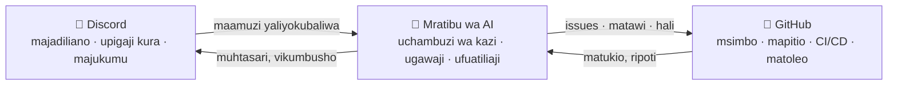

# 🗼 Tower of Babel (Mnara wa Babeli)

🌍 [العربية](README.ar.md) · [বাংলা](README.bn.md) · [Deutsch](README.de.md) · [English](../README.md) · [Español](README.es.md) · [Filipino](README.tl.md) · [Français](README.fr.md) · [हिन्दी](README.hi.md) · [Bahasa Indonesia](README.id.md) · [Italiano](README.it.md) · [日本語](README.ja.md) · [한국어](README.ko.md) · [Português](README.pt.md) · [Русский](README.ru.md) · **Kiswahili** · [தமிழ்](README.ta.md) · [ไทย](README.th.md) · [Türkçe](README.tr.md) · [Tiếng Việt](README.vi.md) · [中文](README.zh.md)

> Mfumo wazi wa uundaji wa programu kwa pamoja — unaongozwa na watu, unatekelezwa na AI.
> Mradi wa kujifunza-kwa-kujenga wa shule ya [Skillaria.Top](https://skillaria.top).

---

## 💡 Wazo

Watu hufanya maamuzi kwenye **Discord**, msimbo huishi kwenye **GitHub**, na katikati yao anafanya kazi **Mratibu wa AI** anayegeuza maamuzi ya jumuiya kuwa kazi mahususi, kuzigawa, kufuatilia maendeleo, na kushughulikia mambo yote ya kawaida.

Sifa kuu inayoutambulisha mradi huu ni **kujitumia wenyewe**: Tower of Babel inaundwa *kwa kanuni za Tower of Babel yenyewe*. Kila uboreshaji wa boti, wa mratibu, au wa michakato hupitia kura, kazi na mapitio yale yale ambayo mfumo huu unayafanya kiotomatiki.



---

## 📜 Misingi

1. **Watu huamua — AI hutekeleza.** Mratibu hafanyi maamuzi yoyote ya msingi peke yake. Chanzo chake cha ukweli ni maamuzi ya jumuiya yaliyorekodiwa.
2. **Uwazi.** Kila kitendo cha AI na kila uamuzi wa binadamu huandikwa kwenye kumbukumbu ya wazi. Hakuna maamuzi ya "mlango uliofungwa".
3. **Ustahili.** Mamlaka hayagawiwi bure — yanapatikana kwa mchango na kuthibitishwa kwa kura.
4. **Ugeuzika.** Uamuzi wowote unaweza kupitiwa upya kwa kura mpya. Kitendo chochote cha AI kinaweza kurudishwa nyuma.
5. **Kujitumia wenyewe.** Mradi hukua kwa kanuni zake wenyewe tangu siku ya kwanza — kwa mikono mwanzoni, kisha kwa otomatiki zaidi na zaidi.

---

## 👥 Mfumo wa Majukumu

Majukumu yameunganishwa kati ya Discord na GitHub: boti huyalinganisha kiotomatiki (mpaka boti itakapokuwepo, Walinzi hufanya hivyo kwa mikono).

| Jukumu | Jinsi ya kulipata | Discord | GitHub | Mamlaka |
|---|---|---|---|---|
| 👁️ **Mtazamaji** | Jiunge na seva kupitia dashibodi yako ya shule | Kusoma chaneli zote, kuuliza katika `#help` | Fork, kuunda Issues | Kutazama, kuuliza, kupendekeza mawazo |
| 🧱 **Mwanagenzi** | Jitambulishe + chukua kazi yako ya kwanza | Kupiga kura katika kura za *kawaida*, kujiunga na majadiliano | PR kutoka kwenye fork, kupangiwa kazi za `good first issue` | Kuchukua kazi, kushiriki katika majadiliano |
| ⚒️ **Mwashi** | PR 5 zilizounganishwa + kura ya wingi rahisi | Kupiga kura katika kura *zote*, kuunda RFC | Triage: lebo, ugawaji; mapitio ya PR | Kuchukua kazi yoyote, kupitia kazi, kupendekeza RFC na wagombea |
| 🏛️ **Msanifu** | Kupendekezwa + kura ya 2/3 ya Waashi | Kusimamia chaneli za kiufundi, kumiliki nyanja | Maintain: kuunganisha kwenye `main`, milestones, matawi ya matoleo | Kuamua *ndani ya nyanja yake* peke yake (ona "Nyanja"), kuunganisha PR |
| 🛡️ **Mlinzi** | Wasimamizi wa shule / waanzilishi | Msimamizi wa seva | Admin: siri, mipangilio, ulinzi wa matawi | Veto ya dharura, swichi ya kuzima AI, upokeaji wa wapya. Haingilii uundaji wa kila siku |
| 🤖 **Mratibu** | Ni boti. Huwezi kuwa yeye 🙂 | Jukumu lake mwenyewe lenye haki finyu | Akaunti tofauti ya mashine, haunganishi kwenye `main` | Ona "Mratibu wa AI" |

**Nyanja** ni maeneo ya uwajibikaji yanayomilikiwa na Wasanifu (mfano: `bot`, `orchestrator`, `infra`, `docs`). Msanifu huamua mambo ndani ya nyanja yake bila kura, lakini Waashi wowote 3 wanaweza kupinga uamuzi huo na kuupeleka kwenye kura ("changamoto").

**Kushushwa cheo** hufanyika kupitia kura ile ile ya kupandishwa cheo, au kiotomatiki baada ya siku 60 za kutokuwepo (jukumu hugandishwa na kurudishwa mtu akirejea bila kura).

---

## 🗳️ Ufanyaji Maamuzi

Maamuzi yote yamegawanyika katika ngazi tatu. Kura hupigwa katika `#voting` (kwa riaksheni au amri ya boti `/vote`), na matokeo hurekodiwa kama faili katika `decisions/` — hiki ndicho **chanzo cha ukweli kwa AI**.

| Ngazi | Mifano | Nani anapiga kura | Kiwango | Akidi | Muda |
|---|---|---|---|---|---|
| 🟢 **Kawaida** | majina ya vipengele, muundo wa muhtasari, kipaumbele cha kazi | Mwanagenzi+ | wingi rahisi | kura 3 | saa 24 |
| 🟡 **Muhimu** | usanifu, teknolojia, ramani ya mradi, kupandishwa kuwa Mwashi/Msanifu | Mwashi+ | 2/3 | 50% ya wanachama hai | saa 48 |
| 🔴 **Nyeti** | mabadiliko ya kanuni za uongozi, ruhusa za AI, leseni, ufutaji wa data | Mwashi+ | 3/4 **+ idhini ya Mlinzi** | 50% ya wanachama hai | saa 72 |

Zaidi ya hayo:

- **Uamuzi kwa mamlaka.** Msanifu anaweza kuamua jambo ndani ya nyanja yake bila kura — uamuzi bado hurekodiwa katika `decisions/` na alama ya `by-authority`.
- **Uamuzi wa dharura.** Mlinzi anaweza kuchukua hatua peke yake (tukio, usalama), lakini lazima atoe ripoti ndani ya saa 24; jumuiya inaweza kuubatilisha uamuzi huo kwa kura ya ngazi muhimu.
- **Mchakato wa RFC.** Mapendekezo makubwa huandikwa kama RFC katika chaneli ya jukwaa `#rfc`: tatizo → pendekezo → njia mbadala → angalau saa 48 za majadiliano → kura.

### Muundo wa faili ya uamuzi (`decisions/`)

```yaml
# decisions/2026-06-15-choose-tech-stack.yaml
id: 23
title: "Kuchagua teknolojia za mradi"
level: significant        # routine | significant | critical | by-authority | emergency
status: accepted          # accepted | rejected | superseded
votes: { for: 14, against: 3, abstain: 2 }
discord_thread: "<kiungo cha uzi>"
decision: |
  Backend kwa Python 3.12, boti kwa discord.py, AI nyuma ya
  adapta ya OpenRouter/Ollama, hifadhidata ya PostgreSQL, usambazaji kwa Docker.
tasks_hint: |              # dokezo kwa Mratibu wakati wa kuchambua kazi (si lazima)
  Anza na kiunzi cha boti na CI.
```

---

## 🤖 Mratibu wa AI

Ubongo wa kazi za kawaida. Hufanya kazi kupitia OpenRouter (modeli za wingu) au Ollama (modeli za ndani) nyuma ya adapta moja — mtoa huduma huchaguliwa kupitia config.

### Anachofanya

- 📥 **Husoma** maamuzi yaliyokubaliwa kutoka `decisions/` na nyuzi za Discord;
- 🧩 **Huchambua** maamuzi kuwa GitHub Issues: kazi ndogo, lebo, makadirio, utegemezi, milestones;
- 🎯 **Hugawa** kazi kwa kipaumbele: aliyejitolea → ujuzi unaolingana → mzigo mdogo zaidi. Ugawaji wowote unaweza kukataliwa kwa amri moja tu;
- ⏰ **Hufuatilia** makataa: hukumbusha, hupeleka jambo kwa Msanifu wa nyanja husika, hugawa upya kazi zilizokwama;
- 📝 **Hufanya muhtasari**: muhtasari mfupi wa majadiliano marefu, muhtasari wa maendeleo wa kila wiki katika `#announcements`;
- 🔍 **Huandaa rasimu za mapitio ya PR** (ushauri, si hukumu — neno la mwisho ni la binadamu);
- 🗳️ **Huendesha kura**: kuhesabu, kudhibiti akidi, kutengeneza faili ya uamuzi;
- 📒 **Hutunza kumbukumbu ya ukaguzi**: kila kitendo chake huchapishwa katika `#audit-log`.

### Asichoweza kufanya (mipaka migumu)

- ❌ Kuunganisha kwenye `main` au matawi ya matoleo (ulinzi wa matawi);
- ❌ Kubadilisha majukumu ya watu (yeye hurekodi tu matokeo ya kura);
- ❌ Kubadilisha system prompt yake, ruhusa zake, au config yake — kwa kura 🔴 nyeti pekee;
- ❌ Kugusa siri, mipangilio ya hazina, au malipo;
- ❌ Kufuta matawi, issues, au ujumbe wa watu;
- ❌ Kutenda bila uamuzi uliorekodiwa — kwa maombi ya "mdomo" katika gumzo hujibu "tafadhali rasimisha uamuzi".

Walinzi wana **swichi ya kuzima** — boti inaweza kusimamishwa papo hapo kwa amri moja.

---

## 🔄 Mzunguko wa Maisha ya Kazi

```
💬 Majadiliano katika Discord
        ↓
🗳️ Kura → decisions/NNN.yaml
        ↓
🤖 AI huchambua → GitHub Issues (backlog)
        ↓
🎯 Ugawaji (aliyejitolea / AI hupendekeza)
        ↓
🌿 Tawi feat/NNN-short-name → msimbo → PR
        ↓
✅ CI (majaribio, linters) + 🤖 rasimu ya mapitio
        ↓
👤 Mapitio na Mwashi+ → kuunganishwa na Msanifu
        ↓
🚀 Toleo → 🤖 maelezo ya toleo → muhtasari katika Discord
```

---

## 💬 Muundo wa Seva ya Discord

| Chaneli | Madhumuni |
|---|---|
| `#announcements` | Matoleo, muhtasari, maamuzi muhimu (Wasanifu+ na boti huchapisha) |
| `#rfc` *(jukwaa)* | Mapendekezo makubwa, kila moja katika uzi wake |
| `#voting` | Kura na matokeo yake pekee |
| `#tasks` | Mtiririko wa kazi kutoka kwa Mratibu, kuchukua/kuwasilisha kazi |
| `#dev-general` | Majadiliano huru ya kiufundi |
| `#help` | Maswali ya wapya — kila mtu hujibu |
| `#audit-log` | Kumbukumbu ya vitendo vya AI (boti pekee) |
| 🔊 `Construction Site` | Simu za sauti, vikao vya pamoja, mikutano ya kila siku |

---

## 📁 Muundo wa Hazina (lengwa)

```
Tower_of_Babel/
├── README.md            ← uko hapa
├── translations/        ← README hii katika lugha nyingine 19
├── docs/                ← kanuni, miongozo, kumbukumbu za RFC, ADR
├── decisions/           ← kumbukumbu ya maamuzi — chanzo cha ukweli kwa AI
├── bot/                 ← boti ya Discord (amri, kura, majukumu)
├── orchestrator/        ← kiini cha AI (adapta ya LLM, uchambuzi, ugawaji)
├── integrations/        ← wateja wa GitHub API, webhooks
├── infra/               ← Docker, compose, CI/CD, usambazaji
└── tests/               ← majaribio ya yote yaliyo hapo juu
```

---

## 🛠️ Teknolojia (pendekezo — litaidhinishwa kwa Kura #1)

| Tabaka | Mgombea | Kwa nini |
|---|---|---|
| Lugha | Python 3.12+ | Kizingiti kidogo cha kuingia kwa wanafunzi, mfumo-ikolojia tajiri |
| Discord | `discord.py` | Maktaba iliyokomaa, amri za slash, matukio |
| GitHub | `githubkit` / REST + webhooks | Ufikiaji kamili wa API |
| LLM | OpenRouter **na** Ollama nyuma ya adapta moja | Wingu kwa ubora, ya ndani kwa bure na faragha |
| Webhooks/API | FastAPI | Rahisi, async, hujiandikia nyaraka zenyewe |
| Hifadhidata | SQLite → PostgreSQL | Anza kirahisi, kua bila maumivu |
| Infra | Docker Compose, GitHub Actions | Urudufu, CI ya bure |

---

## 🗺️ Ramani ya Mradi

### Awamu ya 0 — "Msingi" *(kwa mikono, bila msimbo)*
- [ ] Kuunda seva ya Discord kulingana na muundo ulio hapo juu, kugawa majukumu ya mwanzo
- [ ] Kufanya **Kura #1** — kuidhinisha teknolojia (uamuzi wa kwanza katika `decisions/`!)
- [ ] Kuidhinisha kanuni za README hii kwa kura nyeti
- [ ] Kuendesha mzunguko kamili wa kazi kwa mikono — kuelewa mchakato kabla ya kuufanya otomatiki

### Awamu ya 1 — "Jiwe la Kwanza": boti ya Discord
- [ ] Kiunzi cha boti, usambazaji kwa Docker
- [ ] `/vote` — kuunda kura, kuhesabu, kudhibiti akidi na makataa
- [ ] Utengenezaji otomatiki wa faili ya uamuzi katika `decisions/` (PR kutoka kwa boti)
- [ ] Ulinganishaji wa jukumu la Discord ↔ timu ya GitHub

### Awamu ya 2 — "Daraja": muunganiko na GitHub
- [ ] Webhooks za GitHub → matukio katika `#tasks` (PR imefunguliwa, CI imeshindwa, imeunganishwa)
- [ ] Amri `/task take`, `/task done`, `/task status`
- [ ] Ubao wa mradi (GitHub Projects), otomatiki ya hali

### Awamu ya 3 — "Sauti ya Mnara": kuunganisha AI
- [ ] Adapta moja ya LLM (OpenRouter / Ollama, huchaguliwa kupitia config)
- [ ] Uchambuzi wa maamuzi → Issues zenye lebo na utegemezi
- [ ] Muhtasari wa nyuzi na muhtasari wa kila wiki

### Awamu ya 4 — "Okestra": usimamizi kamili
- [ ] Ugawaji wa kazi (aliyejitolea → ujuzi → mzigo wa kazi)
- [ ] Udhibiti wa makataa, vikumbusho, upelekaji juu
- [ ] Rasimu za mapitio ya PR za AI, maelezo ya matoleo
- [ ] `#audit-log` na swichi ya kuzima

### Awamu ya 5 — "Kujijenga"
- [ ] Mfumo unasimamia kikamilifu uundaji wake wenyewe (dogfooding)
- [ ] Vipimo: kasi ya kazi, ushiriki, ubora wa mapitio
- [ ] Kupokea mradi wa pili — kupima uhamishika
- [ ] Kiolezo cha umma: "simika Mnara wako mwenyewe kwa jioni moja"

---

## 🚪 Jinsi ya Kujiunga

Seva ya Discord ya mradi inapatikana kwa wanafunzi wa Skillaria.Top pekee:

1. Kuwa mwanafunzi katika [Skillaria.Top](https://skillaria.top);
2. Jifunze na ukue mpaka ufikie ngazi ya **Intern**;
3. Pata kiungo cha mwaliko cha Discord katika dashibodi yako binafsi;
4. Jitambulishe katika `#help` — utapewa jukumu la 🧱 Mwanagenzi;
5. Chukua kazi yenye lebo [`good first issue`](https://github.com/skillariatop/Tower_of_Babel/labels/good%20first%20issue);
6. Fungua PR — na uko njiani kuwa ⚒️ Mwashi.

Huwezi kuandika msimbo? Tunahitaji pia wajaribu, waandishi wa kiufundi, wasimamizi, na wabunifu wa michakato — michango katika `docs/` na `decisions/` inathaminiwa sawa na msimbo.

---

## 📄 Leseni

Mradi unasambazwa chini ya leseni iliyo katika faili la [LICENSE](../LICENSE).

> *"Bwana akasema, Tazama, watu hawa ni taifa moja, na lugha yao ni moja; na haya ndiyo wanayoanza kuyafanya, wala sasa hawatazuiliwa neno wanalokusudia kulifanya"* — Mwanzo 11:6.
> Safari hii, tunayo udhibiti wa matoleo.
