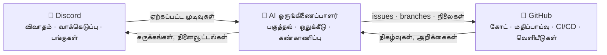

# 🗼 Tower of Babel (பாபேல் கோபுரம்)

🌍 [العربية](README.ar.md) · [বাংলা](README.bn.md) · [Deutsch](README.de.md) · [English](../README.md) · [Español](README.es.md) · [Filipino](README.tl.md) · [Français](README.fr.md) · [हिन्दी](README.hi.md) · [Bahasa Indonesia](README.id.md) · [Italiano](README.it.md) · [日本語](README.ja.md) · [한국어](README.ko.md) · [Português](README.pt.md) · [Русский](README.ru.md) · [Kiswahili](README.sw.md) · **தமிழ்** · [ไทย](README.th.md) · [Türkçe](README.tr.md) · [Tiếng Việt](README.vi.md) · [中文](README.zh.md)

> கூட்டாக மென்பொருள் உருவாக்குவதற்கான ஒரு திறந்த அமைப்பு — மக்களால் ஆளப்படுகிறது, AI-ஆல் செயல்படுத்தப்படுகிறது.
> [Skillaria.Top](https://skillaria.top) பள்ளியின் "கட்டிக் கற்கும்" திட்டம்.

---

## 💡 கருத்து

மக்கள் **Discord**-இல் முடிவுகளை எடுக்கிறார்கள், கோட் **GitHub**-இல் வாழ்கிறது; இவை இரண்டுக்கும் நடுவில் ஒரு **AI ஒருங்கிணைப்பாளர்** வேலை செய்கிறது — சமூகத்தின் முடிவுகளை உறுதியான பணிகளாக மாற்றி, அவற்றை ஒதுக்கீடு செய்து, முன்னேற்றத்தைக் கண்காணித்து, அன்றாட வேலைகளையெல்லாம் கையாள்கிறது.

இந்தத் திட்டத்தின் தனிச்சிறப்பு **தன்னைத் தானே பின்பற்றுவது**: Tower of Babel திட்டம் *Tower of Babel-இன் விதிகளின்படியே* உருவாக்கப்படுகிறது. பாட், ஒருங்கிணைப்பாளர் அல்லது செயல்முறைகளில் செய்யப்படும் ஒவ்வொரு மேம்பாடும், இந்த அமைப்பு தானியக்கமாக்கும் அதே வாக்கெடுப்புகள், பணிகள் மற்றும் மதிப்பாய்வுகள் வழியாகவே செல்கிறது.



---

## 📜 கொள்கைகள்

1. **மக்கள் முடிவு செய்கிறார்கள் — AI செயல்படுத்துகிறது.** ஒருங்கிணைப்பாளர் தானாக எந்த முக்கிய முடிவையும் எடுப்பதில்லை. சமூகத்தால் பதிவு செய்யப்பட்ட முடிவுகளே அதன் உண்மையின் மூலாதாரம்.
2. **வெளிப்படைத்தன்மை.** AI-இன் ஒவ்வொரு செயலும், மனிதர்களின் ஒவ்வொரு முடிவும் பொதுப் பதிவேட்டில் எழுதப்படுகிறது. "மூடிய கதவுக்குப் பின்னால்" முடிவுகள் எதுவும் இல்லை.
3. **தகுதியாட்சி.** அதிகாரம் யாருக்கும் இலவசமாக வழங்கப்படுவதில்லை — பங்களிப்பின் மூலம் சம்பாதிக்கப்பட்டு, வாக்கெடுப்பால் உறுதிப்படுத்தப்படுகிறது.
4. **மீட்டெடுக்கும் தன்மை.** எந்த முடிவையும் புதிய வாக்கெடுப்பால் மறுபரிசீலனை செய்யலாம். AI-இன் எந்தச் செயலையும் திரும்பப் பெறலாம்.
5. **தன்னைத் தானே பின்பற்றுதல்.** முதல் நாளிலிருந்தே திட்டம் தன் சொந்த விதிகளின்படியே வளர்கிறது — முதலில் கையால், பின்னர் படிப்படியாக மேலும் மேலும் தானியக்கத்துடன்.

---

## 👥 பங்கு அமைப்பு

Discord மற்றும் GitHub இரண்டிலும் பங்குகள் ஒன்றுபட்டவை: பாட் அவற்றைத் தானாக ஒத்திசைக்கிறது (பாட் உருவாகும் வரை, காப்பாளர்கள் கையால் செய்கிறார்கள்).

| பங்கு | எப்படிப் பெறுவது | Discord | GitHub | அதிகாரம் |
|---|---|---|---|---|
| 👁️ **பார்வையாளர் (Observer)** | உங்கள் பள்ளி டாஷ்போர்டு வழியாக சேவையகத்தில் சேருங்கள் | எல்லா சேனல்களையும் படிக்கலாம், `#help`-இல் கேள்வி கேட்கலாம் | Fork, Issues உருவாக்கலாம் | கவனிக்கலாம், கேட்கலாம், யோசனைகளைப் பரிந்துரைக்கலாம் |
| 🧱 **பயிற்சிக் கொத்தனார் (Apprentice)** | உங்களை அறிமுகப்படுத்திக்கொண்டு முதல் பணியை எடுங்கள் | *அன்றாட* வாக்கெடுப்புகளில் வாக்களிக்கலாம், விவாதங்களில் கலந்துகொள்ளலாம் | Fork-இலிருந்து PR-கள், `good first issue` பணிகளுக்கு ஒதுக்கீடு | பணிகளை எடுக்கலாம், விவாதங்களில் பங்கேற்கலாம் |
| ⚒️ **கொத்தனார் (Mason)** | 5 merge செய்யப்பட்ட PR-கள் + எளிய பெரும்பான்மை வாக்கெடுப்பு | *எல்லா* வாக்கெடுப்புகளிலும் வாக்களிக்கலாம், RFC-கள் உருவாக்கலாம் | Triage: labels, ஒதுக்கீடுகள்; PR மதிப்பாய்வுகள் | எந்தப் பணியையும் எடுக்கலாம், மதிப்பாய்வு செய்யலாம், RFC-களையும் வேட்பாளர்களையும் முன்மொழியலாம் |
| 🏛️ **கட்டிடக் கலைஞர் (Architect)** | பரிந்துரை + கொத்தனார்களின் 2/3 வாக்குகள் | தொழில்நுட்ப சேனல்களை நிர்வகிக்கலாம், ஒரு துறைக்கு உரிமையாளர் | Maintain: `main`-இல் merge, milestones, வெளியீட்டு branches | *தம் துறைக்குள்* தனியாக முடிவெடுக்கலாம் ("துறைகள்" பகுதியைப் பார்க்கவும்), PR-களை merge செய்யலாம் |
| 🛡️ **காப்பாளர் (Keeper)** | பள்ளி வழிகாட்டிகள் / நிறுவனர்கள் | சேவையக நிர்வாகி | Admin: secrets, அமைப்புகள், branch protection | அவசரகால வீட்டோ, AI நிறுத்து-சாவி, புதியவர் வரவேற்பு. அன்றாட மேம்பாட்டில் தலையிடுவதில்லை |
| 🤖 **ஒருங்கிணைப்பாளர் (Orchestrator)** | இது பாட்தான். நீங்கள் இதுவாக மாற முடியாது 🙂 | வரம்புக்குட்பட்ட உரிமைகளுடன் தனிப் பங்கு | தனி இயந்திரக் கணக்கு, `main`-இல் merge செய்ய முடியாது | "AI ஒருங்கிணைப்பாளர்" பகுதியைப் பார்க்கவும் |

**துறைகள்** என்பவை கட்டிடக் கலைஞர்களுக்குச் சொந்தமான பொறுப்புப் பகுதிகள் (எ.கா. `bot`, `orchestrator`, `infra`, `docs`). ஒரு கட்டிடக் கலைஞர் தம் துறைக்குள் வாக்கெடுப்பு இல்லாமலே முடிவெடுக்கலாம்; ஆனால் எந்த 3 கொத்தனார்களும் அந்த முடிவை எதிர்த்து அதை வாக்கெடுப்புக்குக் கொண்டுவரலாம் (ஒரு "சவால்").

**பதவி இறக்கம்** பதவி உயர்வுக்கான அதே வாக்கெடுப்பு வழியாகவோ, அல்லது 60 நாட்கள் செயலின்மைக்குப் பிறகு தானாகவோ நடக்கிறது (பங்கு முடக்கப்பட்டு, திரும்பி வந்ததும் வாக்கெடுப்பு இல்லாமல் மீட்டளிக்கப்படுகிறது).

---

## 🗳️ முடிவெடுத்தல்

எல்லா முடிவுகளும் மூன்று நிலைகளில் அடங்கும். வாக்கெடுப்புகள் `#voting`-இல் நடத்தப்படுகின்றன (reaction-கள் வழியாகவோ, பாட்டின் `/vote` கட்டளை வழியாகவோ), முடிவு `decisions/`-இல் ஒரு கோப்பாகப் பதிவு செய்யப்படுகிறது — இதுவே **AI-க்கான உண்மையின் மூலாதாரம்**.

| நிலை | எடுத்துக்காட்டுகள் | யார் வாக்களிக்கலாம் | வரம்பு | குறைந்தபட்ச வாக்கு (Quorum) | காலம் |
|---|---|---|---|---|---|
| 🟢 **அன்றாடம் (Routine)** | feature பெயரிடல், சுருக்க வடிவம், பணி முன்னுரிமை | பயிற்சிக் கொத்தனார்+ | எளிய பெரும்பான்மை | 3 வாக்குகள் | 24 மணி |
| 🟡 **குறிப்பிடத்தக்கது (Significant)** | கட்டமைப்பு, தொழில்நுட்பத் தொகுப்பு, roadmap, கொத்தனார்/கட்டிடக் கலைஞர் பதவி உயர்வு | கொத்தனார்+ | 2/3 | செயலில் உள்ள உறுப்பினர்களில் 50% | 48 மணி |
| 🔴 **முக்கியமானது (Critical)** | ஆட்சி விதிகளில் மாற்றம், AI அனுமதிகள், உரிமம், தரவு நீக்கம் | கொத்தனார்+ | 3/4 **+ காப்பாளர் ஒப்புதல்** | செயலில் உள்ள உறுப்பினர்களில் 50% | 72 மணி |

கூடுதலாக:

- **அதிகாரத்தின் மூலம் முடிவு.** ஒரு கட்டிடக் கலைஞர் தம் துறையில் ஒரு விஷயத்தை வாக்கெடுப்பு இல்லாமல் தீர்த்துவைக்கலாம் — இருந்தாலும் அந்த முடிவு `by-authority` கொடியுடன் `decisions/`-இல் பதிவு செய்யப்படுகிறது.
- **அவசரகால முடிவு.** ஒரு காப்பாளர் தனியாகச் செயல்படலாம் (சம்பவம், பாதுகாப்பு), ஆனால் 24 மணிக்குள் அறிக்கை வெளியிட வேண்டும்; சமூகம் ஒரு குறிப்பிடத்தக்க வாக்கெடுப்பால் அந்த முடிவை ரத்து செய்யலாம்.
- **RFC செயல்முறை.** பெரிய முன்மொழிவுகள் `#rfc` மன்றச் சேனலில் RFC-களாக எழுதப்படுகின்றன: பிரச்சினை → முன்மொழிவு → மாற்று வழிகள் → குறைந்தது 48 மணி விவாதம் → வாக்கெடுப்பு.

### முடிவுக் கோப்பின் வடிவம் (`decisions/`)

```yaml
# decisions/2026-06-15-choose-tech-stack.yaml
id: 23
title: "தொழில்நுட்பத் தொகுப்பைத் தேர்ந்தெடுத்தல்"
level: significant        # routine | significant | critical | by-authority | emergency
status: accepted          # accepted | rejected | superseded
votes: { for: 14, against: 3, abstain: 2 }
discord_thread: "<thread-க்கான இணைப்பு>"
decision: |
  Backend Python 3.12-இல், பாட் discord.py-இல், AI ஒரு
  OpenRouter/Ollama adapter-க்குப் பின்னால், PostgreSQL தரவுத்தளம், Docker deployment.
tasks_hint: |              # ஒருங்கிணைப்பாளரின் பகுத்தலுக்கான குறிப்பு (விருப்பத்தேர்வு)
  பாட்டின் எலும்புக்கூட்டிலும் CI-இலும் தொடங்குங்கள்.
```

---

## 🤖 AI ஒருங்கிணைப்பாளர்

அன்றாட வேலைகளின் மூளை. OpenRouter (மேக மாடல்கள்) அல்லது Ollama (உள்ளூர் மாடல்கள்) வழியாக, ஒரே adapter-க்குப் பின்னால் வேலை செய்கிறது — config வழியாக வழங்குநர் தேர்ந்தெடுக்கப்படுகிறார்.

### அது என்ன செய்கிறது

- 📥 `decisions/`-இலிருந்தும் Discord thread-களிலிருந்தும் ஏற்கப்பட்ட முடிவுகளை **படிக்கிறது**;
- 🧩 முடிவுகளை GitHub Issues-ஆக **பகுக்கிறது**: துணைப்பணிகள், labels, மதிப்பீடுகள், சார்புகள், milestones;
- 🎯 முன்னுரிமையின்படி பணிகளை **ஒதுக்குகிறது**: தன்னார்வலர் → பொருந்தும் திறன்கள் → குறைந்த பணிச்சுமை. எந்த ஒதுக்கீட்டையும் ஒரே கட்டளையில் மறுக்கலாம்;
- ⏰ காலக்கெடுக்களை **கண்காணிக்கிறது**: நினைவூட்டுகிறது, துறையின் கட்டிடக் கலைஞரிடம் கொண்டுசெல்கிறது, தேங்கிய பணிகளை மறு ஒதுக்கீடு செய்கிறது;
- 📝 **சுருக்குகிறது**: நீண்ட விவாதங்களின் சிறு சுருக்கங்கள், `#announcements`-இல் வாராந்திர முன்னேற்றச் சுருக்கம்;
- 🔍 **PR மதிப்பாய்வு வரைவுகளை எழுதுகிறது** (ஆலோசனை மட்டுமே, தீர்ப்பு அல்ல — இறுதி வார்த்தை மனிதருடையது);
- 🗳️ **வாக்கெடுப்புகளை நடத்துகிறது**: எண்ணிக்கை, quorum கட்டுப்பாடு, முடிவுக் கோப்பை உருவாக்குதல்;
- 📒 **தணிக்கைப் பதிவேட்டைப் பராமரிக்கிறது**: அது எடுக்கும் ஒவ்வொரு செயலும் `#audit-log`-இல் வெளியிடப்படுகிறது.

### அது செய்ய முடியாதவை (கடுமையான வரம்புகள்)

- ❌ `main` அல்லது வெளியீட்டு branch-களில் merge செய்தல் (branch protection);
- ❌ மக்களின் பங்குகளை மாற்றுதல் (வாக்கெடுப்பு முடிவுகளைப் பதிவு செய்வது மட்டுமே);
- ❌ தன் சொந்த system prompt, அனுமதிகள் அல்லது config-ஐ மாற்றுதல் — 🔴 முக்கியமான வாக்கெடுப்பு வழியாக மட்டுமே;
- ❌ Secrets, repository அமைப்புகள் அல்லது billing-ஐத் தொடுதல்;
- ❌ Branch-கள், issue-கள் அல்லது மக்களின் செய்திகளை நீக்குதல்;
- ❌ பதிவு செய்யப்பட்ட முடிவின்றி செயல்படுதல் — chat-இல் வரும் "வாய்மொழி" கோரிக்கைகளுக்கு "தயவுசெய்து ஒரு முடிவாகப் பதிவு செய்யுங்கள்" என்று பதிலளிக்கிறது.

காப்பாளர்களிடம் ஒரு **நிறுத்து-சாவி (kill switch)** உள்ளது — ஒரே கட்டளையில் பாட்டை உடனடியாக நிறுத்தலாம்.

---

## 🔄 பணியின் வாழ்க்கைச் சுழற்சி

```
💬 Discord-இல் விவாதம்
        ↓
🗳️ வாக்கெடுப்பு → decisions/NNN.yaml
        ↓
🤖 AI பகுக்கிறது → GitHub Issues (backlog)
        ↓
🎯 ஒதுக்கீடு (தன்னார்வலர் / AI பரிந்துரைக்கிறது)
        ↓
🌿 Branch feat/NNN-short-name → கோட் → PR
        ↓
✅ CI (சோதனைகள், linter-கள்) + 🤖 மதிப்பாய்வு வரைவு
        ↓
👤 கொத்தனார்+ ஒருவரின் மதிப்பாய்வு → கட்டிடக் கலைஞரின் merge
        ↓
🚀 வெளியீடு → 🤖 release notes → Discord-இல் சுருக்கம்
```

---

## 💬 Discord சேவையக அமைப்பு

| சேனல் | நோக்கம் |
|---|---|
| `#announcements` | வெளியீடுகள், சுருக்கங்கள், முக்கிய முடிவுகள் (கட்டிடக் கலைஞர்கள்+ மற்றும் பாட் மட்டும் பதிவிடுவர்) |
| `#rfc` *(மன்றம்)* | பெரிய முன்மொழிவுகள், ஒவ்வொன்றும் தனித்தனி thread-இல் |
| `#voting` | வாக்கெடுப்புகளும் அவற்றின் முடிவுகளும் மட்டும் |
| `#tasks` | ஒருங்கிணைப்பாளரின் பணி ஓடை, பணிகளை எடுத்தல்/சமர்ப்பித்தல் |
| `#dev-general` | சுதந்திரமான தொழில்நுட்ப விவாதம் |
| `#help` | புதியவர்களின் கேள்விகள் — எல்லோரும் பதிலளிப்பார்கள் |
| `#audit-log` | AI செயல் பதிவேடு (பாட் மட்டும்) |
| 🔊 `Construction Site` | குரல் அழைப்புகள், mob session-கள், standup-கள் |

---

## 📁 Repository அமைப்பு (இலக்கு)

```
Tower_of_Babel/
├── README.md            ← நீங்கள் இங்கே இருக்கிறீர்கள்
├── translations/        ← இந்த README, வேறு 19 மொழிகளில்
├── docs/                ← விதிகள், வழிகாட்டிகள், RFC காப்பகம், ADR-கள்
├── decisions/           ← முடிவுப் பதிவேடு — AI-க்கான உண்மையின் மூலாதாரம்
├── bot/                 ← Discord பாட் (கட்டளைகள், வாக்கெடுப்புகள், பங்குகள்)
├── orchestrator/        ← AI மையம் (LLM adapter, பகுத்தல், ஒதுக்கீடு)
├── integrations/        ← GitHub API client-கள், webhook-கள்
├── infra/               ← Docker, compose, CI/CD, deployment
└── tests/               ← மேலே உள்ள அனைத்துக்குமான சோதனைகள்
```

---

## 🛠️ தொழில்நுட்பம் (முன்மொழிவு — வாக்கெடுப்பு #1-இல் அங்கீகரிக்கப்பட வேண்டியது)

| அடுக்கு | வேட்பாளர் | ஏன் |
|---|---|---|
| மொழி | Python 3.12+ | மாணவர்களுக்கு எளிதான தொடக்கம், செழிப்பான ecosystem |
| Discord | `discord.py` | முதிர்ந்த library, slash கட்டளைகள், events |
| GitHub | `githubkit` / REST + webhooks | முழுமையான API ஆதரவு |
| LLM | OpenRouter **மற்றும்** Ollama, ஒரே adapter-க்குப் பின்னால் | தரத்துக்கு மேகம், இலவசமாகவும் தனிமையாகவும் உள்ளூர் |
| Webhooks/API | FastAPI | எளிமை, async, தானியங்கி ஆவணமாக்கம் |
| தரவுத்தளம் | SQLite → PostgreSQL | எளிமையாகத் தொடங்கி, வலியின்றி வளரலாம் |
| Infra | Docker Compose, GitHub Actions | மீண்டும் உருவாக்கும் தன்மை, இலவச CI |

---

## 🗺️ வழித்திட்டம் (Roadmap)

### கட்டம் 0 — "அஸ்திவாரம்" *(கையால், கோட் இல்லாமல்)*
- [ ] மேலே உள்ள அமைப்பின்படி Discord சேவையகத்தை உருவாக்கி, தொடக்கப் பங்குகளை வழங்குதல்
- [ ] **வாக்கெடுப்பு #1** நடத்துதல் — தொழில்நுட்பத் தொகுப்பை அங்கீகரித்தல் (`decisions/`-இல் முதல் முடிவு!)
- [ ] இந்த README-இல் உள்ள விதிகளை ஒரு முக்கியமான வாக்கெடுப்பால் அங்கீகரித்தல்
- [ ] ஒரு முழுப் பணி வாழ்க்கைச் சுழற்சியைக் கையால் நடத்துதல் — தானியக்கமாக்கும் முன் செயல்முறையைப் புரிந்துகொள்ளுதல்

### கட்டம் 1 — "முதல் கல்": Discord பாட்
- [ ] பாட்டின் எலும்புக்கூடு, Docker deployment
- [ ] `/vote` — வாக்கெடுப்பு உருவாக்கம், எண்ணிக்கை, quorum மற்றும் காலக்கெடு கட்டுப்பாடு
- [ ] `decisions/`-இல் முடிவுக் கோப்பின் தானியங்கி உருவாக்கம் (பாட்டிடமிருந்து PR)
- [ ] Discord பங்கு ↔ GitHub team ஒத்திசைவு

### கட்டம் 2 — "பாலம்": GitHub ஒருங்கிணைப்பு
- [ ] GitHub webhooks → `#tasks`-இல் நிகழ்வுகள் (PR திறக்கப்பட்டது, CI தோல்வி, merge ஆனது)
- [ ] `/task take`, `/task done`, `/task status` கட்டளைகள்
- [ ] Project board (GitHub Projects), நிலை தானியக்கம்

### கட்டம் 3 — "கோபுரத்தின் குரல்": AI-ஐ இணைத்தல்
- [ ] ஒருங்கிணைந்த LLM adapter (OpenRouter / Ollama, config வழியாகத் தேர்வு)
- [ ] முடிவுகளின் பகுத்தல் → labels மற்றும் சார்புகளுடன் Issues
- [ ] Thread சுருக்கங்களும் வாராந்திரச் சுருக்கமும்

### கட்டம் 4 — "இசைக்குழு": முழு மேலாண்மை
- [ ] பணி ஒதுக்கீடு (தன்னார்வலர் → திறன்கள் → பணிச்சுமை)
- [ ] காலக்கெடு கட்டுப்பாடு, நினைவூட்டல்கள், மேல்முறையீடு
- [ ] PR-களுக்கு AI மதிப்பாய்வு வரைவுகள், release notes
- [ ] `#audit-log` மற்றும் நிறுத்து-சாவி

### கட்டம் 5 — "தன்னைத் தானே கட்டுதல்"
- [ ] அமைப்பு தன் சொந்த மேம்பாட்டை முழுமையாக நிர்வகிக்கிறது (dogfooding)
- [ ] அளவீடுகள்: பணி வேகம், செயல்பாடு, மதிப்பாய்வுத் தரம்
- [ ] இரண்டாவது திட்டத்தை இணைத்தல் — இடமாற்றத்தன்மையைச் சோதித்தல்
- [ ] ஒரு பொது வார்ப்புரு: "ஒரே மாலையில் உங்கள் சொந்தக் கோபுரத்தை எழுப்புங்கள்"

---

## 🚪 எப்படிச் சேர்வது

திட்டத்தின் Discord சேவையகம் Skillaria.Top மாணவர்களுக்கு மட்டுமே:

1. [Skillaria.Top](https://skillaria.top)-இல் மாணவராகுங்கள்;
2. **Intern** நிலையை அடையும் வரை கற்று வளருங்கள்;
3. உங்கள் தனிப்பட்ட டாஷ்போர்டில் Discord அழைப்பு இணைப்பைப் பெறுங்கள்;
4. `#help`-இல் உங்களை அறிமுகப்படுத்திக்கொள்ளுங்கள் — 🧱 பயிற்சிக் கொத்தனார் பங்கு கிடைக்கும்;
5. [`good first issue`](https://github.com/skillariatop/Tower_of_Babel/labels/good%20first%20issue) label உள்ள ஒரு பணியை எடுங்கள்;
6. ஒரு PR திறங்கள் — நீங்கள் ⚒️ கொத்தனார் ஆகும் பாதையில் இருக்கிறீர்கள்.

கோட் எழுதத் தெரியாதா? எங்களுக்கு testers, தொழில்நுட்ப எழுத்தாளர்கள், moderator-கள், செயல்முறை வடிவமைப்பாளர்களும் தேவை — `docs/` மற்றும் `decisions/`-க்கான பங்களிப்புகள் கோட்டுக்கு இணையாக மதிக்கப்படுகின்றன.

---

## 📄 உரிமம்

இந்தத் திட்டம் [LICENSE](../LICENSE) கோப்பில் உள்ள உரிமத்தின் கீழ் விநியோகிக்கப்படுகிறது.

> *"அப்பொழுது கர்த்தர்: இதோ, ஜனங்கள் ஒரே கூட்டமாயிருக்கிறார்கள்; அவர்கள் அனைவருக்கும் ஒரே பாஷையும் இருக்கிறது; அவர்கள் இதைச் செய்யத்தொடங்கினார்கள்; இப்பொழுதும் தாங்கள் செய்ய நினைத்தது ஒன்றும் தடைபடாது என்கிறார்களே"* — ஆதியாகமம் 11:6.
> இந்த முறை, எங்களிடம் version control இருக்கிறது.
