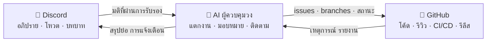

# 🗼 Tower of Babel (หอคอยบาเบล)

🌍 [العربية](README.ar.md) · [বাংলা](README.bn.md) · [Deutsch](README.de.md) · [English](../README.md) · [Español](README.es.md) · [Filipino](README.tl.md) · [Français](README.fr.md) · [हिन्दी](README.hi.md) · [Bahasa Indonesia](README.id.md) · [Italiano](README.it.md) · [日本語](README.ja.md) · [한국어](README.ko.md) · [Português](README.pt.md) · [Русский](README.ru.md) · [Kiswahili](README.sw.md) · [தமிழ்](README.ta.md) · **ไทย** · [Türkçe](README.tr.md) · [Tiếng Việt](README.vi.md) · [中文](README.zh.md)

> ระบบเปิดสำหรับการพัฒนาซอฟต์แวร์แบบรวมหมู่ — มนุษย์เป็นผู้ตัดสินใจ AI เป็นผู้ลงมือทำ
> โปรเจกต์เรียนรู้ผ่านการลงมือสร้างจริง โดยโรงเรียน [Skillaria.Top](https://skillaria.top)

---

## 💡 แนวคิด

ผู้คนตัดสินใจกันใน **Discord** โค้ดอาศัยอยู่บน **GitHub** และตรงกลางระหว่างทั้งสองคือ **AI ผู้ควบคุมวง (Orchestrator)** ที่แปลงมติของชุมชนให้กลายเป็นงานที่จับต้องได้ มอบหมายงาน ติดตามความคืบหน้า และจัดการงานจุกจิกทั้งหมดแทนเรา

จุดเด่นที่นิยามตัวโปรเจกต์นี้คือ **การใช้กับตัวเอง (self-application)**: Tower of Babel ถูกพัฒนา *ตามกติกาของ Tower of Babel เอง* การปรับปรุงบอท ผู้ควบคุมวง หรือกระบวนการใด ๆ ล้วนต้องผ่านการโหวต งาน และการรีวิวชุดเดียวกันกับที่ระบบนี้ทำให้เป็นอัตโนมัติ



---

## 📜 หลักการ

1. **มนุษย์ตัดสินใจ — AI ลงมือทำ** ผู้ควบคุมวงไม่ตัดสินใจเรื่องสาระสำคัญใด ๆ ด้วยตัวเอง แหล่งความจริงของมันคือมติของชุมชนที่ถูกบันทึกไว้
2. **ความโปร่งใส** ทุกการกระทำของ AI และทุกการตัดสินใจของมนุษย์ถูกบันทึกลงล็อกสาธารณะ ไม่มีการตัดสินใจ "หลังประตูปิด"
3. **ระบบคุณธรรมนิยม (Meritocracy)** อำนาจไม่ใช่ของแจก — ต้องหามาด้วยผลงาน และยืนยันด้วยการโหวต
4. **ย้อนกลับได้เสมอ** มติใด ๆ สามารถถูกหยิบขึ้นมาทบทวนใหม่ได้ด้วยการโหวตครั้งใหม่ การกระทำใด ๆ ของ AI สามารถถูกย้อนคืนได้
5. **ใช้กับตัวเอง** โปรเจกต์เติบโตตามกติกาของตัวเองตั้งแต่วันแรก — เริ่มจากทำมือก่อน แล้วค่อย ๆ เพิ่มความอัตโนมัติขึ้นเรื่อย ๆ

---

## 👥 ระบบบทบาท

บทบาทถูกผูกเป็นหนึ่งเดียวกันระหว่าง Discord และ GitHub: บอทจะซิงก์ให้โดยอัตโนมัติ (ระหว่างที่บอทยังไม่เกิด เหล่าผู้พิทักษ์จะทำมือไปก่อน)

| บทบาท | วิธีได้มา | Discord | GitHub | อำนาจ |
|---|---|---|---|---|
| 👁️ **ผู้สังเกตการณ์ (Observer)** | เข้าร่วมเซิร์ฟเวอร์ผ่านแดชบอร์ดโรงเรียนของคุณ | อ่านได้ทุกช่อง ถามได้ใน `#help` | Fork, สร้าง Issues | เฝ้าดู ตั้งคำถาม เสนอไอเดีย |
| 🧱 **ช่างฝึกหัด (Apprentice)** | แนะนำตัว + รับงานชิ้นแรก | โหวตในเรื่อง*งานประจำ* ร่วมวงอภิปราย | ส่ง PR จาก fork, รับมอบหมายงาน `good first issue` | รับงาน ร่วมอภิปราย |
| ⚒️ **ช่างก่อ (Mason)** | PR ถูก merge แล้ว 5 ชิ้น + โหวตเสียงข้างมากธรรมดา | โหวตได้*ทุก*เรื่อง สร้าง RFC ได้ | Triage: ติด label, มอบหมายงาน; รีวิว PR | รับงานได้ทุกชิ้น รีวิว เสนอ RFC และเสนอชื่อผู้สมัคร |
| 🏛️ **สถาปนิก (Architect)** | ได้รับการเสนอชื่อ + เสียงโหวต 2/3 ของเหล่าช่างก่อ | ดูแลช่องเทคนิค เป็นเจ้าของโดเมน | Maintain: merge เข้า `main`, milestones, release branches | ตัดสินใจ*ภายในโดเมนของตน*ได้เพียงลำพัง (ดู "โดเมน"), merge PR |
| 🛡️ **ผู้พิทักษ์ (Keeper)** | คิวเรเตอร์ของโรงเรียน / ผู้ก่อตั้ง | ผู้ดูแลเซิร์ฟเวอร์ | Admin: secrets, การตั้งค่า, branch protection | วีโต้ฉุกเฉิน, สวิตช์ปิด AI, การต้อนรับสมาชิกใหม่ ไม่ยุ่งเกี่ยวกับการพัฒนารายวัน |
| 🤖 **ผู้ควบคุมวง (Orchestrator)** | ก็มันคือบอทน่ะ คุณเป็นแทนไม่ได้หรอก 🙂 | บทบาทของตัวเองพร้อมสิทธิ์จำกัด | บัญชี machine แยกต่างหาก ห้าม merge เข้า `main` | ดูหัวข้อ "AI ผู้ควบคุมวง" |

**โดเมน** คือพื้นที่ความรับผิดชอบที่สถาปนิกแต่ละคนเป็นเจ้าของ (เช่น `bot`, `orchestrator`, `infra`, `docs`) สถาปนิกตัดสินใจเรื่องภายในโดเมนของตนได้โดยไม่ต้องโหวต แต่ช่างก่อ 3 คนขึ้นไปสามารถคัดค้านและนำเรื่องเข้าสู่การโหวตได้ (เรียกว่า "การท้าทาย")

**การลดบทบาท** ใช้การโหวตแบบเดียวกับการเลื่อนบทบาท หรือเกิดขึ้นอัตโนมัติหลังไม่มีความเคลื่อนไหว 60 วัน (บทบาทจะถูกแช่แข็งไว้ และคืนให้เมื่อกลับมาโดยไม่ต้องโหวตใหม่)

---

## 🗳️ การตัดสินใจ

มติทั้งหมดแบ่งเป็นสามระดับ การโหวตจัดขึ้นใน `#voting` (ผ่าน reaction หรือคำสั่ง `/vote` ของบอท) และผลจะถูกบันทึกเป็นไฟล์ใน `decisions/` — นี่คือ **แหล่งความจริงของ AI**

| ระดับ | ตัวอย่าง | ใครโหวตได้ | เกณฑ์ผ่าน | องค์ประชุม | ระยะเวลา |
|---|---|---|---|---|---|
| 🟢 **งานประจำ** | การตั้งชื่อฟีเจอร์, รูปแบบสรุปย่อ, ลำดับความสำคัญของงาน | ช่างฝึกหัดขึ้นไป | เสียงข้างมากธรรมดา | 3 เสียง | 24 ชม. |
| 🟡 **สำคัญ** | สถาปัตยกรรม, เทคโนโลยีที่ใช้, roadmap, การเลื่อนขั้นเป็นช่างก่อ/สถาปนิก | ช่างก่อขึ้นไป | 2/3 | 50% ของสมาชิกที่ยังเคลื่อนไหว | 48 ชม. |
| 🔴 **วิกฤต** | การแก้กติกาการปกครอง, สิทธิ์ของ AI, ไลเซนส์, การลบข้อมูล | ช่างก่อขึ้นไป | 3/4 **+ การอนุมัติจากผู้พิทักษ์** | 50% ของสมาชิกที่ยังเคลื่อนไหว | 72 ชม. |

เพิ่มเติม:

- **การตัดสินใจโดยอำนาจหน้าที่** สถาปนิกสามารถชี้ขาดเรื่องในโดเมนของตนได้โดยไม่ต้องโหวต — แต่มติยังต้องถูกบันทึกลง `decisions/` พร้อมแฟล็ก `by-authority`
- **การตัดสินใจฉุกเฉิน** ผู้พิทักษ์สามารถลงมือฝ่ายเดียวได้ (เหตุการณ์ฉุกเฉิน, ความปลอดภัย) แต่ต้องเผยแพร่รายงานภายใน 24 ชม. และชุมชนสามารถคว่ำมตินั้นได้ด้วยการโหวตระดับสำคัญ
- **กระบวนการ RFC** ข้อเสนอชิ้นใหญ่ต้องเขียนเป็น RFC ในช่องฟอรัม `#rfc`: ปัญหา → ข้อเสนอ → ทางเลือกอื่น → อภิปรายอย่างน้อย 48 ชม. → โหวต

### รูปแบบไฟล์มติ (`decisions/`)

```yaml
# decisions/2026-06-15-choose-tech-stack.yaml
id: 23
title: "เลือกชุดเทคโนโลยีที่จะใช้"
level: significant        # routine | significant | critical | by-authority | emergency
status: accepted          # accepted | rejected | superseded
votes: { for: 14, against: 3, abstain: 2 }
discord_thread: "<ลิงก์ไปยังเธรด>"
decision: |
  Backend เขียนด้วย Python 3.12, บอทใช้ discord.py, AI อยู่หลัง
  อะแดปเตอร์ OpenRouter/Ollama, ฐานข้อมูล PostgreSQL, ดีพลอยด้วย Docker
tasks_hint: |              # คำใบ้สำหรับการแตกงานของผู้ควบคุมวง (ใส่หรือไม่ก็ได้)
  เริ่มจากโครงของบอทและ CI ก่อน
```

---

## 🤖 AI ผู้ควบคุมวง

มันสมองของงานประจำทั้งปวง ทำงานผ่าน OpenRouter (โมเดลคลาวด์) หรือ Ollama (โมเดลโลคัล) หลังอะแดปเตอร์ตัวเดียว — เลือกผู้ให้บริการได้ผ่านคอนฟิก

### สิ่งที่มันทำ

- 📥 **อ่าน** มติที่ผ่านการรับรองจาก `decisions/` และเธรดใน Discord;
- 🧩 **แตกงาน** จากมติให้เป็น GitHub Issues: งานย่อย, labels, การประเมินเวลา, งานที่ต้องรอกัน, milestones;
- 🎯 **มอบหมาย** งานตามลำดับความสำคัญ: อาสาสมัครก่อน → คนที่ทักษะตรง → คนที่งานน้อยที่สุด การมอบหมายใด ๆ ปฏิเสธได้ด้วยคำสั่งเดียว;
- ⏰ **ติดตาม** กำหนดส่ง: คอยเตือน ส่งเรื่องต่อให้สถาปนิกของโดเมน และมอบหมายงานที่ค้างให้คนใหม่;
- 📝 **สรุป**: ย่อบทสนทนายาว ๆ ให้สั้น พร้อมสรุปความคืบหน้ารายสัปดาห์ใน `#announcements`;
- 🔍 **ร่างรีวิว PR** (เป็นคำแนะนำ ไม่ใช่คำพิพากษา — คำตัดสินสุดท้ายเป็นของมนุษย์);
- 🗳️ **ดำเนินการโหวต**: นับคะแนน คุมองค์ประชุม สร้างไฟล์มติ;
- 📒 **เก็บล็อกตรวจสอบ**: ทุกการกระทำของมันถูกเผยแพร่ใน `#audit-log`

### สิ่งที่มันทำ "ไม่ได้" (ข้อจำกัดตายตัว)

- ❌ Merge เข้า `main` หรือ release branches (มี branch protection กั้นไว้);
- ❌ เปลี่ยนบทบาทของคน (ทำได้แค่บันทึกผลโหวตเท่านั้น);
- ❌ แก้ system prompt, สิทธิ์ หรือคอนฟิกของตัวเอง — ต้องผ่านโหวตระดับ 🔴 วิกฤตเท่านั้น;
- ❌ แตะต้อง secrets, การตั้งค่า repository หรือเรื่องการเงิน;
- ❌ ลบ branches, issues หรือข้อความของผู้คน;
- ❌ ลงมือโดยไม่มีมติที่ถูกบันทึก — ถ้ามีใครขอ "ปากเปล่า" ในแชต มันจะตอบว่า "กรุณาทำให้เป็นมติอย่างเป็นทางการก่อน"

ผู้พิทักษ์มี **สวิตช์ปิดฉุกเฉิน (kill switch)** — หยุดบอทได้ทันทีด้วยคำสั่งเดียว

---

## 🔄 วงจรชีวิตของงาน

```
💬 อภิปรายใน Discord
        ↓
🗳️ โหวต → decisions/NNN.yaml
        ↓
🤖 AI แตกงาน → GitHub Issues (backlog)
        ↓
🎯 มอบหมายงาน (อาสาสมัคร / AI เสนอชื่อ)
        ↓
🌿 Branch feat/NNN-short-name → โค้ด → PR
        ↓
✅ CI (เทสต์, linters) + 🤖 ร่างรีวิว
        ↓
👤 รีวิวโดยช่างก่อขึ้นไป → merge โดยสถาปนิก
        ↓
🚀 รีลีส → 🤖 release notes → สรุปย่อใน Discord
```

---

## 💬 โครงสร้างเซิร์ฟเวอร์ Discord

| ช่อง | หน้าที่ |
|---|---|
| `#announcements` | รีลีส, สรุปย่อ, มติสำคัญ (สถาปนิกขึ้นไปและบอทเป็นผู้โพสต์) |
| `#rfc` *(ฟอรัม)* | ข้อเสนอชิ้นใหญ่ แยกเธรดของใครของมัน |
| `#voting` | การโหวตและผลโหวตเท่านั้น |
| `#tasks` | ฟีดงานจากผู้ควบคุมวง, การรับ/ส่งงาน |
| `#dev-general` | คุยเรื่องเทคนิคตามอัธยาศัย |
| `#help` | คำถามของมือใหม่ — ใครก็ตอบได้ |
| `#audit-log` | ล็อกการกระทำของ AI (บอทเท่านั้น) |
| 🔊 `Construction Site` | คุยเสียง, mob sessions, standups |

---

## 📁 โครงสร้าง Repository (เป้าหมาย)

```
Tower_of_Babel/
├── README.md            ← คุณอยู่ตรงนี้
├── translations/        ← README ฉบับนี้ในอีก 19 ภาษา
├── docs/                ← กติกา, คู่มือ, คลัง RFC, ADRs
├── decisions/           ← บันทึกมติ — แหล่งความจริงของ AI
├── bot/                 ← บอท Discord (คำสั่ง, โหวต, บทบาท)
├── orchestrator/        ← แกนกลาง AI (อะแดปเตอร์ LLM, การแตกงาน, การมอบหมาย)
├── integrations/        ← ไคลเอนต์ GitHub API, webhooks
├── infra/               ← Docker, compose, CI/CD, การดีพลอย
└── tests/               ← เทสต์ของทั้งหมดข้างบน
```

---

## 🛠️ เทคโนโลยี (ข้อเสนอ — รอการรับรองจาก Vote #1)

| ชั้น | ตัวเลือก | เหตุผล |
|---|---|---|
| ภาษา | Python 3.12+ | กำแพงเริ่มต้นต่ำสำหรับนักเรียน อีโคซิสเต็มอุดมสมบูรณ์ |
| Discord | `discord.py` | ไลบรารีที่อยู่ตัวแล้ว, slash commands, events |
| GitHub | `githubkit` / REST + webhooks | ครอบคลุม API ครบถ้วน |
| LLM | OpenRouter **และ** Ollama หลังอะแดปเตอร์ตัวเดียว | คลาวด์เพื่อคุณภาพ โลคัลเพื่อความฟรีและความเป็นส่วนตัว |
| Webhooks/API | FastAPI | เรียบง่าย, async, เอกสารอัตโนมัติ |
| ฐานข้อมูล | SQLite → PostgreSQL | เริ่มแบบง่าย โตได้แบบไม่เจ็บตัว |
| Infra | Docker Compose, GitHub Actions | ทำซ้ำได้เสมอ, CI ฟรี |

---

## 🗺️ Roadmap

### เฟส 0 — "วางรากฐาน" *(ทำมือ ยังไม่มีโค้ด)*
- [ ] สร้างเซิร์ฟเวอร์ Discord ตามโครงสร้างข้างบน แจกบทบาทเริ่มต้น
- [ ] จัด **Vote #1** — รับรองชุดเทคโนโลยี (มติแรกใน `decisions/`!)
- [ ] รับรองกติกาจาก README ฉบับนี้ด้วยการโหวตระดับวิกฤต
- [ ] ลองรันวงจรชีวิตของงานครบรอบหนึ่งด้วยมือ — เข้าใจกระบวนการก่อนค่อยทำให้อัตโนมัติ

### เฟส 1 — "ศิลาก้อนแรก": บอท Discord
- [ ] โครงของบอท, ดีพลอยด้วย Docker
- [ ] `/vote` — สร้างการโหวต, นับคะแนน, คุมองค์ประชุมและเส้นตาย
- [ ] สร้างไฟล์มติใน `decisions/` อัตโนมัติ (PR จากบอท)
- [ ] ซิงก์บทบาท Discord ↔ ทีม GitHub

### เฟส 2 — "สะพานเชื่อม": ผูกกับ GitHub
- [ ] GitHub webhooks → เหตุการณ์ใน `#tasks` (PR เปิด, CI ล้ม, merge แล้ว)
- [ ] คำสั่ง `/task take`, `/task done`, `/task status`
- [ ] บอร์ดโปรเจกต์ (GitHub Projects), อัปเดตสถานะอัตโนมัติ

### เฟส 3 — "เสียงแห่งหอคอย": ต่อ AI เข้าระบบ
- [ ] อะแดปเตอร์ LLM ตัวเดียว (OpenRouter / Ollama เลือกผ่านคอนฟิก)
- [ ] แตกมติ → Issues พร้อม labels และงานที่ต้องรอกัน
- [ ] สรุปเธรดและสรุปย่อรายสัปดาห์

### เฟส 4 — "วงออร์เคสตรา": บริหารเต็มรูปแบบ
- [ ] การมอบหมายงาน (อาสาสมัคร → ทักษะ → ภาระงาน)
- [ ] คุมเส้นตาย, การแจ้งเตือน, การส่งเรื่องต่อ
- [ ] ร่างรีวิว PR โดย AI, release notes
- [ ] `#audit-log` และสวิตช์ปิดฉุกเฉิน

### เฟส 5 — "หอคอยที่สร้างตัวเอง"
- [ ] ระบบบริหารการพัฒนาตัวเองได้เต็มรูปแบบ (dogfooding)
- [ ] เมตริก: ความเร็วของงาน, ความเคลื่อนไหว, คุณภาพการรีวิว
- [ ] รับโปรเจกต์ที่สอง — ทดสอบว่าระบบยกไปใช้ที่อื่นได้
- [ ] เทมเพลตสาธารณะ: "สร้างหอคอยของคุณเองได้ในเย็นเดียว"

---

## 🚪 วิธีเข้าร่วม

เซิร์ฟเวอร์ Discord ของโปรเจกต์เปิดเฉพาะนักเรียนของ Skillaria.Top เท่านั้น:

1. สมัครเป็นนักเรียนที่ [Skillaria.Top](https://skillaria.top);
2. เรียนรู้และเติบโตจนถึงระดับ **Intern**;
3. รับลิงก์เชิญเข้า Discord ในแดชบอร์ดส่วนตัวของคุณ;
4. แนะนำตัวใน `#help` — แล้วคุณจะได้รับบทบาท 🧱 ช่างฝึกหัด;
5. รับงานที่ติด label [`good first issue`](https://github.com/skillariatop/Tower_of_Babel/labels/good%20first%20issue);
6. เปิด PR — แล้วคุณก็อยู่บนเส้นทางสู่ ⚒️ ช่างก่อ

เขียนโค้ดไม่เป็น? เราต้องการนักทดสอบ นักเขียนเชิงเทคนิค ผู้ดูแลชุมชน และนักออกแบบกระบวนการด้วย — งานใน `docs/` และ `decisions/` มีคุณค่าไม่แพ้โค้ดเลย

---

## 📄 ไลเซนส์

โปรเจกต์นี้เผยแพร่ภายใต้ไลเซนส์ในไฟล์ [LICENSE](../LICENSE)

> *"และพระเยโฮวาห์ตรัสว่า ดูเถิด คนเหล่านี้เป็นอันหนึ่งอันเดียวกัน และพวกเขาทั้งปวงมีภาษาเดียว เขาทั้งหลายเริ่มทำเช่นนี้แล้ว ประเดี๋ยวนี้จะไม่มีอะไรหยุดยั้งพวกเขาได้ในสิ่งที่เขาคิดจะกระทำ"* — ปฐมกาล 11:6
> แต่คราวนี้ เรามี version control แล้ว
