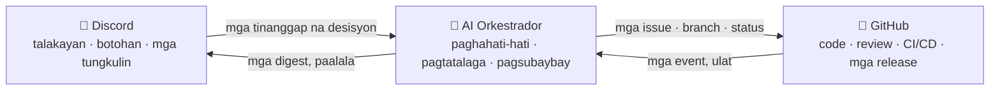

# 🗼 Tower of Babel (Ang Tore ng Babel)

🌍 [العربية](README.ar.md) · [বাংলা](README.bn.md) · [Deutsch](README.de.md) · [English](../README.md) · [Español](README.es.md) · **Filipino** · [Français](README.fr.md) · [हिन्दी](README.hi.md) · [Bahasa Indonesia](README.id.md) · [Italiano](README.it.md) · [日本語](README.ja.md) · [한국어](README.ko.md) · [Português](README.pt.md) · [Русский](README.ru.md) · [Kiswahili](README.sw.md) · [தமிழ்](README.ta.md) · [ไทย](README.th.md) · [Türkçe](README.tr.md) · [Tiếng Việt](README.vi.md) · [中文](README.zh.md)

> Isang bukas na sistema para sa sama-samang pagbuo ng software — pinamamahalaan ng mga tao, isinasagawa ng AI.
> Isang proyektong pag-aaral-habang-nagtatayo mula sa paaralang [Skillaria.Top](https://skillaria.top).

---

## 💡 Ang Ideya

Ang mga tao ang nagdedesisyon sa **Discord**, ang code ay nakatira sa **GitHub**, at sa pagitan nila ay may gumagawang **AI Orkestrador** na nagsasalin ng mga desisyon ng komunidad tungo sa kongkretong mga gawain, nagtatalaga ng mga ito, sumusubaybay sa progreso, at humahawak ng lahat ng nakakapagod na rutina.

Ang natatanging katangian ng proyekto ay ang **paggamit-sa-sarili**: ang Tower of Babel ay binubuo *ayon sa mismong mga patakaran ng Tower of Babel*. Bawat pagpapabuti sa bot, sa orkestrador, o sa mga proseso ay dumadaan sa parehong mga botohan, gawain, at review na ino-automate ng sistema.



---

## 📜 Mga Prinsipyo

1. **Tao ang nagdedesisyon — AI ang gumagawa.** Walang sariling makabuluhang desisyon ang Orkestrador. Ang pinagmumulan ng katotohanan nito ay ang mga naitalang desisyon ng komunidad.
2. **Transparency.** Bawat kilos ng AI at bawat desisyon ng tao ay isinusulat sa isang pampublikong log. Walang desisyong "sa likod ng saradong pinto".
3. **Meritokrasya.** Ang awtoridad ay hindi basta ipinamimigay — pinaghihirapan ito sa pamamagitan ng kontribusyon at pinagtitibay ng boto.
4. **Kakayahang baligtarin.** Anumang desisyon ay maaaring balikan sa pamamagitan ng bagong botohan. Anumang kilos ng AI ay maaaring i-rollback.
5. **Paggamit-sa-sarili.** Ang proyekto ay lumalago ayon sa sarili nitong mga patakaran mula sa unang araw — mano-mano sa simula, pagkatapos ay dahan-dahang mas maraming automation.

---

## 👥 Sistema ng mga Tungkulin

Ang mga tungkulin ay pinag-isa sa Discord at GitHub: awtomatikong sini-sync ng bot ang mga ito (hangga't wala pa ang bot, mano-mano itong ginagawa ng mga Tagapag-ingat).

| Tungkulin | Paano makakamit | Discord | GitHub | Kapangyarihan |
|---|---|---|---|---|
| 👁️ **Tagamasid** | Sumali sa server sa pamamagitan ng iyong school dashboard | Magbasa ng lahat ng channel, magtanong sa `#help` | Mag-fork, gumawa ng mga Issue | Manood, magtanong, magmungkahi ng mga ideya |
| 🧱 **Aprentis** | Magpakilala + kunin ang iyong unang gawain | Bumoto sa mga *rutinang* botohan, makibahagi sa mga talakayan | Mga PR mula sa fork, pagtatalaga sa mga gawaing `good first issue` | Kumuha ng mga gawain, makibahagi sa mga talakayan |
| ⚒️ **Kantero** | 5 na-merge na PR + simpleng mayorya sa botohan | Bumoto sa *lahat* ng botohan, gumawa ng mga RFC | Triage: mga label, pagtatalaga; mga review ng PR | Kumuha ng anumang gawain, mag-review, magmungkahi ng mga RFC at kandidato |
| 🏛️ **Arkitekto** | Nominasyon + 2/3 ng boto ng mga Kantero | Mag-moderate ng mga tech channel, mag-ari ng isang domain | Maintain: pag-merge sa `main`, mga milestone, mga release branch | Magdesisyon *sa loob ng kanilang domain* nang mag-isa (tingnan ang "Mga Domain"), mag-merge ng mga PR |
| 🛡️ **Tagapag-ingat** | Mga curator ng paaralan / mga founder | Administrator ng server | Admin: mga secret, settings, branch protection | Emergency veto, AI kill switch, onboarding. Hindi nakikialam sa pang-araw-araw na development |
| 🤖 **Orkestrador** | Ito ang bot. Hindi ka pwedeng maging ito 🙂 | Sariling tungkulin na may limitadong karapatan | Hiwalay na machine account, walang merge sa `main` | Tingnan ang "AI Orkestrador" |

Ang **mga Domain** ay mga larangan ng responsibilidad na pag-aari ng mga Arkitekto (hal. `bot`, `orchestrator`, `infra`, `docs`). Ang isang Arkitekto ay nagdedesisyon sa mga usapin sa loob ng kanilang domain nang walang botohan, ngunit maaaring hamunin ng kahit 3 Kantero ang desisyon at ilagay ito sa botohan (isang "hamon").

Ang **pagbababa ng tungkulin** ay dumadaan sa parehong botohan tulad ng pagtataas, o awtomatiko pagkatapos ng 60 araw ng kawalan ng aktibidad (ang tungkulin ay nai-freeze at ibinabalik pagbalik nang walang botohan).

---

## 🗳️ Pagdedesisyon

Lahat ng desisyon ay nahahati sa tatlong antas. Ang mga botohan ay ginaganap sa `#voting` (sa pamamagitan ng mga reaction o ng command na `/vote` ng bot), at ang resulta ay itinatala bilang isang file sa `decisions/` — ito ang **pinagmumulan ng katotohanan para sa AI**.

| Antas | Mga halimbawa | Sino ang boboto | Threshold | Quorum | Tagal |
|---|---|---|---|---|---|
| 🟢 **Rutina** | pagpapangalan ng feature, format ng digest, priyoridad ng gawain | Aprentis+ | simpleng mayorya | 3 boto | 24 h |
| 🟡 **Makabuluhan** | arkitektura, tech stack, roadmap, pagtataas sa Kantero/Arkitekto | Kantero+ | 2/3 | 50% ng mga aktibong miyembro | 48 h |
| 🔴 **Kritikal** | mga pagbabago sa mga patakaran ng pamamahala, mga pahintulot ng AI, lisensya, pagbura ng data | Kantero+ | 3/4 **+ pag-apruba ng Tagapag-ingat** | 50% ng mga aktibong miyembro | 72 h |

Bukod pa rito:

- **Desisyon sa pamamagitan ng awtoridad.** Maaaring lutasin ng isang Arkitekto ang isang usapin sa kanilang domain nang walang botohan — itinatala pa rin ang desisyon sa `decisions/` na may flag na `by-authority`.
- **Emergency na desisyon.** Maaaring kumilos ang isang Tagapag-ingat nang mag-isa (insidente, seguridad), ngunit kailangang maglathala ng ulat sa loob ng 24 h; maaaring baligtarin ng komunidad ang desisyon sa pamamagitan ng makabuluhang botohan.
- **Proseso ng RFC.** Ang mga malalaking panukala ay isinusulat bilang mga RFC sa forum channel na `#rfc`: problema → panukala → mga alternatibo → hindi bababa sa 48 h ng talakayan → botohan.

### Format ng decision file (`decisions/`)

```yaml
# decisions/2026-06-15-choose-tech-stack.yaml
id: 23
title: "Pagpili ng tech stack"
level: significant        # routine | significant | critical | by-authority | emergency
status: accepted          # accepted | rejected | superseded
votes: { for: 14, against: 3, abstain: 2 }
discord_thread: "<link papunta sa thread>"
decision: |
  Backend sa Python 3.12, bot sa discord.py, AI sa likod ng
  OpenRouter/Ollama adapter, PostgreSQL na database, Docker deployment.
tasks_hint: |              # pahiwatig para sa paghahati-hati ng Orkestrador (opsyonal)
  Simulan sa skeleton ng bot at sa CI.
```

---

## 🤖 AI Orkestrador

Ang utak ng rutina. Gumagana sa pamamagitan ng OpenRouter (mga cloud model) o Ollama (mga lokal na model) sa likod ng iisang adapter — pinipili ang provider sa config.

### Ano ang ginagawa nito

- 📥 **Binabasa** ang mga tinanggap na desisyon mula sa `decisions/` at sa mga Discord thread;
- 🧩 **Hinahati-hati** ang mga desisyon tungo sa mga GitHub Issue: mga subtask, label, estimate, dependency, milestone;
- 🎯 **Nagtatalaga** ng mga gawain ayon sa priyoridad: boluntaryo → tugmang kasanayan → pinakamagaan na workload. Anumang pagtatalaga ay maaaring tanggihan sa iisang command lang;
- ⏰ **Sumusubaybay** sa mga deadline: nagpapaalala, nag-e-escalate sa Arkitekto ng domain, naglilipat ng mga gawaing naipit;
- 📝 **Nagbubuod**: maiikling digest ng mahahabang talakayan, lingguhang digest ng progreso sa `#announcements`;
- 🔍 **Gumagawa ng draft ng mga PR review** (payo, hindi hatol — sa tao pa rin ang huling salita);
- 🗳️ **Nagpapatakbo ng mga botohan**: pagbibilang, kontrol ng quorum, paggawa ng decision file;
- 📒 **Nag-iingat ng audit log**: bawat kilos nito ay inilalathala sa `#audit-log`.

### Ano ang HINDI nito kayang gawin (matitigas na limitasyon)

- ❌ Mag-merge sa `main` o sa mga release branch (branch protection);
- ❌ Baguhin ang mga tungkulin ng mga tao (itinatala lamang nito ang mga resulta ng botohan);
- ❌ Baguhin ang sarili nitong system prompt, mga pahintulot, o config — sa pamamagitan lamang ng 🔴 kritikal na botohan;
- ❌ Galawin ang mga secret, mga setting ng repository, o ang billing;
- ❌ Magbura ng mga branch, issue, o mensahe ng mga tao;
- ❌ Kumilos nang walang naitalang desisyon — sa mga "berbal" na kahilingan sa chat, sumasagot ito ng "pakigawa pong pormal na desisyon".

May **kill switch** ang mga Tagapag-ingat — maaaring patayin agad ang bot sa iisang command lang.

---

## 🔄 Lifecycle ng Gawain

```
💬 Talakayan sa Discord
        ↓
🗳️ Botohan → decisions/NNN.yaml
        ↓
🤖 Hinahati-hati ng AI → GitHub Issues (backlog)
        ↓
🎯 Pagtatalaga (boluntaryo / mungkahi ng AI)
        ↓
🌿 Branch na feat/NNN-short-name → code → PR
        ↓
✅ CI (mga test, linter) + 🤖 draft na review
        ↓
👤 Review ng Kantero+ → merge ng Arkitekto
        ↓
🚀 Release → 🤖 release notes → digest sa Discord
```

---

## 💬 Istruktura ng Discord Server

| Channel | Layunin |
|---|---|
| `#announcements` | Mga release, digest, mahahalagang desisyon (mga Arkitekto+ at ang bot ang nagpo-post) |
| `#rfc` *(forum)* | Mga malalaking panukala, bawat isa sa sariling thread |
| `#voting` | Mga botohan at mga resulta nito lamang |
| `#tasks` | Feed ng mga gawain mula sa Orkestrador, pagkuha/pagsusumite ng mga gawain |
| `#dev-general` | Malayang teknikal na talakayan |
| `#help` | Mga tanong ng mga bagong dating — lahat ay sumasagot |
| `#audit-log` | Log ng mga kilos ng AI (bot lamang) |
| 🔊 `Construction Site` | Mga voice call, mob session, standup |

---

## 📁 Istruktura ng Repository (target)

```
Tower_of_Babel/
├── README.md            ← nandito ka
├── translations/        ← ang README na ito sa 19 pang ibang wika
├── docs/                ← mga patakaran, gabay, arkibo ng RFC, mga ADR
├── decisions/           ← log ng mga desisyon — ang pinagmumulan ng katotohanan para sa AI
├── bot/                 ← Discord bot (mga command, botohan, tungkulin)
├── orchestrator/        ← AI core (LLM adapter, paghahati-hati, pagtatalaga)
├── integrations/        ← mga GitHub API client, mga webhook
├── infra/               ← Docker, compose, CI/CD, deployment
└── tests/               ← mga test para sa lahat ng nasa itaas
```

---

## 🛠️ Teknolohiya (panukala — aaprubahan sa Botohan #1)

| Layer | Kandidato | Bakit |
|---|---|---|
| Wika | Python 3.12+ | Mababang hagdan para sa mga estudyante, mayamang ecosystem |
| Discord | `discord.py` | Mature na library, mga slash command, mga event |
| GitHub | `githubkit` / REST + mga webhook | Buong saklaw ng API |
| LLM | OpenRouter **at** Ollama sa likod ng iisang adapter | Cloud para sa kalidad, lokal para libre at pribado |
| Webhooks/API | FastAPI | Simple, async, may automatikong dokumentasyon |
| Database | SQLite → PostgreSQL | Magsimula nang simple, lumaki nang walang sakit ng ulo |
| Infra | Docker Compose, GitHub Actions | Reproducibility, libreng CI |

---

## 🗺️ Roadmap

### Phase 0 — "Ang Pundasyon" *(mano-mano, walang code)*
- [ ] Gawin ang Discord server ayon sa istruktura sa itaas, ipamahagi ang mga panimulang tungkulin
- [ ] Isagawa ang **Botohan #1** — aprubahan ang tech stack (ang unang desisyon sa `decisions/`!)
- [ ] Aprubahan ang mga patakaran mula sa README na ito sa pamamagitan ng kritikal na botohan
- [ ] Patakbuhin nang mano-mano ang buong lifecycle ng isang gawain — unawain ang proseso bago ito i-automate

### Phase 1 — "Ang Unang Bato": ang Discord bot
- [ ] Skeleton ng bot, Docker deployment
- [ ] `/vote` — paggawa ng botohan, pagbibilang, kontrol ng quorum at deadline
- [ ] Awtomatikong paggawa ng decision file sa `decisions/` (PR mula sa bot)
- [ ] Pag-sync ng Discord role ↔ GitHub team

### Phase 2 — "Ang Tulay": GitHub integration
- [ ] Mga GitHub webhook → mga event sa `#tasks` (PR opened, CI failed, merged)
- [ ] Mga command na `/task take`, `/task done`, `/task status`
- [ ] Project board (GitHub Projects), automation ng status

### Phase 3 — "Ang Tinig ng Tore": pagkakabit ng AI
- [ ] Pinag-isang LLM adapter (OpenRouter / Ollama, pinipili sa config)
- [ ] Paghahati-hati ng mga desisyon → mga Issue na may mga label at dependency
- [ ] Mga buod ng thread at ang lingguhang digest

### Phase 4 — "Ang Orkestra": buong pamamahala
- [ ] Pagtatalaga ng mga gawain (boluntaryo → mga kasanayan → workload)
- [ ] Kontrol ng deadline, mga paalala, escalation
- [ ] Mga draft na AI review ng mga PR, release notes
- [ ] `#audit-log` at ang kill switch

### Phase 5 — "Pagtatayo-sa-Sarili"
- [ ] Buong pinamamahalaan ng sistema ang sarili nitong development (dogfooding)
- [ ] Mga sukatan: bilis ng mga gawain, aktibidad, kalidad ng review
- [ ] Mag-onboard ng pangalawang proyekto — subukin ang portability
- [ ] Isang pampublikong template: "magtayo ng sarili mong Tore sa loob ng isang gabi"

---

## 🚪 Paano Sumali

Ang Discord server ng proyekto ay para lamang sa mga estudyante ng Skillaria.Top:

1. Maging estudyante sa [Skillaria.Top](https://skillaria.top);
2. Mag-aral at lumago hanggang maabot mo ang antas na **Intern**;
3. Kunin ang invite link ng Discord sa iyong personal na dashboard;
4. Magpakilala sa `#help` — matatanggap mo ang tungkuling 🧱 Aprentis;
5. Kumuha ng gawaing may label na [`good first issue`](https://github.com/skillariatop/Tower_of_Babel/labels/good%20first%20issue);
6. Magbukas ng PR — at papunta ka na sa pagiging ⚒️ Kantero.

Hindi marunong mag-code? Kailangan din namin ng mga tester, technical writer, moderator, at process designer — ang mga kontribusyon sa `docs/` at `decisions/` ay kasinghalaga ng code.

---

## 📄 Lisensya

Ang proyekto ay ipinamamahagi sa ilalim ng lisensyang nasa file na [LICENSE](../LICENSE).

> *"At sinabi ng Panginoon, Narito, sila'y iisang bayan, at silang lahat ay may isang wika; at ito ang kanilang pinasimulang gawin: at, ngayon nga'y walang makasasawata sa anomang kanilang balaking gawin."* — Genesis 11:6.
> Sa pagkakataong ito, may version control na tayo.
