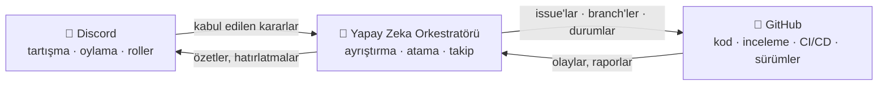

# 🗼 Tower of Babel (Babil Kulesi)

🌍 [العربية](README.ar.md) · [বাংলা](README.bn.md) · [Deutsch](README.de.md) · [English](../README.md) · [Español](README.es.md) · [Filipino](README.tl.md) · [Français](README.fr.md) · [हिन्दी](README.hi.md) · [Bahasa Indonesia](README.id.md) · [Italiano](README.it.md) · [日本語](README.ja.md) · [한국어](README.ko.md) · [Português](README.pt.md) · [Русский](README.ru.md) · [Kiswahili](README.sw.md) · [தமிழ்](README.ta.md) · [ไทย](README.th.md) · **Türkçe** · [Tiếng Việt](README.vi.md) · [中文](README.zh.md)

> Kolektif yazılım geliştirme için açık bir sistem — insanlar yönetir, yapay zeka uygular.
> [Skillaria.Top](https://skillaria.top) okulunun "yaparak öğrenme" projesi.

---

## 💡 Fikir

İnsanlar kararları **Discord**'da alır, kod **GitHub**'da yaşar; ikisinin arasında ise topluluk kararlarını somut görevlere dönüştüren, bunları atayan, ilerlemeyi izleyen ve tüm rutin işleri üstlenen bir **Yapay Zeka Orkestratörü** çalışır.

Projenin ayırt edici özelliği **kendi kendine uygulama**: Tower of Babel, *bizzat Tower of Babel'in kurallarıyla* geliştirilir. Bota, orkestratöre veya süreçlere yapılan her iyileştirme, sistemin otomatikleştirdiği aynı oylamalardan, görevlerden ve incelemelerden geçer.



---

## 📜 İlkeler

1. **İnsanlar karar verir — yapay zeka uygular.** Orkestratör kendi başına hiçbir esaslı karar almaz. Onun hakikat kaynağı, topluluğun kayda geçirilmiş kararlarıdır.
2. **Şeffaflık.** Her yapay zeka eylemi ve her insan kararı herkese açık bir günlüğe yazılır. "Kapalı kapılar ardında" karar yoktur.
3. **Liyakat.** Yetki dağıtılmaz — katkıyla kazanılır ve oylamayla onaylanır.
4. **Geri alınabilirlik.** Her karar yeni bir oylamayla yeniden ele alınabilir. Her yapay zeka eylemi geri sarılabilir.
5. **Kendi kendine uygulama.** Proje ilk günden itibaren kendi kurallarıyla gelişir — önce elle, sonra giderek artan otomasyonla.

---

## 👥 Rol Sistemi

Roller Discord ve GitHub genelinde ortaktır: bot bunları otomatik olarak eşitler (bot var olana dek bu işi Muhafızlar elle yapar).

| Rol | Nasıl elde edilir | Discord | GitHub | Yetki |
|---|---|---|---|---|
| 👁️ **Gözlemci** | Okul panelinizden sunucuya katılın | Tüm kanalları okuma, `#help`'te soru sorma | Fork, Issue açma | İzlemek, sormak, fikir önermek |
| 🧱 **Çırak** | Kendinizi tanıtın + ilk görevinizi alın | *Rutin* oylamalarda oy kullanma, tartışmalara katılma | Fork'tan PR, `good first issue` görevlerine atanma | Görev almak, tartışmalara katılmak |
| ⚒️ **Duvarcı Ustası** | 5 merge edilmiş PR + salt çoğunluk oylaması | *Tüm* oylamalarda oy kullanma, RFC açma | Triage: etiketler, atamalar; PR incelemeleri | Her görevi almak, inceleme yapmak, RFC ve aday önermek |
| 🏛️ **Mimar** | Adaylık + Duvarcı Ustalarının 2/3 oyu | Teknik kanalları yönetme, bir alanın sahibi olma | Maintain: `main`'e merge, milestone'lar, release branch'leri | *Kendi alanında* tek başına karar vermek (bkz. "Alanlar"), PR merge etmek |
| 🛡️ **Muhafız** | Okul küratörleri / kurucular | Sunucu yöneticisi | Admin: secret'lar, ayarlar, branch koruması | Acil veto, yapay zeka acil durdurma anahtarı, oryantasyon. Günlük geliştirmeye karışmaz |
| 🤖 **Orkestratör** | Botun ta kendisi. Ona dönüşemezsiniz 🙂 | Sınırlı haklara sahip kendi rolü | Ayrı makine hesabı, `main`'e merge yok | Bkz. "Yapay Zeka Orkestratörü" |

**Alanlar**, Mimarların sahiplendiği sorumluluk bölgeleridir (örn. `bot`, `orchestrator`, `infra`, `docs`). Bir Mimar kendi alanındaki konuları oylamasız karara bağlar; ancak herhangi 3 Duvarcı Ustası karara itiraz edip konuyu oylamaya taşıyabilir ("itiraz").

**Rol düşürme**, terfiyle aynı oylama yoluyla gerçekleşir ya da 60 günlük hareketsizlik sonrası otomatik olur (rol dondurulur ve geri dönüşte oylamasız iade edilir).

---

## 🗳️ Karar Alma

Tüm kararlar üç seviyeye ayrılır. Oylamalar `#voting` kanalında yapılır (tepkilerle veya botun `/vote` komutuyla) ve sonuç `decisions/` içinde bir dosya olarak kaydedilir — bu, **yapay zekanın hakikat kaynağıdır**.

| Seviye | Örnekler | Kim oy kullanır | Eşik | Yeter sayı | Süre |
|---|---|---|---|---|---|
| 🟢 **Rutin** | özellik adlandırma, özet formatı, görev önceliği | Çırak+ | salt çoğunluk | 3 oy | 24 sa |
| 🟡 **Önemli** | mimari, teknoloji yığını, yol haritası, Duvarcı Ustası/Mimar terfileri | Duvarcı Ustası+ | 2/3 | aktif üyelerin %50'si | 48 sa |
| 🔴 **Kritik** | yönetişim kurallarında değişiklik, yapay zeka izinleri, lisans, veri silme | Duvarcı Ustası+ | 3/4 **+ Muhafız onayı** | aktif üyelerin %50'si | 72 sa |

Ayrıca:

- **Yetkiyle karar.** Bir Mimar kendi alanındaki bir konuyu oylamasız karara bağlayabilir — karar yine `decisions/` içine `by-authority` bayrağıyla kaydedilir.
- **Acil karar.** Bir Muhafız tek taraflı hareket edebilir (olay, güvenlik), ancak 24 saat içinde bir rapor yayımlamak zorundadır; topluluk kararı önemli bir oylamayla bozabilir.
- **RFC süreci.** Büyük öneriler `#rfc` forum kanalında RFC olarak yazılır: sorun → öneri → alternatifler → en az 48 saatlik tartışma → oylama.

### Karar dosyası formatı (`decisions/`)

```yaml
# decisions/2026-06-15-choose-tech-stack.yaml
id: 23
title: "Teknoloji yığınının seçimi"
level: significant        # routine | significant | critical | by-authority | emergency
status: accepted          # accepted | rejected | superseded
votes: { for: 14, against: 3, abstain: 2 }
discord_thread: "<thread bağlantısı>"
decision: |
  Backend Python 3.12 ile, bot discord.py üzerinde, yapay zeka
  OpenRouter/Ollama adaptörünün arkasında, PostgreSQL veritabanı, Docker dağıtımı.
tasks_hint: |              # Orkestratörün ayrıştırması için ipucu (isteğe bağlı)
  Botun iskeletiyle ve CI ile başlayın.
```

---

## 🤖 Yapay Zeka Orkestratörü

Rutin işlerin beyni. Tek bir adaptörün arkasında OpenRouter (bulut modelleri) veya Ollama (yerel modeller) üzerinden çalışır — sağlayıcı yapılandırma dosyasından seçilir.

### Neler yapar

- 📥 Kabul edilen kararları `decisions/` ve Discord thread'lerinden **okur**;
- 🧩 Kararları GitHub Issue'larına **ayrıştırır**: alt görevler, etiketler, tahminler, bağımlılıklar, milestone'lar;
- 🎯 Görevleri önceliğe göre **atar**: gönüllü → uygun beceriler → en düşük iş yükü. Her atama tek bir komutla reddedilebilir;
- ⏰ Son teslim tarihlerini **izler**: hatırlatır, ilgili alanın Mimarına eskalasyon yapar, tıkanmış görevleri yeniden atar;
- 📝 **Özetler**: uzun tartışmaların kısa özetleri, `#announcements` kanalında haftalık ilerleme özeti;
- 🔍 **PR inceleme taslakları hazırlar** (tavsiyedir, hüküm değil — son söz insana aittir);
- 🗳️ **Oylamaları yürütür**: sayım, yeter sayı kontrolü, karar dosyasının oluşturulması;
- 📒 **Denetim günlüğünü tutar**: yaptığı her eylem `#audit-log` kanalında yayımlanır.

### Neler YAPAMAZ (katı sınırlar)

- ❌ `main`'e veya release branch'lerine merge yapamaz (branch koruması);
- ❌ İnsanların rollerini değiştiremez (yalnızca oylama sonuçlarını kaydeder);
- ❌ Kendi sistem prompt'unu, izinlerini veya yapılandırmasını değiştiremez — yalnızca 🔴 kritik bir oylamayla;
- ❌ Secret'lara, depo ayarlarına veya faturalandırmaya dokunamaz;
- ❌ Branch'leri, issue'ları veya insanların mesajlarını silemez;
- ❌ Kayıtlı bir karar olmadan harekete geçemez — sohbetteki "sözlü" isteklere "lütfen kararı resmileştirin" diye yanıt verir.

Muhafızların elinde bir **acil durdurma anahtarı** vardır — bot tek bir komutla anında durdurulabilir.

---

## 🔄 Görev Yaşam Döngüsü

```
💬 Discord'da tartışma
        ↓
🗳️ Oylama → decisions/NNN.yaml
        ↓
🤖 Yapay zeka ayrıştırır → GitHub Issue'ları (backlog)
        ↓
🎯 Atama (gönüllü / yapay zeka önerir)
        ↓
🌿 Branch feat/NNN-short-name → kod → PR
        ↓
✅ CI (testler, linter'lar) + 🤖 inceleme taslağı
        ↓
👤 Duvarcı Ustası+ incelemesi → Mimar tarafından merge
        ↓
🚀 Sürüm → 🤖 sürüm notları → Discord'da özet
```

---

## 💬 Discord Sunucu Yapısı

| Kanal | Amaç |
|---|---|
| `#announcements` | Sürümler, özetler, önemli kararlar (Mimar+ ve bot yazar) |
| `#rfc` *(forum)* | Büyük öneriler, her biri kendi thread'inde |
| `#voting` | Yalnızca oylamalar ve sonuçları |
| `#tasks` | Orkestratörden görev akışı, görev alma/teslim etme |
| `#dev-general` | Serbest teknik tartışma |
| `#help` | Yeni gelenlerin soruları — herkes yanıtlar |
| `#audit-log` | Yapay zeka eylem günlüğü (yalnızca bot) |
| 🔊 `Construction Site` | Sesli görüşmeler, mob oturumları, standup'lar |

---

## 📁 Depo Yapısı (hedef)

```
Tower_of_Babel/
├── README.md            ← şu an buradasınız
├── translations/        ← bu README 19 başka dilde
├── docs/                ← kurallar, kılavuzlar, RFC arşivi, ADR'ler
├── decisions/           ← karar günlüğü — yapay zekanın hakikat kaynağı
├── bot/                 ← Discord botu (komutlar, oylamalar, roller)
├── orchestrator/        ← yapay zeka çekirdeği (LLM adaptörü, ayrıştırma, atama)
├── integrations/        ← GitHub API istemcileri, webhook'lar
├── infra/               ← Docker, compose, CI/CD, dağıtım
└── tests/               ← yukarıdakilerin tamamı için testler
```

---

## 🛠️ Teknoloji (öneri — 1 No'lu Oylamayla onaylanacak)

| Katman | Aday | Neden |
|---|---|---|
| Dil | Python 3.12+ | Öğrenciler için düşük giriş eşiği, zengin ekosistem |
| Discord | `discord.py` | Olgun kütüphane, slash komutları, olaylar |
| GitHub | `githubkit` / REST + webhook'lar | Tam API kapsamı |
| LLM | Tek bir adaptörün arkasında OpenRouter **ve** Ollama | Kalite için bulut, ücretsiz ve gizli kullanım için yerel |
| Webhook/API | FastAPI | Basit, asenkron, otomatik dokümante |
| Veritabanı | SQLite → PostgreSQL | Basit başla, sancısız büyü |
| Altyapı | Docker Compose, GitHub Actions | Tekrarlanabilirlik, ücretsiz CI |

---

## 🗺️ Yol Haritası

### Aşama 0 — "Temel" *(elle, kodsuz)*
- [ ] Discord sunucusunu yukarıdaki yapıya göre kur, başlangıç rollerini dağıt
- [ ] **1 No'lu Oylamayı** yap — teknoloji yığınını onayla (`decisions/` içindeki ilk karar!)
- [ ] Bu README'deki kuralları kritik bir oylamayla onayla
- [ ] Tam bir görev yaşam döngüsünü elle yürüt — otomatikleştirmeden önce süreci anla

### Aşama 1 — "İlk Taş": Discord botu
- [ ] Bot iskeleti, Docker dağıtımı
- [ ] `/vote` — oylama oluşturma, sayım, yeter sayı ve süre kontrolü
- [ ] `decisions/` içindeki karar dosyasının otomatik üretimi (bottan PR)
- [ ] Discord rolü ↔ GitHub takımı senkronizasyonu

### Aşama 2 — "Köprü": GitHub entegrasyonu
- [ ] GitHub webhook'ları → `#tasks` kanalında olaylar (PR açıldı, CI başarısız, merge edildi)
- [ ] `/task take`, `/task done`, `/task status` komutları
- [ ] Proje panosu (GitHub Projects), durum otomasyonu

### Aşama 3 — "Kulenin Sesi": yapay zekanın devreye girişi
- [ ] Birleşik LLM adaptörü (OpenRouter / Ollama, yapılandırmayla seçilir)
- [ ] Karar ayrıştırma → etiketli ve bağımlılıklı Issue'lar
- [ ] Thread özetleri ve haftalık özet

### Aşama 4 — "Orkestra": tam yönetim
- [ ] Görev atama (gönüllü → beceriler → iş yükü)
- [ ] Süre kontrolü, hatırlatmalar, eskalasyon
- [ ] PR'lar için yapay zeka inceleme taslakları, sürüm notları
- [ ] `#audit-log` ve acil durdurma anahtarı

### Aşama 5 — "Kendi Kendini İnşa"
- [ ] Sistem kendi geliştirilmesini tamamen yönetir (dogfooding)
- [ ] Metrikler: görev hızı, etkinlik, inceleme kalitesi
- [ ] İkinci bir projeyi sisteme al — taşınabilirliği test et
- [ ] Herkese açık bir şablon: "kendi Kuleni bir akşamda kur"

---

## 🚪 Nasıl Katılırım

Projenin Discord sunucusu yalnızca Skillaria.Top öğrencilerine açıktır:

1. [Skillaria.Top](https://skillaria.top)'ta öğrenci olun;
2. **Intern** seviyesine ulaşana kadar öğrenin ve gelişin;
3. Discord davet bağlantısını kişisel panelinizden alın;
4. `#help` kanalında kendinizi tanıtın — 🧱 Çırak rolünü alacaksınız;
5. [`good first issue`](https://github.com/skillariatop/Tower_of_Babel/labels/good%20first%20issue) etiketli bir görev alın;
6. Bir PR açın — ve ⚒️ Duvarcı Ustası olma yolunda ilerliyorsunuz.

Kod yazamıyor musunuz? Test uzmanlarına, teknik yazarlara, moderatörlere ve süreç tasarımcılarına da ihtiyacımız var — `docs/` ve `decisions/` katkıları en az kod kadar değerlidir.

---

## 📄 Lisans

Proje, [LICENSE](../LICENSE) dosyasındaki lisans kapsamında dağıtılmaktadır.

> *"RAB, 'Tek bir halk olup aynı dili konuşarak bunu yapmaya başladıklarına göre, düşündüklerini gerçekleştirecek, hiçbir engel tanımayacaklar' dedi."* — Yaratılış 11:6.
> Bu sefer elimizde sürüm kontrolü var.
