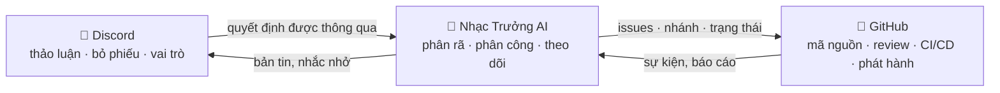

# 🗼 Tower of Babel — Tháp Babel

🌍 [العربية](README.ar.md) · [বাংলা](README.bn.md) · [Deutsch](README.de.md) · [English](../README.md) · [Español](README.es.md) · [Filipino](README.tl.md) · [Français](README.fr.md) · [हिन्दी](README.hi.md) · [Bahasa Indonesia](README.id.md) · [Italiano](README.it.md) · [日本語](README.ja.md) · [한국어](README.ko.md) · [Português](README.pt.md) · [Русский](README.ru.md) · [Kiswahili](README.sw.md) · [தமிழ்](README.ta.md) · [ไทย](README.th.md) · [Türkçe](README.tr.md) · **Tiếng Việt** · [中文](README.zh.md)

> Một hệ thống mở dành cho phát triển phần mềm tập thể — con người điều hành, AI thực thi.
> Dự án học-qua-thực-hành của trường [Skillaria.Top](https://skillaria.top).

---

## 💡 Ý Tưởng

Con người ra quyết định trên **Discord**, mã nguồn nằm trên **GitHub**, còn ở giữa là **Nhạc Trưởng AI** — bộ máy biến các quyết định của cộng đồng thành những nhiệm vụ cụ thể, phân công, theo dõi tiến độ và lo hết mọi việc lặt vặt.

Nét đặc trưng của dự án là **tự áp dụng**: Tower of Babel được phát triển *theo chính luật chơi của Tower of Babel*. Mọi cải tiến cho bot, cho bộ điều phối hay cho quy trình đều phải đi qua đúng những cuộc bỏ phiếu, nhiệm vụ và lượt review mà hệ thống tự động hóa.



---

## 📜 Nguyên Tắc

1. **Con người quyết định — AI thực thi.** Nhạc Trưởng không tự đưa ra bất kỳ quyết định nội dung nào. Nguồn chân lý của nó là các quyết định đã được cộng đồng ghi nhận.
2. **Minh bạch.** Mọi hành động của AI và mọi quyết định của con người đều được ghi vào nhật ký công khai. Không có chuyện quyết định "sau cánh cửa đóng kín".
3. **Trọng tài năng.** Quyền hạn không được ban phát — nó được tích lũy qua đóng góp và được xác nhận bằng một cuộc bỏ phiếu.
4. **Có thể đảo ngược.** Bất kỳ quyết định nào cũng có thể được xem xét lại bằng một cuộc bỏ phiếu mới. Bất kỳ hành động nào của AI cũng có thể được hoàn tác.
5. **Tự áp dụng.** Dự án vận hành theo luật của chính mình ngay từ ngày đầu — ban đầu làm thủ công, rồi tự động hóa dần dần.

---

## 👥 Hệ Thống Vai Trò

Vai trò được đồng bộ giữa Discord và GitHub: bot tự động đồng bộ chúng (khi bot chưa ra đời, các Người Canh Giữ làm việc này bằng tay).

| Vai trò | Cách đạt được | Discord | GitHub | Quyền hạn |
|---|---|---|---|---|
| 👁️ **Người Quan Sát** (Observer) | Vào server qua bảng điều khiển của trường | Đọc mọi kênh, đặt câu hỏi trong `#help` | Fork, tạo Issues | Quan sát, hỏi han, gợi ý ý tưởng |
| 🧱 **Thợ Học Việc** (Apprentice) | Giới thiệu bản thân + nhận nhiệm vụ đầu tiên | Bỏ phiếu trong các cuộc bỏ phiếu *thường nhật*, tham gia thảo luận | PR từ fork, được giao các nhiệm vụ `good first issue` | Nhận nhiệm vụ, tham gia thảo luận |
| ⚒️ **Thợ Xây** (Mason) | 5 PR được merge + bỏ phiếu đa số thường | Bỏ phiếu trong *tất cả* các cuộc bỏ phiếu, tạo RFC | Triage: gắn nhãn, phân công; review PR | Nhận bất kỳ nhiệm vụ nào, review, đề xuất RFC và ứng viên |
| 🏛️ **Kiến Trúc Sư** (Architect) | Được đề cử + 2/3 phiếu của các Thợ Xây | Điều hành các kênh kỹ thuật, sở hữu một lãnh địa | Maintain: merge vào `main`, milestones, nhánh phát hành | Tự quyết *trong lãnh địa của mình* (xem "Lãnh địa"), merge PR |
| 🛡️ **Người Canh Giữ** (Keeper) | Giáo viên hướng dẫn / người sáng lập của trường | Quản trị viên server | Admin: secrets, cài đặt, branch protection | Phủ quyết khẩn cấp, công tắc tắt AI, onboarding. Không can thiệp vào việc phát triển hằng ngày |
| 🤖 **Nhạc Trưởng** (Orchestrator) | Là con bot. Bạn không thể trở thành nó đâu 🙂 | Vai trò riêng với quyền hạn giới hạn | Tài khoản máy riêng, không được merge vào `main` | Xem mục "Nhạc Trưởng AI" |

**Lãnh địa** là các mảng trách nhiệm do Kiến Trúc Sư sở hữu (ví dụ `bot`, `orchestrator`, `infra`, `docs`). Kiến Trúc Sư tự quyết các vấn đề trong lãnh địa của mình mà không cần bỏ phiếu, nhưng bất kỳ 3 Thợ Xây nào cũng có thể phản đối và đưa quyết định đó ra bỏ phiếu (gọi là "khiếu nại").

**Hạ cấp** diễn ra qua cùng kiểu bỏ phiếu như thăng cấp, hoặc tự động sau 60 ngày không hoạt động (vai trò bị đóng băng và được khôi phục khi quay lại mà không cần bỏ phiếu).

---

## 🗳️ Ra Quyết Định

Mọi quyết định chia làm ba cấp độ. Các cuộc bỏ phiếu diễn ra trong `#voting` (qua reaction hoặc lệnh `/vote` của bot), kết quả được ghi thành một tệp trong `decisions/` — đây chính là **nguồn chân lý của AI**.

| Cấp độ | Ví dụ | Ai bỏ phiếu | Ngưỡng | Túc số | Thời hạn |
|---|---|---|---|---|---|
| 🟢 **Thường nhật** | đặt tên tính năng, định dạng bản tin, độ ưu tiên nhiệm vụ | Thợ Học Việc trở lên | đa số thường | 3 phiếu | 24 giờ |
| 🟡 **Quan trọng** | kiến trúc, công nghệ nền tảng, lộ trình, thăng cấp lên Thợ Xây/Kiến Trúc Sư | Thợ Xây trở lên | 2/3 | 50% thành viên hoạt động | 48 giờ |
| 🔴 **Hệ trọng** | thay đổi luật điều hành, quyền hạn của AI, giấy phép, xóa dữ liệu | Thợ Xây trở lên | 3/4 **+ phê duyệt của Người Canh Giữ** | 50% thành viên hoạt động | 72 giờ |

Ngoài ra:

- **Quyết định theo thẩm quyền.** Kiến Trúc Sư có thể tự giải quyết vấn đề trong lãnh địa của mình mà không cần bỏ phiếu — quyết định vẫn được ghi vào `decisions/` với cờ `by-authority`.
- **Quyết định khẩn cấp.** Người Canh Giữ có thể hành động đơn phương (sự cố, bảo mật), nhưng phải công bố báo cáo trong vòng 24 giờ; cộng đồng có thể lật ngược quyết định bằng một cuộc bỏ phiếu cấp quan trọng.
- **Quy trình RFC.** Các đề xuất lớn được viết thành RFC trong kênh diễn đàn `#rfc`: vấn đề → đề xuất → phương án thay thế → ít nhất 48 giờ thảo luận → bỏ phiếu.

### Định dạng tệp quyết định (`decisions/`)

```yaml
# decisions/2026-06-15-choose-tech-stack.yaml
id: 23
title: "Chọn công nghệ nền tảng"
level: significant        # routine | significant | critical | by-authority | emergency
status: accepted          # accepted | rejected | superseded
votes: { for: 14, against: 3, abstain: 2 }
discord_thread: "<liên kết tới thread>"
decision: |
  Backend bằng Python 3.12, bot trên discord.py, AI đứng sau
  adapter OpenRouter/Ollama, cơ sở dữ liệu PostgreSQL, triển khai bằng Docker.
tasks_hint: |              # gợi ý cho Nhạc Trưởng khi phân rã (không bắt buộc)
  Bắt đầu từ khung xương của bot và CI.
```

---

## 🤖 Nhạc Trưởng AI

Bộ não lo việc lặt vặt. Hoạt động qua OpenRouter (mô hình đám mây) hoặc Ollama (mô hình chạy cục bộ) sau một adapter duy nhất — nhà cung cấp được chọn qua config.

### Những việc nó làm

- 📥 **Đọc** các quyết định đã thông qua từ `decisions/` và các thread trên Discord;
- 🧩 **Phân rã** quyết định thành GitHub Issues: nhiệm vụ con, nhãn, ước lượng, phụ thuộc, milestones;
- 🎯 **Phân công** nhiệm vụ theo thứ tự ưu tiên: người tình nguyện → kỹ năng phù hợp → người ít việc nhất. Bất kỳ phân công nào cũng có thể từ chối bằng một lệnh duy nhất;
- ⏰ **Theo dõi** thời hạn: nhắc nhở, báo lên Kiến Trúc Sư của lãnh địa, phân công lại các nhiệm vụ bị ngâm quá lâu;
- 📝 **Tóm tắt**: bản tóm lược ngắn cho các cuộc thảo luận dài, bản tin tiến độ hằng tuần trong `#announcements`;
- 🔍 **Soạn bản nháp review PR** (chỉ là lời khuyên, không phải phán quyết — tiếng nói cuối cùng thuộc về con người);
- 🗳️ **Vận hành bỏ phiếu**: kiểm phiếu, kiểm soát túc số, sinh ra tệp quyết định;
- 📒 **Ghi nhật ký kiểm toán**: mọi hành động của nó đều được công bố trong `#audit-log`.

### Những việc nó KHÔNG được làm (giới hạn cứng)

- ❌ Merge vào `main` hay các nhánh phát hành (branch protection);
- ❌ Thay đổi vai trò của con người (nó chỉ ghi nhận kết quả bỏ phiếu);
- ❌ Sửa system prompt, quyền hạn hay config của chính mình — chỉ được phép qua một cuộc bỏ phiếu 🔴 hệ trọng;
- ❌ Đụng vào secrets, cài đặt repository hay billing;
- ❌ Xóa nhánh, issue hay tin nhắn của con người;
- ❌ Hành động khi chưa có quyết định được ghi nhận — với các yêu cầu "nói miệng" trong chat, nó trả lời "vui lòng chính thức hóa thành một quyết định".

Người Canh Giữ nắm trong tay **công tắc tắt khẩn cấp** — bot có thể bị dừng ngay lập tức chỉ bằng một lệnh.

---

## 🔄 Vòng Đời Của Một Nhiệm Vụ

```
💬 Thảo luận trên Discord
        ↓
🗳️ Bỏ phiếu → decisions/NNN.yaml
        ↓
🤖 AI phân rã → GitHub Issues (backlog)
        ↓
🎯 Phân công (tình nguyện / AI gợi ý)
        ↓
🌿 Nhánh feat/NNN-short-name → viết mã → PR
        ↓
✅ CI (tests, linters) + 🤖 bản nháp review
        ↓
👤 Review bởi Thợ Xây trở lên → merge bởi Kiến Trúc Sư
        ↓
🚀 Phát hành → 🤖 release notes → bản tin trên Discord
```

---

## 💬 Cấu Trúc Server Discord

| Kênh | Mục đích |
|---|---|
| `#announcements` | Phát hành, bản tin, quyết định quan trọng (Kiến Trúc Sư trở lên và bot được đăng) |
| `#rfc` *(diễn đàn)* | Các đề xuất lớn, mỗi đề xuất một thread riêng |
| `#voting` | Chỉ dành cho bỏ phiếu và kết quả |
| `#tasks` | Luồng nhiệm vụ từ Nhạc Trưởng, nhận/nộp nhiệm vụ |
| `#dev-general` | Thảo luận kỹ thuật tự do |
| `#help` | Câu hỏi của người mới — ai cũng trả lời |
| `#audit-log` | Nhật ký hành động của AI (chỉ bot) |
| 🔊 `Construction Site` | Gọi thoại, mob session, standup |

---

## 📁 Cấu Trúc Repository (mục tiêu)

```
Tower_of_Babel/
├── README.md            ← bạn đang ở đây
├── translations/        ← README này trong 19 ngôn ngữ khác
├── docs/                ← luật chơi, hướng dẫn, kho lưu trữ RFC, ADR
├── decisions/           ← nhật ký quyết định — nguồn chân lý của AI
├── bot/                 ← bot Discord (lệnh, bỏ phiếu, vai trò)
├── orchestrator/        ← lõi AI (adapter LLM, phân rã, phân công)
├── integrations/        ← client GitHub API, webhooks
├── infra/               ← Docker, compose, CI/CD, triển khai
└── tests/               ← kiểm thử cho tất cả những thứ trên
```

---

## 🛠️ Công Nghệ (đề xuất — sẽ được phê duyệt qua Cuộc Bỏ Phiếu #1)

| Tầng | Ứng viên | Lý do |
|---|---|---|
| Ngôn ngữ | Python 3.12+ | Rào cản gia nhập thấp cho học viên, hệ sinh thái phong phú |
| Discord | `discord.py` | Thư viện trưởng thành, slash commands, events |
| GitHub | `githubkit` / REST + webhooks | Phủ trọn API |
| LLM | OpenRouter **và** Ollama sau một adapter duy nhất | Đám mây cho chất lượng, cục bộ thì miễn phí và riêng tư |
| Webhooks/API | FastAPI | Đơn giản, bất đồng bộ, tự sinh tài liệu |
| Cơ sở dữ liệu | SQLite → PostgreSQL | Khởi đầu đơn giản, lớn lên không đau đớn |
| Hạ tầng | Docker Compose, GitHub Actions | Tái lập được, CI miễn phí |

---

## 🗺️ Lộ Trình

### Giai đoạn 0 — "Nền Móng" *(làm tay, chưa có code)*
- [ ] Tạo server Discord theo cấu trúc bên trên, phát vai trò khởi điểm
- [ ] Tổ chức **Cuộc Bỏ Phiếu #1** — phê duyệt công nghệ nền tảng (quyết định đầu tiên trong `decisions/`!)
- [ ] Phê duyệt luật chơi trong README này bằng một cuộc bỏ phiếu hệ trọng
- [ ] Chạy trọn một vòng đời nhiệm vụ bằng tay — hiểu quy trình trước khi tự động hóa nó

### Giai đoạn 1 — "Viên Đá Đầu Tiên": bot Discord
- [ ] Khung xương của bot, triển khai bằng Docker
- [ ] `/vote` — tạo cuộc bỏ phiếu, kiểm phiếu, kiểm soát túc số và thời hạn
- [ ] Tự động sinh tệp quyết định trong `decisions/` (PR từ bot)
- [ ] Đồng bộ vai trò Discord ↔ team GitHub

### Giai đoạn 2 — "Cây Cầu": tích hợp GitHub
- [ ] GitHub webhooks → sự kiện trong `#tasks` (PR mở, CI fail, đã merge)
- [ ] Các lệnh `/task take`, `/task done`, `/task status`
- [ ] Bảng dự án (GitHub Projects), tự động hóa trạng thái

### Giai đoạn 3 — "Tiếng Nói Của Tòa Tháp": cắm AI vào
- [ ] Adapter LLM thống nhất (OpenRouter / Ollama, chọn qua config)
- [ ] Phân rã quyết định → Issues với nhãn và phụ thuộc
- [ ] Tóm tắt thread và bản tin hằng tuần

### Giai đoạn 4 — "Dàn Nhạc": quản lý toàn diện
- [ ] Phân công nhiệm vụ (tình nguyện → kỹ năng → khối lượng việc)
- [ ] Kiểm soát thời hạn, nhắc nhở, báo cáo vượt cấp
- [ ] Bản nháp review PR bằng AI, release notes
- [ ] `#audit-log` và công tắc tắt khẩn cấp

### Giai đoạn 5 — "Tự Xây Chính Mình"
- [ ] Hệ thống tự quản lý hoàn toàn việc phát triển của chính nó (dogfooding)
- [ ] Số liệu: tốc độ hoàn thành nhiệm vụ, mức độ hoạt động, chất lượng review
- [ ] Đưa thêm một dự án thứ hai vào — kiểm chứng khả năng di chuyển
- [ ] Một bản mẫu công khai: "dựng Tòa Tháp của riêng bạn trong một buổi tối"

---

## 🚪 Cách Tham Gia

Server Discord của dự án chỉ dành cho học viên Skillaria.Top:

1. Trở thành học viên tại [Skillaria.Top](https://skillaria.top);
2. Học tập và tiến bộ cho đến khi đạt cấp độ **Intern**;
3. Nhận liên kết mời vào Discord trong bảng điều khiển cá nhân;
4. Giới thiệu bản thân trong `#help` — bạn sẽ nhận vai trò 🧱 Thợ Học Việc;
5. Nhận một nhiệm vụ gắn nhãn [`good first issue`](https://github.com/skillariatop/Tower_of_Babel/labels/good%20first%20issue);
6. Mở một PR — và bạn đã trên đường trở thành ⚒️ Thợ Xây.

Không biết lập trình? Chúng tôi cũng cần tester, người viết tài liệu kỹ thuật, điều phối viên và người thiết kế quy trình — đóng góp vào `docs/` và `decisions/` được trân trọng không kém gì code.

---

## 📄 Giấy Phép

Dự án được phân phối theo giấy phép trong tệp [LICENSE](../LICENSE).

> *"Đức Giê-hô-va phán rằng: Nầy, chỉ có một thứ dân, cùng đồng một thứ tiếng; và kia kìa công việc chúng nó đương khởi làm; bây giờ chẳng còn chi ngăn chúng nó làm các điều đã quyết định được"* — Sáng Thế Ký 11:6.
> Lần này, chúng ta đã có quản lý phiên bản.
