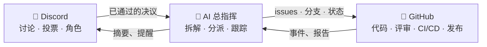

# 🗼 Tower of Babel（巴别塔）

🌍 [العربية](README.ar.md) · [বাংলা](README.bn.md) · [Deutsch](README.de.md) · [English](../README.md) · [Español](README.es.md) · [Filipino](README.tl.md) · [Français](README.fr.md) · [हिन्दी](README.hi.md) · [Bahasa Indonesia](README.id.md) · [Italiano](README.it.md) · [日本語](README.ja.md) · [한국어](README.ko.md) · [Português](README.pt.md) · [Русский](README.ru.md) · [Kiswahili](README.sw.md) · [தமிழ்](README.ta.md) · [ไทย](README.th.md) · [Türkçe](README.tr.md) · [Tiếng Việt](README.vi.md) · **中文**

> 一个面向集体软件开发的开放系统——由人类治理，由 AI 执行。
> 这是 [Skillaria.Top](https://skillaria.top) 学校的一个"边建造边学习"项目。

---

## 💡 核心理念

人们在 **Discord** 中做决策，代码托管在 **GitHub** 上，而在两者之间运转的是一个 **AI 总指挥（Orchestrator）**——它把社区的决议转化为具体任务、分派任务、跟踪进度，并包揽所有琐碎的日常工作。

本项目最大的特色是**自我应用**：Tower of Babel *按照巴别塔自己的规则*来开发自己。对机器人、总指挥或流程的每一次改进，都要经过系统所自动化的那一套投票、任务和评审。



---

## 📜 基本原则

1. **人类决策——AI 执行。** 总指挥不做任何实质性决定。它的唯一事实来源是社区记录在案的决议。
2. **透明。** AI 的每一次行动、人类的每一个决定都写入公开日志。不存在"关起门来"的决策。
3. **能者居之。** 权限不是分配的，而是通过贡献赢得、由投票确认的。
4. **可逆性。** 任何决议都可以通过新的投票重新审议；AI 的任何操作都可以回滚。
5. **自我应用。** 项目从第一天起就按自己的规则演进——先靠手动，再逐步加大自动化程度。

---

## 👥 角色体系

角色在 Discord 与 GitHub 之间统一同步：机器人会自动完成（在机器人诞生之前，由守塔人手动维护）。

| 角色 | 如何获得 | Discord | GitHub | 权限 |
|---|---|---|---|---|
| 👁️ **旁观者（Observer）** | 通过学校个人面板加入服务器 | 阅读所有频道，在 `#help` 提问 | Fork、创建 Issue | 围观、提问、提出想法 |
| 🧱 **学徒（Apprentice）** | 自我介绍 + 领取第一个任务 | 参与*日常*投票，加入讨论 | 从 fork 提交 PR，可被分派 `good first issue` 任务 | 领取任务，参与讨论 |
| ⚒️ **砌筑工（Mason）** | 5 个已合并的 PR + 简单多数投票通过 | 参与*所有*投票，发起 RFC | Triage 权限：标签、分派；PR 评审 | 领取任何任务、做评审、提出 RFC 与候选人 |
| 🏛️ **建筑师（Architect）** | 被提名 + 砌筑工 2/3 票数通过 | 管理技术频道，主管一个领域 | Maintain 权限：合并入 `main`、里程碑、发布分支 | 在*自己领域内*可独立决策（见"领域"），合并 PR |
| 🛡️ **守塔人（Keeper）** | 学校导师 / 创始人 | 服务器管理员 | Admin 权限：密钥、设置、分支保护 | 紧急否决权、AI 紧急停机开关、新人引导。不干预日常开发 |
| 🤖 **总指挥（Orchestrator）** | 它就是机器人本人。你成不了它 🙂 | 拥有权限受限的专属角色 | 独立的机器账号，无法合并入 `main` | 见"AI 总指挥" |

**领域**是建筑师各自负责的职责范围（例如 `bot`、`orchestrator`、`infra`、`docs`）。建筑师可在自己领域内不经投票直接拍板，但任意 3 名砌筑工可以对该决定提出异议并交付投票（即"质询"）。

**降级**与晋升走同一套投票流程，或在连续 60 天不活跃后自动触发（角色被冻结，回归后无需投票即可恢复）。

---

## 🗳️ 决策机制

所有决策分为三个等级。投票在 `#voting` 频道进行（通过表情回应或机器人的 `/vote` 命令），结果以文件形式记录在 `decisions/` 中——这就是 **AI 的事实来源**。

| 等级 | 示例 | 谁可投票 | 通过门槛 | 法定人数 | 时长 |
|---|---|---|---|---|---|
| 🟢 **日常** | 功能命名、摘要格式、任务优先级 | 学徒及以上 | 简单多数 | 3 票 | 24 小时 |
| 🟡 **重大** | 架构、技术栈、路线图、晋升砌筑工/建筑师 | 砌筑工及以上 | 2/3 | 活跃成员的 50% | 48 小时 |
| 🔴 **关键** | 修改治理规则、AI 权限、许可证、删除数据 | 砌筑工及以上 | 3/4 **+ 守塔人批准** | 活跃成员的 50% | 72 小时 |

此外：

- **职权决策。** 建筑师可在自己领域内不经投票直接定夺——该决定仍需记录到 `decisions/`，并带上 `by-authority` 标记。
- **紧急决策。** 守塔人可单方面行动（事故、安全事件），但必须在 24 小时内公布报告；社区可以通过一次重大投票推翻该决定。
- **RFC 流程。** 重大提案以 RFC 的形式写在 `#rfc` 论坛频道：问题 → 提案 → 备选方案 → 至少 48 小时讨论 → 投票。

### 决议文件格式（`decisions/`）

```yaml
# decisions/2026-06-15-choose-tech-stack.yaml
id: 23
title: "选择技术栈"
level: significant        # routine | significant | critical | by-authority | emergency
status: accepted          # accepted | rejected | superseded
votes: { for: 14, against: 3, abstain: 2 }
discord_thread: "<讨论帖链接>"
decision: |
  后端使用 Python 3.12，机器人基于 discord.py，AI 通过
  OpenRouter/Ollama 适配器接入，数据库用 PostgreSQL，以 Docker 部署。
tasks_hint: |              # 给总指挥做任务拆解的提示（可选）
  先从机器人骨架和 CI 开始。
```

---

## 🤖 AI 总指挥

包揽日常琐事的大脑。通过 OpenRouter（云端模型）或 Ollama（本地模型）工作，二者藏在同一个适配器后面——通过配置选择提供方。

### 它做什么

- 📥 **读取** `decisions/` 中已通过的决议以及 Discord 讨论帖；
- 🧩 **拆解**决议为 GitHub Issue：子任务、标签、工作量估算、依赖关系、里程碑；
- 🎯 **分派**任务，按优先级排序：自愿认领 → 技能匹配 → 负载最低。任何分派都可以用一条命令拒绝；
- ⏰ **跟踪**截止时间：提醒、向领域建筑师升级上报、重新分派停滞的任务；
- 📝 **总结**：为冗长讨论生成简短摘要，每周在 `#announcements` 发布进度速报；
- 🔍 **撰写 PR 评审草稿**（仅供参考，不是裁决——最终话语权属于人类）；
- 🗳️ **主持投票**：计票、法定人数控制、生成决议文件；
- 📒 **维护审计日志**：它的每一次操作都会发布到 `#audit-log`。

### 它不能做什么（硬性限制）

- ❌ 合并入 `main` 或发布分支（分支保护）；
- ❌ 修改任何人的角色（它只记录投票结果）；
- ❌ 修改自己的系统提示词、权限或配置——只能通过 🔴 关键投票；
- ❌ 触碰密钥、仓库设置或账单；
- ❌ 删除分支、Issue 或他人的消息；
- ❌ 在没有书面决议的情况下行动——对于聊天中的"口头"请求，它会回复"请先正式形成决议"。

守塔人手握**紧急停机开关**——一条命令即可让机器人立刻停止。

---

## 🔄 任务生命周期

```
💬 在 Discord 中讨论
        ↓
🗳️ 投票 → decisions/NNN.yaml
        ↓
🤖 AI 拆解 → GitHub Issues（待办池）
        ↓
🎯 分派（自愿认领 / AI 建议）
        ↓
🌿 分支 feat/NNN-short-name → 写代码 → PR
        ↓
✅ CI（测试、代码检查）+ 🤖 评审草稿
        ↓
👤 砌筑工及以上评审 → 建筑师合并
        ↓
🚀 发布 → 🤖 发布说明 → Discord 摘要
```

---

## 💬 Discord 服务器结构

| 频道 | 用途 |
|---|---|
| `#announcements` | 发布、摘要、重要决议（仅建筑师及以上和机器人可发言） |
| `#rfc` *（论坛）* | 重大提案，每个提案一个讨论帖 |
| `#voting` | 只放投票及其结果 |
| `#tasks` | 来自总指挥的任务流，认领/提交任务 |
| `#dev-general` | 自由形式的技术讨论 |
| `#help` | 新人提问——人人都来解答 |
| `#audit-log` | AI 操作日志（仅机器人可写） |
| 🔊 `Construction Site` | 语音通话、结对编程、站会 |

---

## 📁 仓库结构（目标形态）

```
Tower_of_Babel/
├── README.md            ← 你在这里
├── translations/        ← 本 README 的另外 19 种语言版本
├── docs/                ← 规则、指南、RFC 归档、ADR
├── decisions/           ← 决议日志——AI 的事实来源
├── bot/                 ← Discord 机器人（命令、投票、角色）
├── orchestrator/        ← AI 核心（LLM 适配器、拆解、分派）
├── integrations/        ← GitHub API 客户端、webhook
├── infra/               ← Docker、compose、CI/CD、部署
└── tests/               ← 以上所有内容的测试
```

---

## 🛠️ 技术选型（提案——待第 1 号投票批准）

| 层级 | 候选方案 | 理由 |
|---|---|---|
| 语言 | Python 3.12+ | 对学生入门门槛低，生态丰富 |
| Discord | `discord.py` | 成熟的库，支持斜杠命令与事件 |
| GitHub | `githubkit` / REST + webhooks | 完整覆盖 API |
| LLM | OpenRouter **加** Ollama，共用一个适配器 | 云端保质量，本地免费又私密 |
| Webhooks/API | FastAPI | 简单、异步、自动生成文档 |
| 数据库 | SQLite → PostgreSQL | 起步从简，扩展无痛 |
| 基础设施 | Docker Compose、GitHub Actions | 可复现，免费 CI |

---

## 🗺️ 路线图

### 阶段 0——"地基" *（纯手动，不写代码）*
- [ ] 按上述结构创建 Discord 服务器，分发初始角色
- [ ] 举行**第 1 号投票**——批准技术栈（`decisions/` 中的第一个决议！）
- [ ] 通过一次关键投票批准本 README 中的规则
- [ ] 手动走完一次完整的任务生命周期——先理解流程，再谈自动化

### 阶段 1——"第一块石头"：Discord 机器人
- [ ] 机器人骨架，Docker 部署
- [ ] `/vote`——创建投票、计票、法定人数与截止时间控制
- [ ] 自动生成 `decisions/` 中的决议文件（由机器人发起 PR）
- [ ] Discord 角色 ↔ GitHub 团队同步

### 阶段 2——"桥梁"：GitHub 集成
- [ ] GitHub webhooks → `#tasks` 中的事件通知（PR 打开、CI 失败、已合并）
- [ ] 命令 `/task take`、`/task done`、`/task status`
- [ ] 项目看板（GitHub Projects），状态自动化

### 阶段 3——"塔之声"：接入 AI
- [ ] 统一的 LLM 适配器（OpenRouter / Ollama，通过配置选择）
- [ ] 决议拆解 → 带标签和依赖关系的 Issue
- [ ] 讨论帖摘要与每周速报

### 阶段 4——"交响乐团"：全面管理
- [ ] 任务分派（自愿认领 → 技能 → 负载）
- [ ] 截止时间控制、提醒、升级上报
- [ ] AI 撰写 PR 评审草稿、发布说明
- [ ] `#audit-log` 与紧急停机开关

### 阶段 5——"自我建造"
- [ ] 系统完全管理自身的开发（自产自用）
- [ ] 指标：任务流速、活跃度、评审质量
- [ ] 接入第二个项目——检验可移植性
- [ ] 公开模板："一个晚上搭起你自己的塔"

---

## 🚪 如何加入

本项目的 Discord 服务器仅向 Skillaria.Top 的学员开放：

1. 成为 [Skillaria.Top](https://skillaria.top) 的学员；
2. 持续学习成长，直至达到**实习生（Intern）**等级；
3. 在个人面板中获取 Discord 邀请链接；
4. 在 `#help` 中自我介绍——你将获得 🧱 学徒角色；
5. 领取一个带 [`good first issue`](https://github.com/skillariatop/Tower_of_Babel/labels/good%20first%20issue) 标签的任务；
6. 提交一个 PR——你就踏上了通往 ⚒️ 砌筑工之路。

不会写代码？我们同样需要测试人员、技术文档作者、版主和流程设计师——对 `docs/` 和 `decisions/` 的贡献与代码同等珍贵。

---

## 📄 许可证

本项目依据 [LICENSE](../LICENSE) 文件中的许可证分发。

> *"耶和华说：看哪，他们成为一样的人民，都是一样的言语，如今既作起这事来，以后他们所要作的事就没有不成就的了。"* ——创世记 11:6。
> 这一次，我们有了版本控制。
